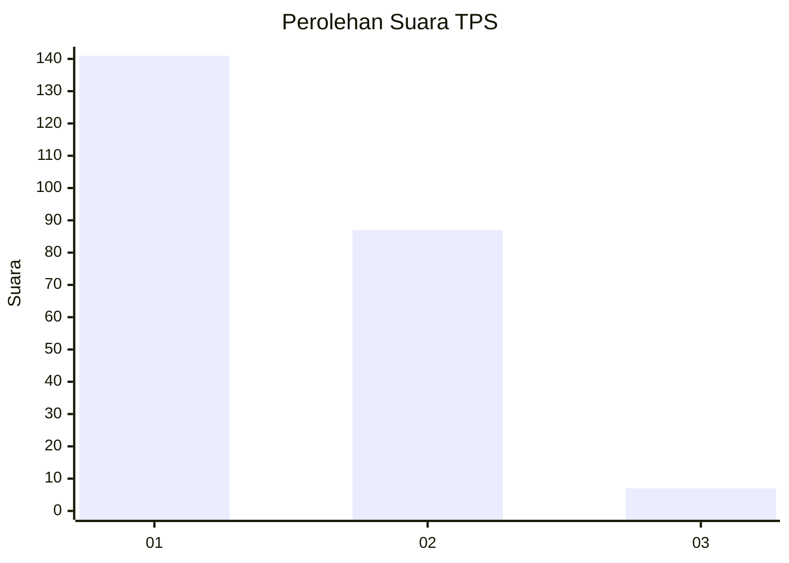
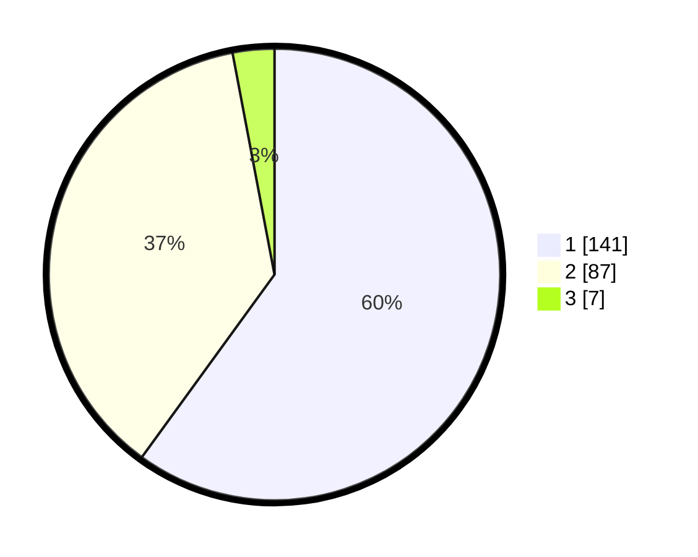

# Hasil

## Grafik

## Tabel

| No. | Nama Paslon    | Suara | Suara (raw) | Persentase |
|:--- |:-------------- | -----:| -----------:| ----------:|
| 1   | ANIES MUHAIMIN | 141   | [141][p-1]  | 60,00      |
| 2   | PRABOWO GIBRAN | 87    | [87][p-2]   | 37,02      |
| 3   | GANJAR MAHFUD  | 7     | [7][p-3]    | 2,98       |

[p-1]: https://github.com/gigit-pemilu/pemilu-2024-11-aceh/blob/main/pilpres/hitung-suara/sub/11-aceh/sub/75-kota-subulussalam/sub/01-simpang-kiri/sub/2003-sikalondang/sub/002-tps/sub/paslon-1.txt
[p-2]: https://github.com/gigit-pemilu/pemilu-2024-11-aceh/blob/main/pilpres/hitung-suara/sub/11-aceh/sub/75-kota-subulussalam/sub/01-simpang-kiri/sub/2003-sikalondang/sub/002-tps/sub/paslon-2.txt
[p-3]: https://github.com/gigit-pemilu/pemilu-2024-11-aceh/blob/main/pilpres/hitung-suara/sub/11-aceh/sub/75-kota-subulussalam/sub/01-simpang-kiri/sub/2003-sikalondang/sub/002-tps/sub/paslon-3.txt

## Foto C Plano

https://sirekap-obj-formc.kpu.go.id/b6e6/pemilu/ppwp/11/75/01/20/03/1175012003002-20240224-103919--0d8ebdc8-5645-4380-be83-cc81f308887a.jpg

https://sirekap-obj-formc.kpu.go.id/b6e6/pemilu/ppwp/11/75/01/20/03/1175012003002-20240224-104626--50bb8771-1b6c-4909-9321-17e45a88dcf3.jpg

https://sirekap-obj-formc.kpu.go.id/b6e6/pemilu/ppwp/11/75/01/20/03/1175012003002-20240224-104106--d12d00ef-7e8a-44e4-a960-c38edfea2970.jpg

## Metadata

| Key        | Value               |
| ---------- | ------------------- |
| Time Stamp | 2024-02-24 22:31:28 |

## DATA PEMILIH TETAP

Jumlah pemilih dalam DPT: **500**.
 * L: **757**.
 * P: **557**.

## DATA PENGGUNA HAK PILIH

Jumlah pengguna hak pilih dalam DPT: **57**.
 * L: **777**.
 * P: **557**.

Jumlah pengguna hak pilih dalam DPTb: **577**.
 * L: **7**.
 * P: **777**.

Jumlah pengguna hak pilih dalam DPK: **444**.
 * L: **4**.
 * P: **444**.

Jumlah pengguna hak pilih: **464**.
 * L: **124**.
 * P: **444**.

## JUMLAH SUARA SAH DAN TIDAK SAH

JUMLAH SELURUH SUARA SAH: **725**.

JUMLAH SUARA TIDAK SAH: **777**.

JUMLAH SELURUH SUARA SAH DAN SUARA TIDAK SAH: **557**.

