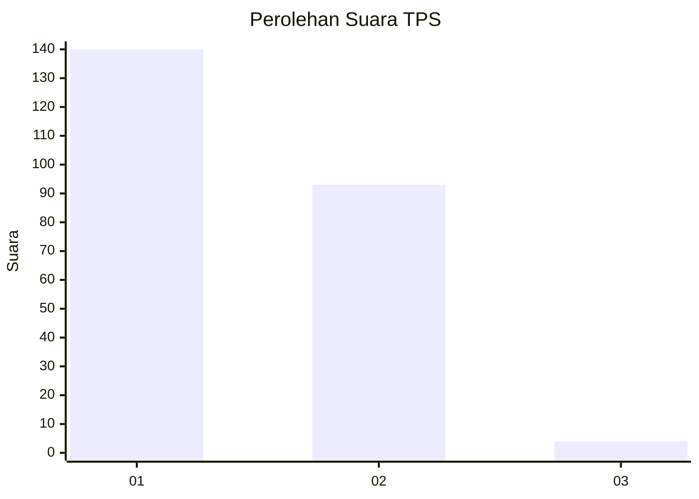
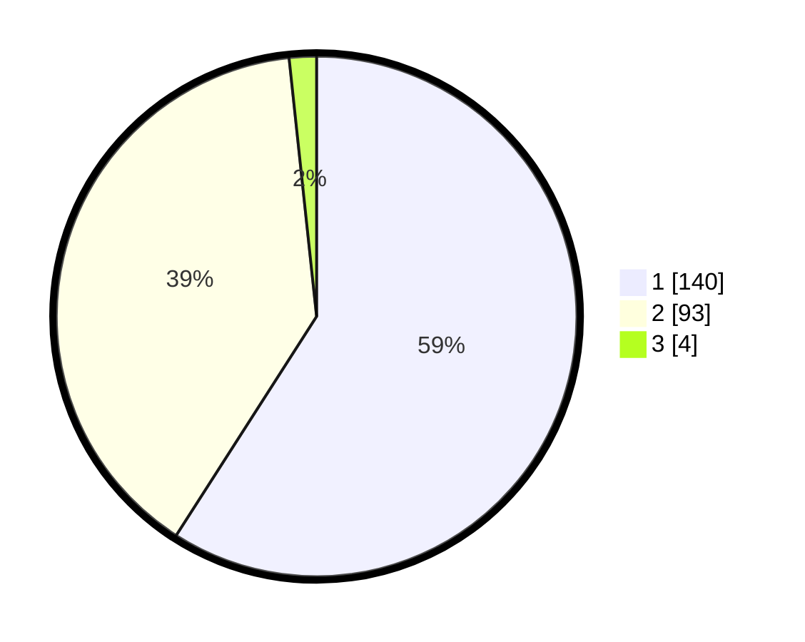

# Hasil

## Grafik

## Tabel

| No. | Nama Paslon    | Suara | Suara (raw) | Persentase |
|:--- |:-------------- | -----:| -----------:| ----------:|
| 1   | ANIES MUHAIMIN | 140   | [140][p-1]  | 59,07      |
| 2   | PRABOWO GIBRAN | 93    | [93][p-2]   | 39,24      |
| 3   | GANJAR MAHFUD  | 4     | [4][p-3]    | 1,69       |

[p-1]: https://github.com/gigit-pemilu/pemilu-2024-11-aceh/blob/main/pilpres/hitung-suara/sub/11-aceh/sub/75-kota-subulussalam/sub/01-simpang-kiri/sub/2004-buluh-dori/sub/001-tps/sub/paslon-1.txt
[p-2]: https://github.com/gigit-pemilu/pemilu-2024-11-aceh/blob/main/pilpres/hitung-suara/sub/11-aceh/sub/75-kota-subulussalam/sub/01-simpang-kiri/sub/2004-buluh-dori/sub/001-tps/sub/paslon-2.txt
[p-3]: https://github.com/gigit-pemilu/pemilu-2024-11-aceh/blob/main/pilpres/hitung-suara/sub/11-aceh/sub/75-kota-subulussalam/sub/01-simpang-kiri/sub/2004-buluh-dori/sub/001-tps/sub/paslon-3.txt

## Foto C Plano

https://sirekap-obj-formc.kpu.go.id/d2b9/pemilu/ppwp/11/75/01/20/04/1175012004001-20240215-102903--2f78e1c5-17a6-4406-b9e0-4225324da0c9.jpg

https://sirekap-obj-formc.kpu.go.id/d2b9/pemilu/ppwp/11/75/01/20/04/1175012004001-20240215-102647--8473aa53-d4fd-4c06-bfa1-ed817f8af028.jpg

https://sirekap-obj-formc.kpu.go.id/d2b9/pemilu/ppwp/11/75/01/20/04/1175012004001-20240215-103551--f23f3fca-78c5-404a-94be-49da08d7fcc8.jpg

## Metadata

| Key        | Value               |
| ---------- | ------------------- |
| Time Stamp | 2024-02-15 22:40:13 |

