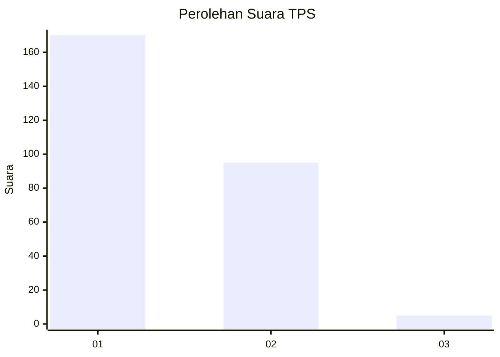
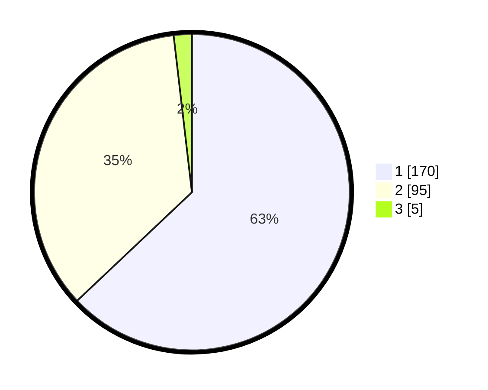

# Hasil

## Grafik

## Tabel

| No. | Nama Paslon    | Suara | Suara (raw) | Persentase |
|:--- |:-------------- | -----:| -----------:| ----------:|
| 1   | ANIES MUHAIMIN | 170   | [170][p-1]  | 62,96      |
| 2   | PRABOWO GIBRAN | 95    | [95][p-2]   | 35,19      |
| 3   | GANJAR MAHFUD  | 5     | [5][p-3]    | 1,85       |

[p-1]: https://github.com/gigit-pemilu/pemilu-2024-11-aceh/blob/main/pilpres/hitung-suara/sub/11-aceh/sub/75-kota-subulussalam/sub/01-simpang-kiri/sub/2004-buluh-dori/sub/002-tps/sub/paslon-1.txt
[p-2]: https://github.com/gigit-pemilu/pemilu-2024-11-aceh/blob/main/pilpres/hitung-suara/sub/11-aceh/sub/75-kota-subulussalam/sub/01-simpang-kiri/sub/2004-buluh-dori/sub/002-tps/sub/paslon-2.txt
[p-3]: https://github.com/gigit-pemilu/pemilu-2024-11-aceh/blob/main/pilpres/hitung-suara/sub/11-aceh/sub/75-kota-subulussalam/sub/01-simpang-kiri/sub/2004-buluh-dori/sub/002-tps/sub/paslon-3.txt

## Foto C Plano

https://sirekap-obj-formc.kpu.go.id/a312/pemilu/ppwp/11/75/01/20/04/1175012004002-20240215-104659--e31fa5eb-f38c-4f7e-aea6-a832dc9a369f.jpg

https://sirekap-obj-formc.kpu.go.id/a312/pemilu/ppwp/11/75/01/20/04/1175012004002-20240215-011436--6535e738-c27c-4db1-8901-171fb06e9c90.jpg

https://sirekap-obj-formc.kpu.go.id/a312/pemilu/ppwp/11/75/01/20/04/1175012004002-20240215-011556--127d80f3-7038-4011-94f5-e720ad4d7805.jpg

## Metadata

| Key        | Value               |
| ---------- | ------------------- |
| Time Stamp | 2024-02-15 22:40:13 |

