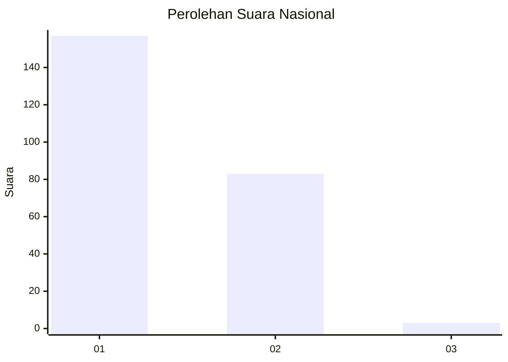
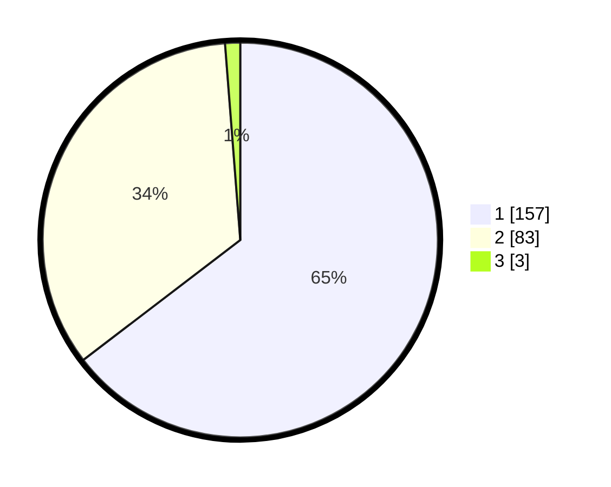

# Hasil

## Grafik

## Tabel

| No. | Nama Paslon    | Suara | Suara (raw) | Persentase |
|:--- |:-------------- | -----:| -----------:| ----------:|
| 1   | ANIES MUHAIMIN | 157   | [157][p-1]  | 64,61      |
| 2   | PRABOWO GIBRAN | 83    | [83][p-2]   | 34,16      |
| 3   | GANJAR MAHFUD  | 3     | [3][p-3]    | 1,23       |

[p-1]: https://github.com/gigit-pemilu/pemilu-2024/blob/main/pilpres/hitung-suara/sub/11-aceh/sub/75-kota-subulussalam/sub/01-simpang-kiri/sub/2004-buluh-dori/sub/003-tps/sub/paslon-1.txt
[p-2]: https://github.com/gigit-pemilu/pemilu-2024/blob/main/pilpres/hitung-suara/sub/11-aceh/sub/75-kota-subulussalam/sub/01-simpang-kiri/sub/2004-buluh-dori/sub/003-tps/sub/paslon-2.txt
[p-3]: https://github.com/gigit-pemilu/pemilu-2024/blob/main/pilpres/hitung-suara/sub/11-aceh/sub/75-kota-subulussalam/sub/01-simpang-kiri/sub/2004-buluh-dori/sub/003-tps/sub/paslon-3.txt

## Foto C Plano

https://sirekap-obj-formc.kpu.go.id/418c/pemilu/ppwp/11/75/01/20/04/1175012004003-20240215-053335--3fc6465c-b5a0-4fe3-aa89-fa6d717eded5.jpg

https://sirekap-obj-formc.kpu.go.id/418c/pemilu/ppwp/11/75/01/20/04/1175012004003-20240215-053445--3023ff69-f36f-48a4-bc24-52ba8953dbc5.jpg

https://sirekap-obj-formc.kpu.go.id/418c/pemilu/ppwp/11/75/01/20/04/1175012004003-20240215-053641--93e37448-8b7c-4bba-a738-0feb0229a80f.jpg

## Metadata

| Key        | Value               |
| ---------- | ------------------- |
| Time Stamp | 2024-02-24 22:31:28 |

