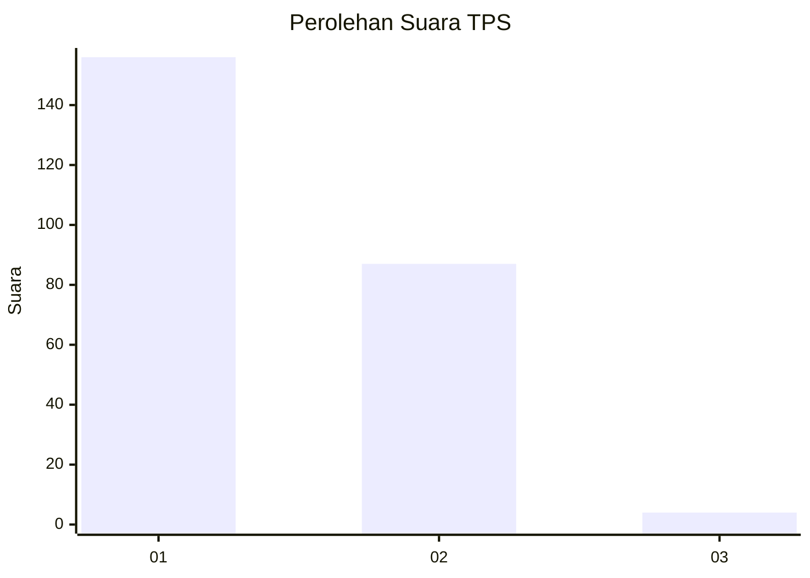
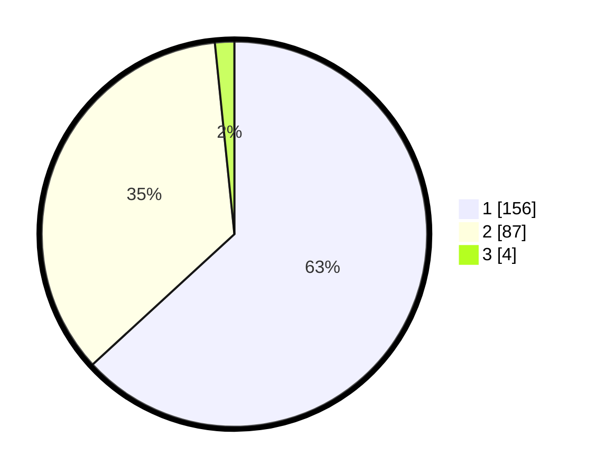

# Hasil

## Grafik

## Tabel

| No. | Nama Paslon    | Suara | Suara (raw) | Persentase |
|:--- |:-------------- | -----:| -----------:| ----------:|
| 1   | ANIES MUHAIMIN | 156   | [156][p-1]  | 63,16      |
| 2   | PRABOWO GIBRAN | 87    | [87][p-2]   | 35,22      |
| 3   | GANJAR MAHFUD  | 4     | [4][p-3]    | 1,62       |

[p-1]: https://github.com/gigit-pemilu/pemilu-2024-11-aceh/blob/main/pilpres/hitung-suara/sub/11-aceh/sub/75-kota-subulussalam/sub/01-simpang-kiri/sub/2004-buluh-dori/sub/004-tps/sub/paslon-1.txt
[p-2]: https://github.com/gigit-pemilu/pemilu-2024-11-aceh/blob/main/pilpres/hitung-suara/sub/11-aceh/sub/75-kota-subulussalam/sub/01-simpang-kiri/sub/2004-buluh-dori/sub/004-tps/sub/paslon-2.txt
[p-3]: https://github.com/gigit-pemilu/pemilu-2024-11-aceh/blob/main/pilpres/hitung-suara/sub/11-aceh/sub/75-kota-subulussalam/sub/01-simpang-kiri/sub/2004-buluh-dori/sub/004-tps/sub/paslon-3.txt

## Foto C Plano

https://sirekap-obj-formc.kpu.go.id/46f7/pemilu/ppwp/11/75/01/20/04/1175012004004-20240214-200509--5d0c2052-ffba-4b62-9a79-5272677b5594.jpg

https://sirekap-obj-formc.kpu.go.id/46f7/pemilu/ppwp/11/75/01/20/04/1175012004004-20240214-200727--8d84b250-354e-4a1f-b53a-03385ac1c139.jpg

https://sirekap-obj-formc.kpu.go.id/46f7/pemilu/ppwp/11/75/01/20/04/1175012004004-20240214-200938--da2633ce-619a-4c5d-b555-0d5dd0c4bb07.jpg

## Metadata

| Key        | Value               |
| ---------- | ------------------- |
| Time Stamp | 2024-02-15 22:40:13 |

