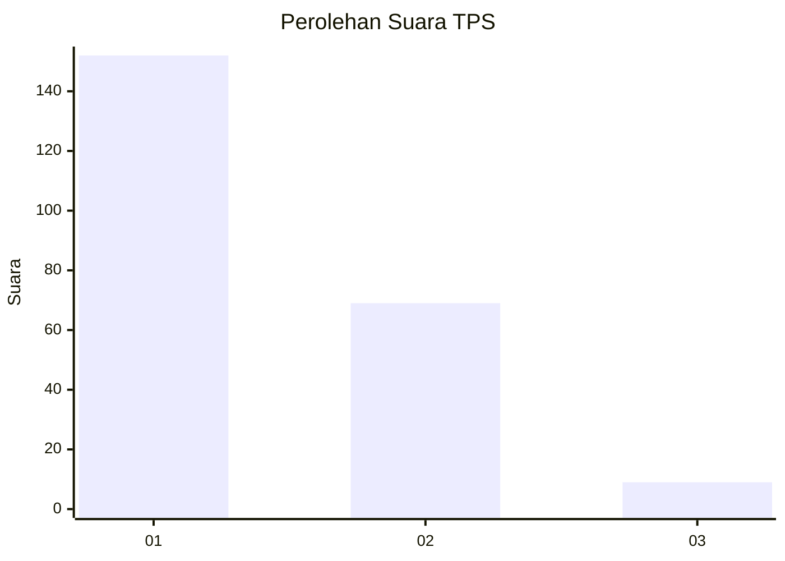
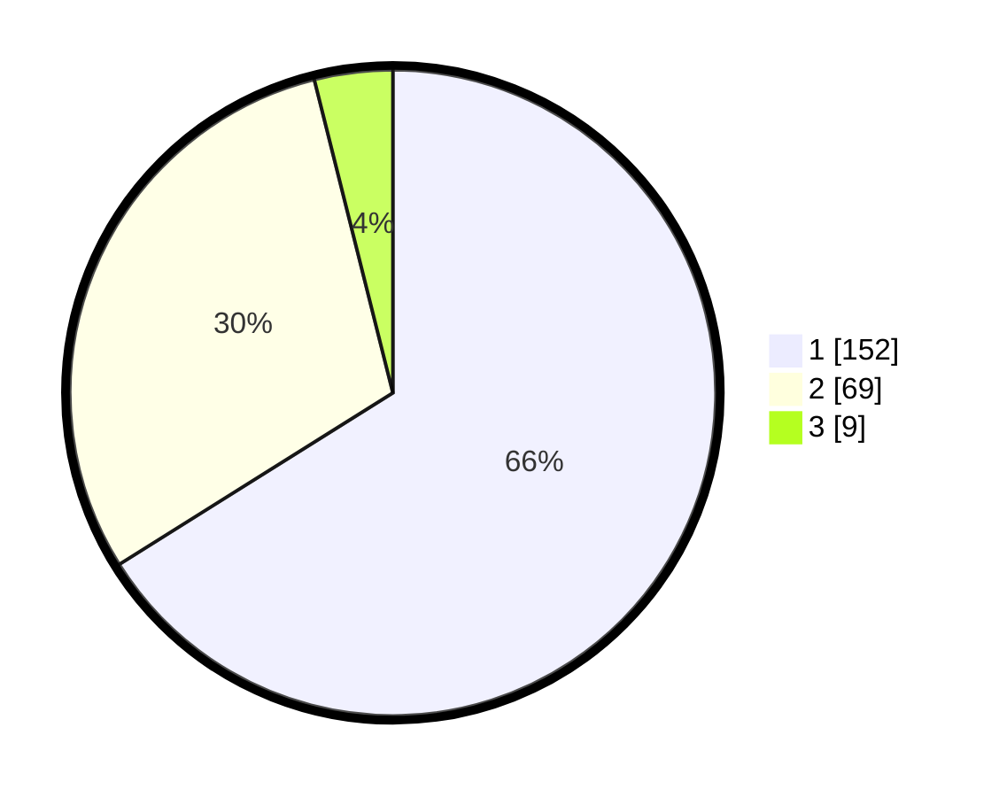

# Hasil

## Grafik

## Tabel

| No. | Nama Paslon    | Suara | Suara (raw) | Persentase |
|:--- |:-------------- | -----:| -----------:| ----------:|
| 1   | ANIES MUHAIMIN | 152   | [152][p-1]  | 66,09      |
| 2   | PRABOWO GIBRAN | 69    | [69][p-2]   | 30,00      |
| 3   | GANJAR MAHFUD  | 9     | [9][p-3]    | 3,91       |

[p-1]: https://github.com/gigit-pemilu/pemilu-2024-11-aceh/blob/main/pilpres/hitung-suara/sub/11-aceh/sub/75-kota-subulussalam/sub/01-simpang-kiri/sub/2005-subulussalam-utara/sub/009-tps/sub/paslon-1.txt
[p-2]: https://github.com/gigit-pemilu/pemilu-2024-11-aceh/blob/main/pilpres/hitung-suara/sub/11-aceh/sub/75-kota-subulussalam/sub/01-simpang-kiri/sub/2005-subulussalam-utara/sub/009-tps/sub/paslon-2.txt
[p-3]: https://github.com/gigit-pemilu/pemilu-2024-11-aceh/blob/main/pilpres/hitung-suara/sub/11-aceh/sub/75-kota-subulussalam/sub/01-simpang-kiri/sub/2005-subulussalam-utara/sub/009-tps/sub/paslon-3.txt

## Foto C Plano

https://sirekap-obj-formc.kpu.go.id/e03d/pemilu/ppwp/11/75/01/20/05/1175012005009-20240215-014703--c9d41140-c373-47cb-b815-debbdac78ad4.jpg

https://sirekap-obj-formc.kpu.go.id/e03d/pemilu/ppwp/11/75/01/20/05/1175012005009-20240215-021553--b5fd1fab-ab43-4e2e-a3fe-24809d3cd18c.jpg

https://sirekap-obj-formc.kpu.go.id/e03d/pemilu/ppwp/11/75/01/20/05/1175012005009-20240215-014915--5533eb3a-0d34-45fb-b734-884c689f89ac.jpg

## Metadata

| Key        | Value               |
| ---------- | ------------------- |
| Time Stamp | 2024-02-15 23:29:50 |

