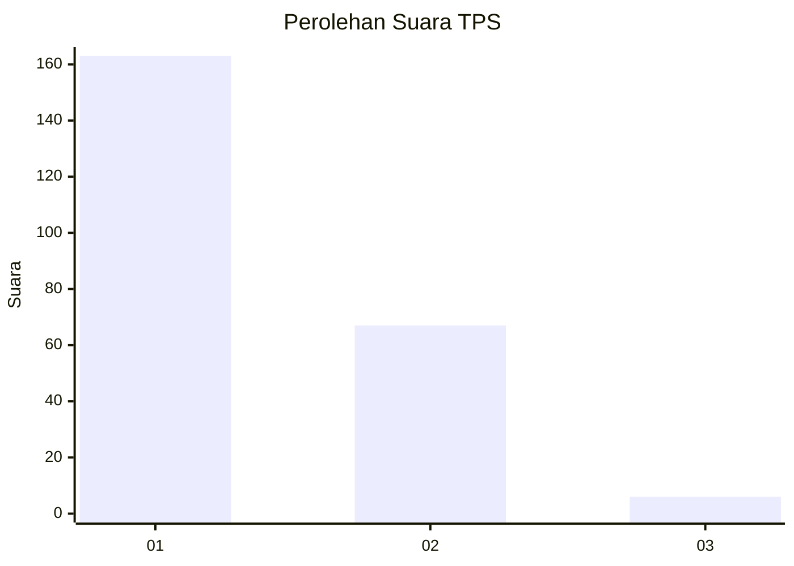
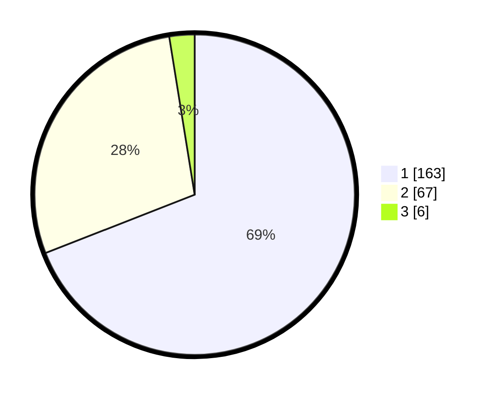

# Hasil

## Grafik

## Tabel

| No. | Nama Paslon    | Suara | Suara (raw) | Persentase |
|:--- |:-------------- | -----:| -----------:| ----------:|
| 1   | ANIES MUHAIMIN | 163   | [163][p-1]  | 69,07      |
| 2   | PRABOWO GIBRAN | 67    | [67][p-2]   | 28,39      |
| 3   | GANJAR MAHFUD  | 6     | [6][p-3]    | 2,54       |

[p-1]: https://github.com/gigit-pemilu/pemilu-2024-11-aceh/blob/main/pilpres/hitung-suara/sub/11-aceh/sub/75-kota-subulussalam/sub/01-simpang-kiri/sub/2005-subulussalam-utara/sub/012-tps/sub/paslon-1.txt
[p-2]: https://github.com/gigit-pemilu/pemilu-2024-11-aceh/blob/main/pilpres/hitung-suara/sub/11-aceh/sub/75-kota-subulussalam/sub/01-simpang-kiri/sub/2005-subulussalam-utara/sub/012-tps/sub/paslon-2.txt
[p-3]: https://github.com/gigit-pemilu/pemilu-2024-11-aceh/blob/main/pilpres/hitung-suara/sub/11-aceh/sub/75-kota-subulussalam/sub/01-simpang-kiri/sub/2005-subulussalam-utara/sub/012-tps/sub/paslon-3.txt

## Foto C Plano

https://sirekap-obj-formc.kpu.go.id/06fd/pemilu/ppwp/11/75/01/20/05/1175012005012-20240214-202146--cc06a63b-0452-4602-856f-85107795fd25.jpg

https://sirekap-obj-formc.kpu.go.id/06fd/pemilu/ppwp/11/75/01/20/05/1175012005012-20240214-202243--52f6ca78-1a56-4cdb-8621-681ddd28a3cb.jpg

https://sirekap-obj-formc.kpu.go.id/06fd/pemilu/ppwp/11/75/01/20/05/1175012005012-20240214-202412--6bb31c75-2340-486b-8832-c841b885343a.jpg

## Metadata

| Key        | Value               |
| ---------- | ------------------- |
| Time Stamp | 2024-02-15 23:29:50 |

