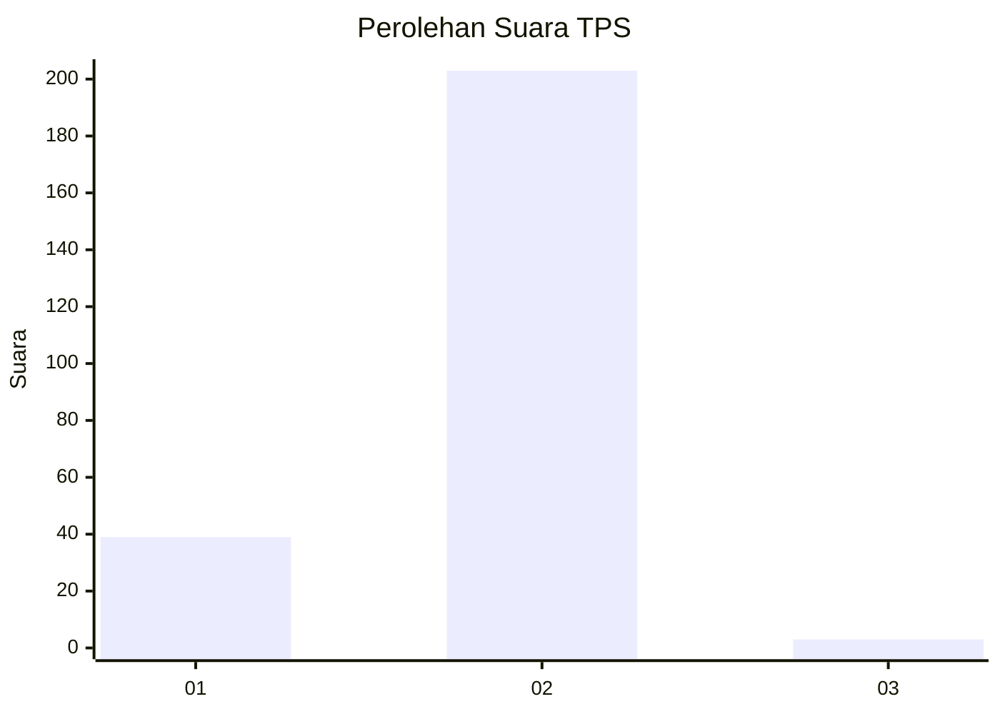
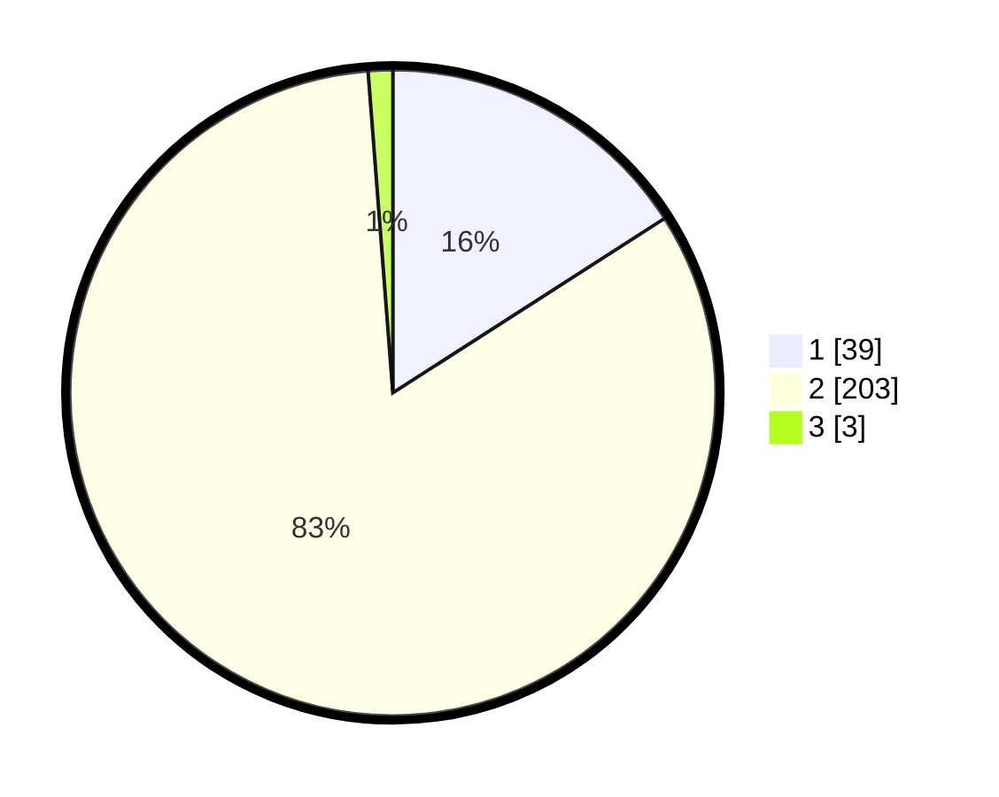

# Hasil

## Grafik

## Tabel

| No. | Nama Paslon    | Suara | Suara (raw) | Persentase |
|:--- |:-------------- | -----:| -----------:| ----------:|
| 1   | ANIES MUHAIMIN | 39    | [39][p-1]   | 15,92      |
| 2   | PRABOWO GIBRAN | 203   | [203][p-2]  | 82,86      |
| 3   | GANJAR MAHFUD  | 3     | [3][p-3]    | 1,22       |

[p-1]: https://github.com/gigit-pemilu/pemilu-2024-11-aceh/blob/main/pilpres/hitung-suara/sub/11-aceh/sub/75-kota-subulussalam/sub/01-simpang-kiri/sub/2006-subulussalam-selatan/sub/001-tps/sub/paslon-1.txt
[p-2]: https://github.com/gigit-pemilu/pemilu-2024-11-aceh/blob/main/pilpres/hitung-suara/sub/11-aceh/sub/75-kota-subulussalam/sub/01-simpang-kiri/sub/2006-subulussalam-selatan/sub/001-tps/sub/paslon-2.txt
[p-3]: https://github.com/gigit-pemilu/pemilu-2024-11-aceh/blob/main/pilpres/hitung-suara/sub/11-aceh/sub/75-kota-subulussalam/sub/01-simpang-kiri/sub/2006-subulussalam-selatan/sub/001-tps/sub/paslon-3.txt

## Foto C Plano

https://sirekap-obj-formc.kpu.go.id/26ae/pemilu/ppwp/11/75/01/20/06/1175012006001-20240223-092644--9d66f329-d3b6-4307-bb57-48b2bbf50236.jpg

https://sirekap-obj-formc.kpu.go.id/26ae/pemilu/ppwp/11/75/01/20/06/1175012006001-20240223-092828--93114e73-9236-4a58-953e-65650a6d01e4.jpg

https://sirekap-obj-formc.kpu.go.id/26ae/pemilu/ppwp/11/75/01/20/06/1175012006001-20240223-092847--4f9f4a2b-8612-4a1a-860e-d7f543daca9b.jpg

## Metadata

| Key        | Value               |
| ---------- | ------------------- |
| Time Stamp | 2024-02-24 22:31:28 |

## DATA PEMILIH TETAP

Jumlah pemilih dalam DPT: **231**.
 * L: **234**.
 * P: **157**.

## DATA PENGGUNA HAK PILIH

Jumlah pengguna hak pilih dalam DPT: **243**.
 * L: **917**.
 * P: **130**.

Jumlah pengguna hak pilih dalam DPTb: **887**.
 * L: **83**.
 * P: **704**.

Jumlah pengguna hak pilih dalam DPK: **204**.
 * L: **84**.
 * P: **0**.

Jumlah pengguna hak pilih: **263**.
 * L: **0**.
 * P: **10**.

## JUMLAH SUARA SAH DAN TIDAK SAH

JUMLAH SELURUH SUARA SAH: **255**.

JUMLAH SUARA TIDAK SAH: **5**.

JUMLAH SELURUH SUARA SAH DAN SUARA TIDAK SAH: **260**.

