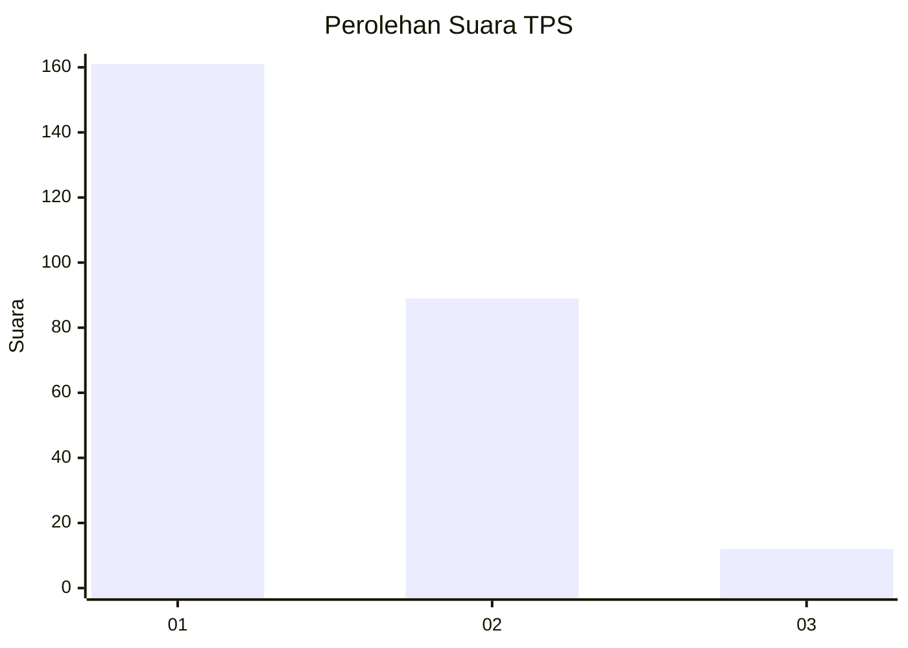
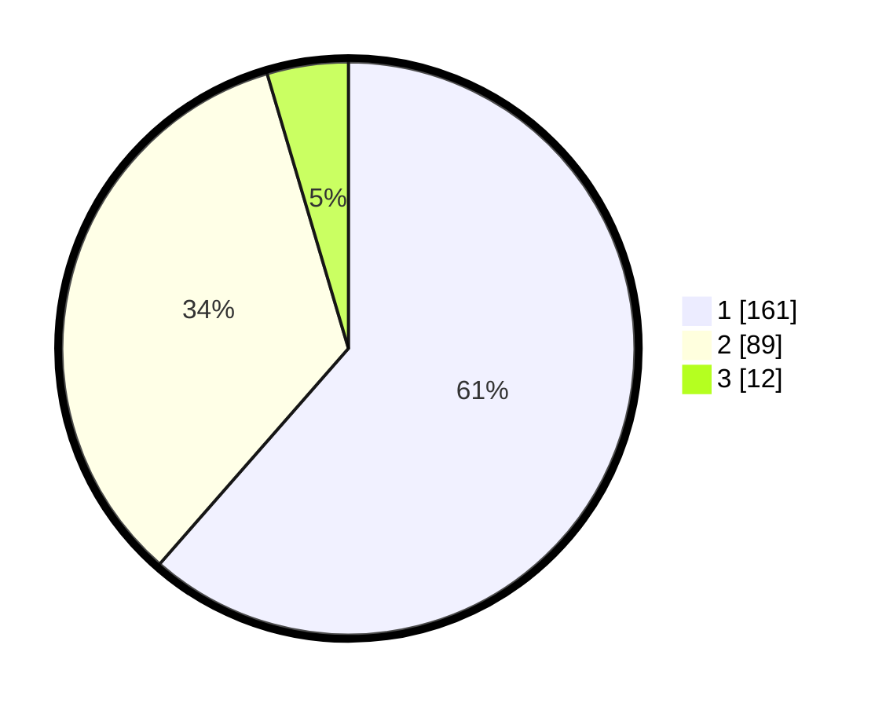

# Hasil

## Grafik

## Tabel

| No. | Nama Paslon    | Suara | Suara (raw) | Persentase |
|:--- |:-------------- | -----:| -----------:| ----------:|
| 1   | ANIES MUHAIMIN | 161   | [161][p-1]  | 61,45      |
| 2   | PRABOWO GIBRAN | 89    | [89][p-2]   | 33,97      |
| 3   | GANJAR MAHFUD  | 12    | [12][p-3]   | 4,58       |

[p-1]: https://github.com/gigit-pemilu/pemilu-2024-11-aceh/blob/main/pilpres/hitung-suara/sub/11-aceh/sub/75-kota-subulussalam/sub/01-simpang-kiri/sub/2006-subulussalam-selatan/sub/002-tps/sub/paslon-1.txt
[p-2]: https://github.com/gigit-pemilu/pemilu-2024-11-aceh/blob/main/pilpres/hitung-suara/sub/11-aceh/sub/75-kota-subulussalam/sub/01-simpang-kiri/sub/2006-subulussalam-selatan/sub/002-tps/sub/paslon-2.txt
[p-3]: https://github.com/gigit-pemilu/pemilu-2024-11-aceh/blob/main/pilpres/hitung-suara/sub/11-aceh/sub/75-kota-subulussalam/sub/01-simpang-kiri/sub/2006-subulussalam-selatan/sub/002-tps/sub/paslon-3.txt

## Foto C Plano

https://sirekap-obj-formc.kpu.go.id/06c8/pemilu/ppwp/11/75/01/20/06/1175012006002-20240215-094420--1ec25b45-d0fc-4691-901e-c1d4fdb6cd56.jpg

https://sirekap-obj-formc.kpu.go.id/06c8/pemilu/ppwp/11/75/01/20/06/1175012006002-20240215-094533--833e537a-1131-4aef-a83c-232ff8460899.jpg

https://sirekap-obj-formc.kpu.go.id/06c8/pemilu/ppwp/11/75/01/20/06/1175012006002-20240215-094726--adb8778e-e078-4969-8a07-9d03e5ae2394.jpg

## Metadata

| Key        | Value               |
| ---------- | ------------------- |
| Time Stamp | 2024-02-24 22:31:28 |

