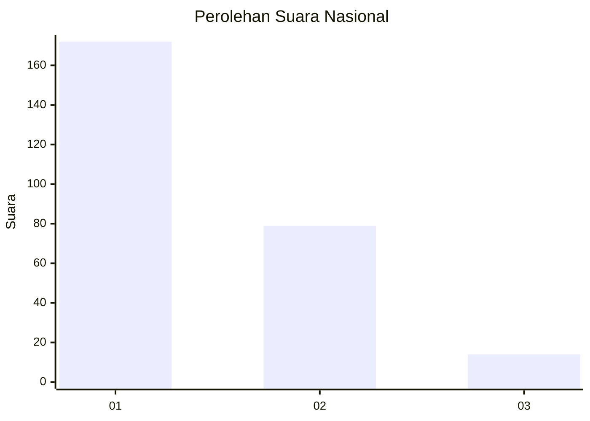
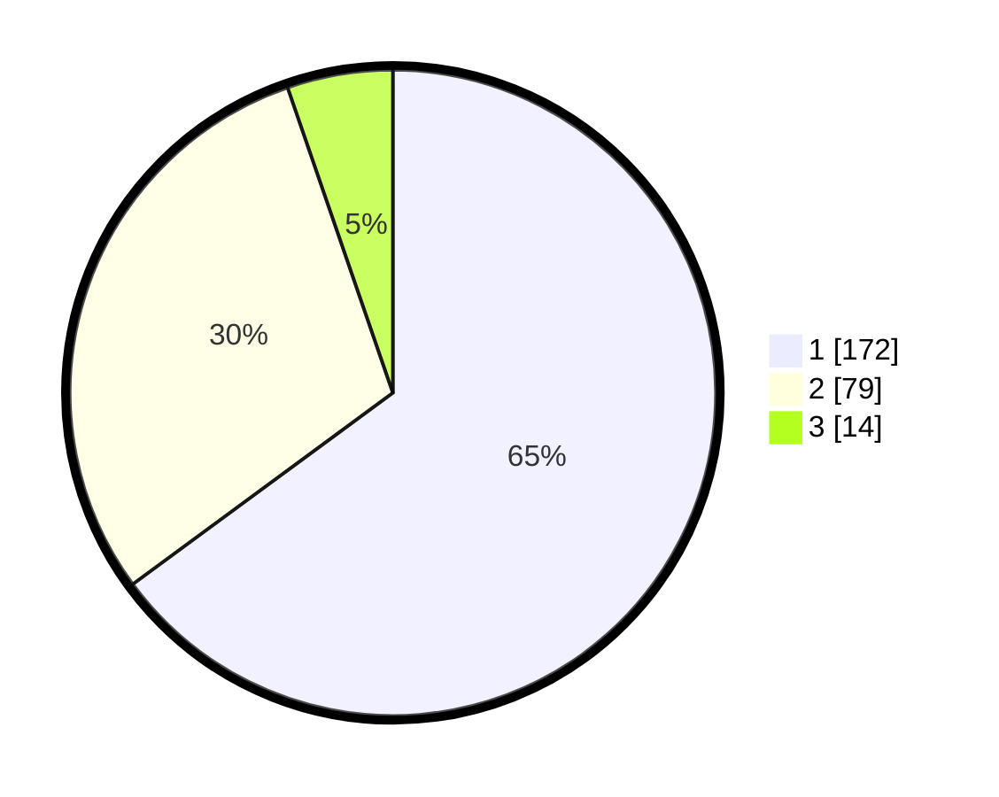

# Hasil

## Grafik

## Tabel

| No. | Nama Paslon    | Suara | Suara (raw) | Persentase |
|:--- |:-------------- | -----:| -----------:| ----------:|
| 1   | ANIES MUHAIMIN | 172   | [172][p-1]  | 64,91      |
| 2   | PRABOWO GIBRAN | 79    | [79][p-2]   | 29,81      |
| 3   | GANJAR MAHFUD  | 14    | [14][p-3]   | 5,28       |

[p-1]: https://github.com/gigit-pemilu/pemilu-2024/blob/main/pilpres/hitung-suara/sub/11-aceh/sub/75-kota-subulussalam/sub/01-simpang-kiri/sub/2006-subulussalam-selatan/sub/004-tps/sub/paslon-1.txt
[p-2]: https://github.com/gigit-pemilu/pemilu-2024/blob/main/pilpres/hitung-suara/sub/11-aceh/sub/75-kota-subulussalam/sub/01-simpang-kiri/sub/2006-subulussalam-selatan/sub/004-tps/sub/paslon-2.txt
[p-3]: https://github.com/gigit-pemilu/pemilu-2024/blob/main/pilpres/hitung-suara/sub/11-aceh/sub/75-kota-subulussalam/sub/01-simpang-kiri/sub/2006-subulussalam-selatan/sub/004-tps/sub/paslon-3.txt

## Foto C Plano

https://sirekap-obj-formc.kpu.go.id/a8d5/pemilu/ppwp/11/75/01/20/06/1175012006004-20240223-162039--f5e221ca-0f30-4200-97c6-034b43e0310b.jpg

https://sirekap-obj-formc.kpu.go.id/a8d5/pemilu/ppwp/11/75/01/20/06/1175012006004-20240223-162115--4cecef60-3af9-4ae6-9516-6bb03cd80677.jpg

https://sirekap-obj-formc.kpu.go.id/a8d5/pemilu/ppwp/11/75/01/20/06/1175012006004-20240223-162252--d1896a41-d439-420d-a947-4298244c9b38.jpg

## Metadata

| Key        | Value               |
| ---------- | ------------------- |
| Time Stamp | 2024-02-24 22:31:28 |

## DATA PEMILIH TETAP

Jumlah pemilih dalam DPT: **300**.
 * L: **144**.
 * P: **156**.

## DATA PENGGUNA HAK PILIH

Jumlah pengguna hak pilih dalam DPT: **252**.
 * L: **119**.
 * P: **133**.

Jumlah pengguna hak pilih dalam DPTb: **12**.
 * L: **9**.
 * P: **3**.

Jumlah pengguna hak pilih dalam DPK: **3**.
 * L: **3**.
 * P: **3**.

Jumlah pengguna hak pilih: **273**.
 * L: **733**.
 * P: **139**.

## JUMLAH SUARA SAH DAN TIDAK SAH

JUMLAH SELURUH SUARA SAH: **255**.

JUMLAH SUARA TIDAK SAH: **5**.

JUMLAH SELURUH SUARA SAH DAN SUARA TIDAK SAH: **270**.

