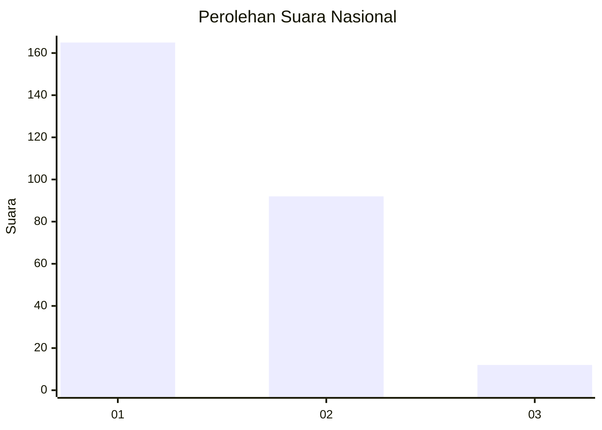
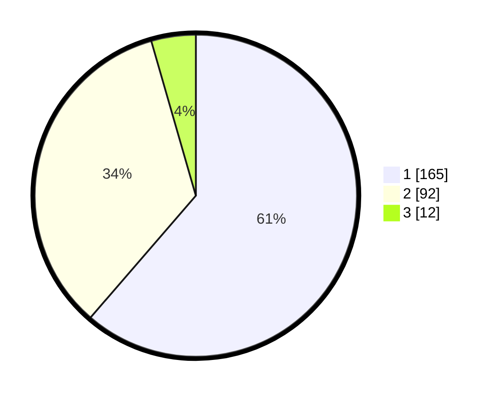

# Hasil

## Grafik

## Tabel

| No. | Nama Paslon    | Suara | Suara (raw) | Persentase |
|:--- |:-------------- | -----:| -----------:| ----------:|
| 1   | ANIES MUHAIMIN | 165   | [165][p-1]  | 61,34      |
| 2   | PRABOWO GIBRAN | 92    | [92][p-2]   | 34,20      |
| 3   | GANJAR MAHFUD  | 12    | [12][p-3]   | 4,46       |

[p-1]: https://github.com/gigit-pemilu/pemilu-2024/blob/main/pilpres/hitung-suara/sub/11-aceh/sub/75-kota-subulussalam/sub/01-simpang-kiri/sub/2006-subulussalam-selatan/sub/006-tps/sub/paslon-1.txt
[p-2]: https://github.com/gigit-pemilu/pemilu-2024/blob/main/pilpres/hitung-suara/sub/11-aceh/sub/75-kota-subulussalam/sub/01-simpang-kiri/sub/2006-subulussalam-selatan/sub/006-tps/sub/paslon-2.txt
[p-3]: https://github.com/gigit-pemilu/pemilu-2024/blob/main/pilpres/hitung-suara/sub/11-aceh/sub/75-kota-subulussalam/sub/01-simpang-kiri/sub/2006-subulussalam-selatan/sub/006-tps/sub/paslon-3.txt

## Foto C Plano

https://sirekap-obj-formc.kpu.go.id/19f4/pemilu/ppwp/11/75/01/20/06/1175012006006-20240223-221458--d9fba633-fb4d-4012-b384-7728d21b1fc5.jpg

https://sirekap-obj-formc.kpu.go.id/19f4/pemilu/ppwp/11/75/01/20/06/1175012006006-20240223-221545--81b8e159-2d0e-4350-8db4-ca0b2c07d554.jpg

https://sirekap-obj-formc.kpu.go.id/19f4/pemilu/ppwp/11/75/01/20/06/1175012006006-20240223-221621--37c3f904-f00c-4062-8e37-abbeaba64087.jpg

## Metadata

| Key        | Value               |
| ---------- | ------------------- |
| Time Stamp | 2024-02-24 22:31:28 |

## DATA PEMILIH TETAP

Jumlah pemilih dalam DPT: **295**.
 * L: **136**.
 * P: **159**.

## DATA PENGGUNA HAK PILIH

Jumlah pengguna hak pilih dalam DPT: **262**.
 * L: **114**.
 * P: **148**.

Jumlah pengguna hak pilih dalam DPTb: **776**.
 * L: **3**.
 * P: **703**.

Jumlah pengguna hak pilih dalam DPK: **5**.
 * L: **2**.
 * P: **3**.

Jumlah pengguna hak pilih: **273**.
 * L: **9**.
 * P: **64**.

## JUMLAH SUARA SAH DAN TIDAK SAH

JUMLAH SELURUH SUARA SAH: **269**.

JUMLAH SUARA TIDAK SAH: **4**.

JUMLAH SELURUH SUARA SAH DAN SUARA TIDAK SAH: **273**.

