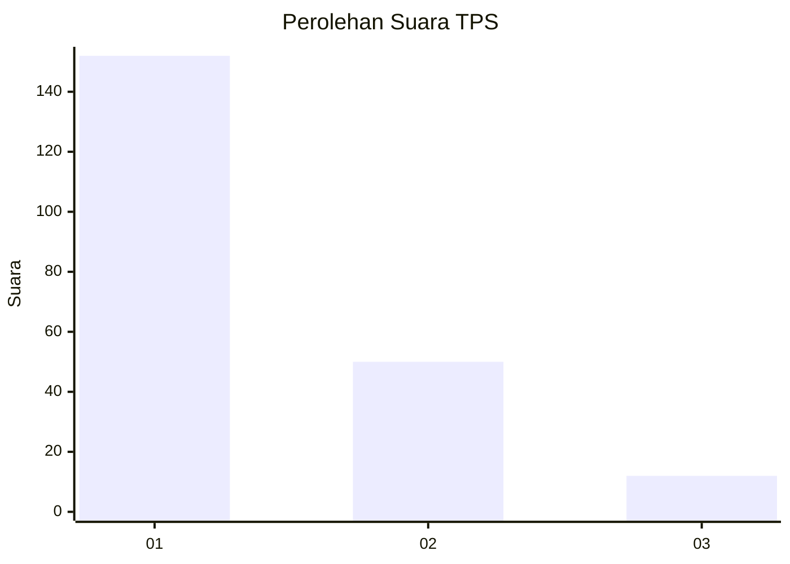
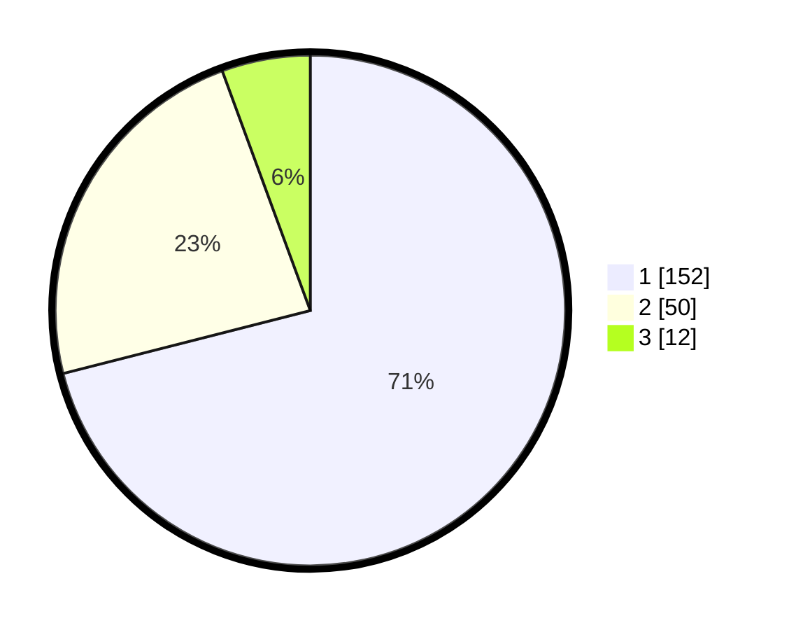

# Hasil

## Grafik

## Tabel

| No. | Nama Paslon    | Suara | Suara (raw) | Persentase |
|:--- |:-------------- | -----:| -----------:| ----------:|
| 1   | ANIES MUHAIMIN | 152   | [152][p-1]  | 71,03      |
| 2   | PRABOWO GIBRAN | 50    | [50][p-2]   | 23,36      |
| 3   | GANJAR MAHFUD  | 12    | [12][p-3]   | 5,61       |

[p-1]: https://github.com/gigit-pemilu/pemilu-2024-11-aceh/blob/main/pilpres/hitung-suara/sub/11-aceh/sub/75-kota-subulussalam/sub/01-simpang-kiri/sub/2007-subulussalam-barat/sub/002-tps/sub/paslon-1.txt
[p-2]: https://github.com/gigit-pemilu/pemilu-2024-11-aceh/blob/main/pilpres/hitung-suara/sub/11-aceh/sub/75-kota-subulussalam/sub/01-simpang-kiri/sub/2007-subulussalam-barat/sub/002-tps/sub/paslon-2.txt
[p-3]: https://github.com/gigit-pemilu/pemilu-2024-11-aceh/blob/main/pilpres/hitung-suara/sub/11-aceh/sub/75-kota-subulussalam/sub/01-simpang-kiri/sub/2007-subulussalam-barat/sub/002-tps/sub/paslon-3.txt

## Foto C Plano

https://sirekap-obj-formc.kpu.go.id/80d6/pemilu/ppwp/11/75/01/20/07/1175012007002-20240226-093201--0edcd2db-3b79-4552-beae-dce416c84776.jpg

https://sirekap-obj-formc.kpu.go.id/80d6/pemilu/ppwp/11/75/01/20/07/1175012007002-20240226-093549--b087df6a-d21c-4d48-bedf-51b09cb15784.jpg

https://sirekap-obj-formc.kpu.go.id/80d6/pemilu/ppwp/11/75/01/20/07/1175012007002-20240226-093556--cfd55a74-a340-4c4b-8374-eafda97786d0.jpg

## Metadata

| Key        | Value               |
| ---------- | ------------------- |
| Time Stamp | 2024-02-28 21:00:00 |

