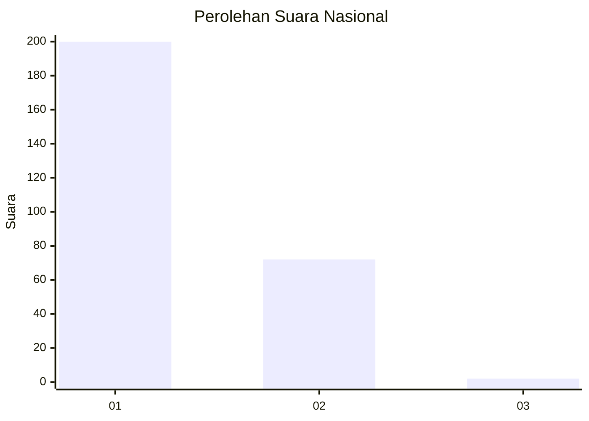
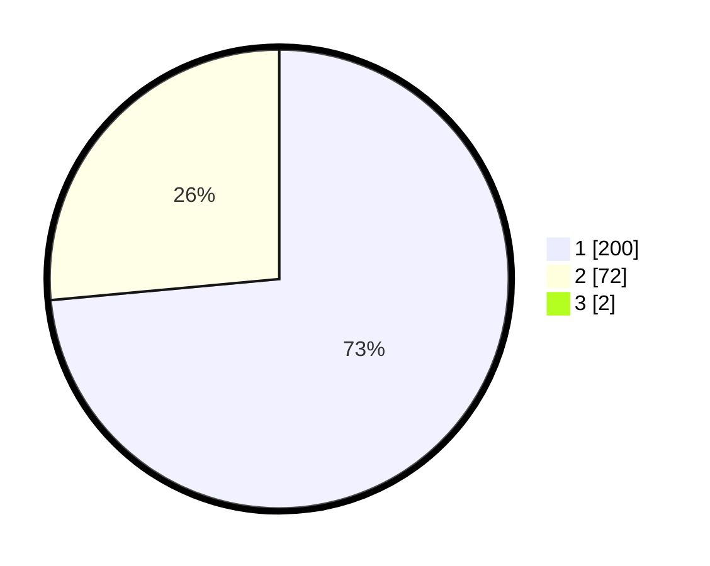

# Hasil

## Grafik

## Tabel

| No. | Nama Paslon    | Suara | Suara (raw) | Persentase |
|:--- |:-------------- | -----:| -----------:| ----------:|
| 1   | ANIES MUHAIMIN | 200   | [200][p-1]  | 72,99      |
| 2   | PRABOWO GIBRAN | 72    | [72][p-2]   | 26,28      |
| 3   | GANJAR MAHFUD  | 2     | [2][p-3]    | 0,73       |

[p-1]: https://github.com/gigit-pemilu/pemilu-2024/blob/main/pilpres/hitung-suara/sub/11-aceh/sub/75-kota-subulussalam/sub/01-simpang-kiri/sub/2007-subulussalam-barat/sub/003-tps/sub/paslon-1.txt
[p-2]: https://github.com/gigit-pemilu/pemilu-2024/blob/main/pilpres/hitung-suara/sub/11-aceh/sub/75-kota-subulussalam/sub/01-simpang-kiri/sub/2007-subulussalam-barat/sub/003-tps/sub/paslon-2.txt
[p-3]: https://github.com/gigit-pemilu/pemilu-2024/blob/main/pilpres/hitung-suara/sub/11-aceh/sub/75-kota-subulussalam/sub/01-simpang-kiri/sub/2007-subulussalam-barat/sub/003-tps/sub/paslon-3.txt

## Foto C Plano

https://sirekap-obj-formc.kpu.go.id/0573/pemilu/ppwp/11/75/01/20/07/1175012007003-20240226-102848--5a71f7a0-6126-4149-bca3-cd6d78822801.jpg

https://sirekap-obj-formc.kpu.go.id/0573/pemilu/ppwp/11/75/01/20/07/1175012007003-20240226-102759--63e84519-4653-4a4f-a834-65221bdb758c.jpg

https://sirekap-obj-formc.kpu.go.id/0573/pemilu/ppwp/11/75/01/20/07/1175012007003-20240226-102819--6b890ee8-325a-47e8-ba3b-69613155878d.jpg

## Metadata

| Key        | Value               |
| ---------- | ------------------- |
| Time Stamp | 2024-02-26 11:00:00 |

## DATA PEMILIH TETAP

Jumlah pemilih dalam DPT: **295**.
 * L: **829**.
 * P: **146**.

## DATA PENGGUNA HAK PILIH

Jumlah pengguna hak pilih dalam DPT: **243**.
 * L: **128**.
 * P: **821**.

Jumlah pengguna hak pilih dalam DPTb: **2**.
 * L: **82**.
 * P: **5**.

Jumlah pengguna hak pilih dalam DPK: **15**.
 * L: **10**.
 * P: **6**.

Jumlah pengguna hak pilih: **272**.
 * L: **140**.
 * P: **132**.

## JUMLAH SUARA SAH DAN TIDAK SAH

JUMLAH SELURUH SUARA SAH: **265**.

JUMLAH SUARA TIDAK SAH: **80**.

JUMLAH SELURUH SUARA SAH DAN SUARA TIDAK SAH: **275**.

