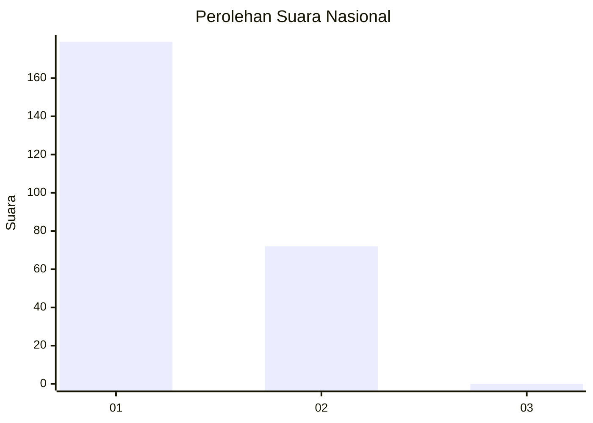
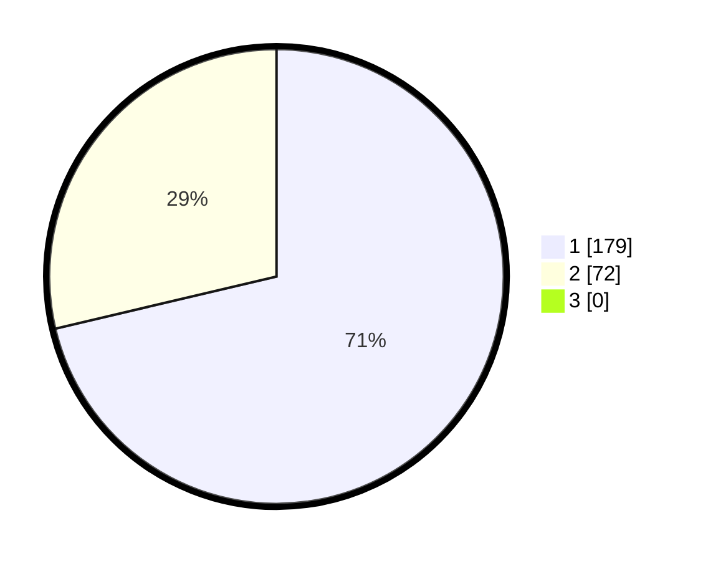

# Hasil

## Grafik

## Tabel

| No. | Nama Paslon    | Suara | Suara (raw) | Persentase |
|:--- |:-------------- | -----:| -----------:| ----------:|
| 1   | ANIES MUHAIMIN | 179   | [179][p-1]  | 71,31      |
| 2   | PRABOWO GIBRAN | 72    | [72][p-2]   | 28,69      |
| 3   | GANJAR MAHFUD  | 0     | [0][p-3]    | 0,00       |

[p-1]: https://github.com/gigit-pemilu/pemilu-2024/blob/main/pilpres/hitung-suara/sub/11-aceh/sub/75-kota-subulussalam/sub/01-simpang-kiri/sub/2007-subulussalam-barat/sub/004-tps/sub/paslon-1.txt
[p-2]: https://github.com/gigit-pemilu/pemilu-2024/blob/main/pilpres/hitung-suara/sub/11-aceh/sub/75-kota-subulussalam/sub/01-simpang-kiri/sub/2007-subulussalam-barat/sub/004-tps/sub/paslon-2.txt
[p-3]: https://github.com/gigit-pemilu/pemilu-2024/blob/main/pilpres/hitung-suara/sub/11-aceh/sub/75-kota-subulussalam/sub/01-simpang-kiri/sub/2007-subulussalam-barat/sub/004-tps/sub/paslon-3.txt

## Foto C Plano

https://sirekap-obj-formc.kpu.go.id/6e44/pemilu/ppwp/11/75/01/20/07/1175012007004-20240215-024643--8a81bdbd-0bef-41a2-8e81-a909c3bfdbb6.jpg

https://sirekap-obj-formc.kpu.go.id/6e44/pemilu/ppwp/11/75/01/20/07/1175012007004-20240215-024806--481178e0-b09b-4842-9f59-b9054c5d0dc3.jpg

https://sirekap-obj-formc.kpu.go.id/6e44/pemilu/ppwp/11/75/01/20/07/1175012007004-20240215-025306--2797c191-2e87-4502-992e-b631e29e65d5.jpg

## Metadata

| Key        | Value               |
| ---------- | ------------------- |
| Time Stamp | 2024-02-15 23:29:50 |

