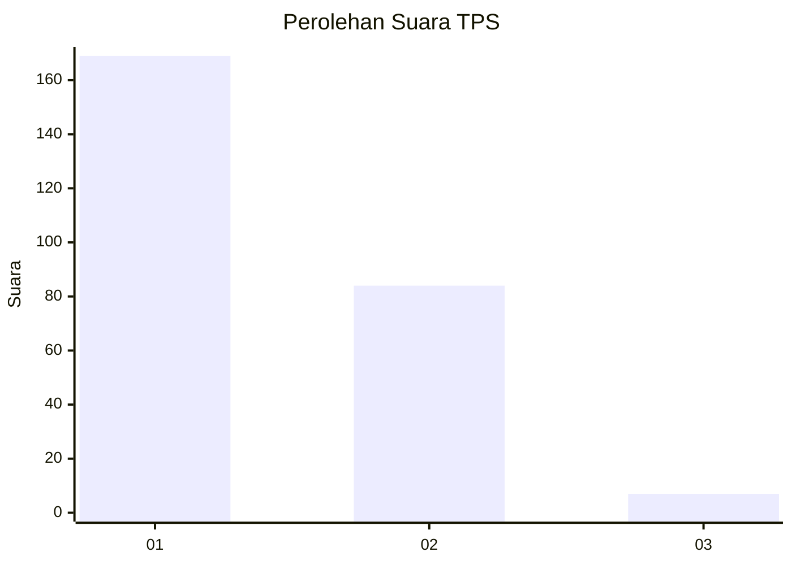
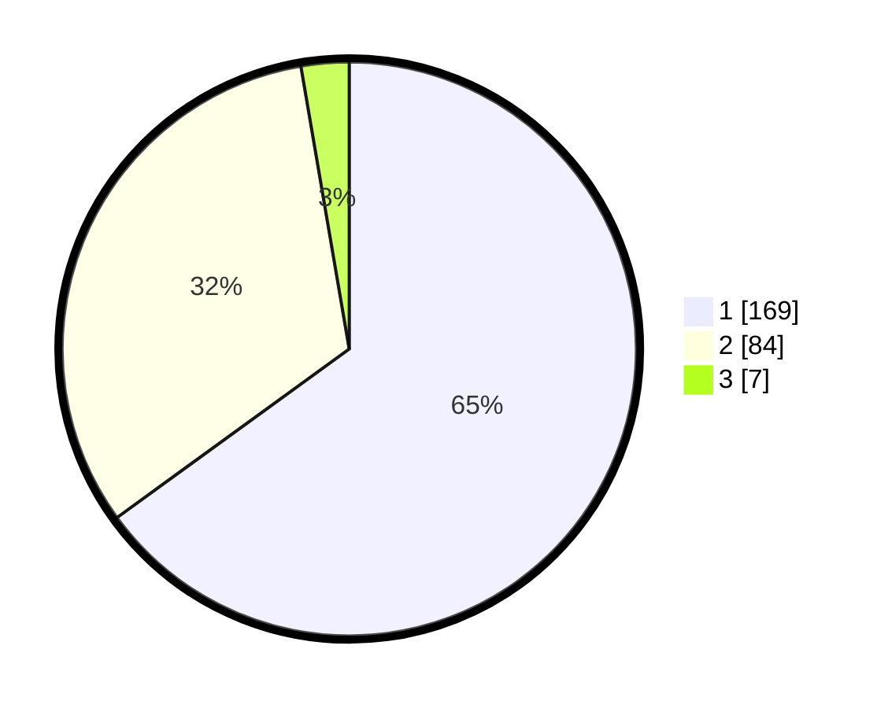

# Hasil

## Grafik

## Tabel

| No. | Nama Paslon    | Suara | Suara (raw) | Persentase |
|:--- |:-------------- | -----:| -----------:| ----------:|
| 1   | ANIES MUHAIMIN | 169   | [169][p-1]  | 65,00      |
| 2   | PRABOWO GIBRAN | 84    | [84][p-2]   | 32,31      |
| 3   | GANJAR MAHFUD  | 7     | [7][p-3]    | 2,69       |

[p-1]: https://github.com/gigit-pemilu/pemilu-2024-11-aceh/blob/main/pilpres/hitung-suara/sub/11-aceh/sub/75-kota-subulussalam/sub/01-simpang-kiri/sub/2007-subulussalam-barat/sub/005-tps/sub/paslon-1.txt
[p-2]: https://github.com/gigit-pemilu/pemilu-2024-11-aceh/blob/main/pilpres/hitung-suara/sub/11-aceh/sub/75-kota-subulussalam/sub/01-simpang-kiri/sub/2007-subulussalam-barat/sub/005-tps/sub/paslon-2.txt
[p-3]: https://github.com/gigit-pemilu/pemilu-2024-11-aceh/blob/main/pilpres/hitung-suara/sub/11-aceh/sub/75-kota-subulussalam/sub/01-simpang-kiri/sub/2007-subulussalam-barat/sub/005-tps/sub/paslon-3.txt

## Foto C Plano

https://sirekap-obj-formc.kpu.go.id/f85c/pemilu/ppwp/11/75/01/20/07/1175012007005-20240214-212735--fc6dd839-0172-425c-9146-e6cf42edc71c.jpg

https://sirekap-obj-formc.kpu.go.id/f85c/pemilu/ppwp/11/75/01/20/07/1175012007005-20240214-212426--6eaaf70b-f33b-4358-a1bd-87d096b6edb3.jpg

https://sirekap-obj-formc.kpu.go.id/f85c/pemilu/ppwp/11/75/01/20/07/1175012007005-20240214-212711--a42c68e9-d8f0-424c-8237-164db0cfd09e.jpg

## Metadata

| Key        | Value               |
| ---------- | ------------------- |
| Time Stamp | 2024-02-24 22:31:28 |

