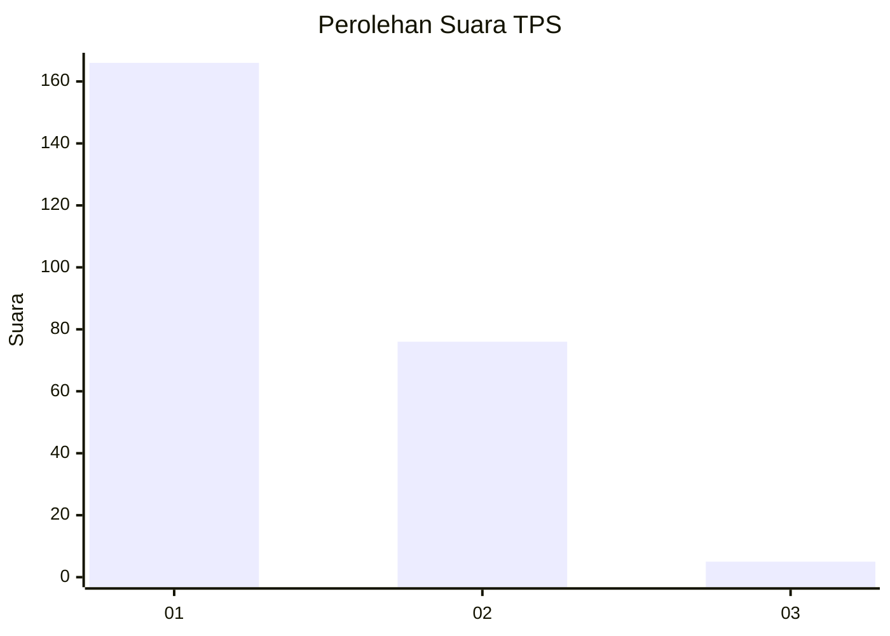
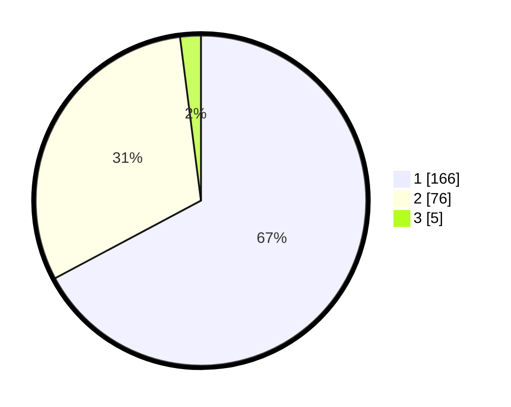

# Hasil

## Grafik

## Tabel

| No. | Nama Paslon    | Suara | Suara (raw) | Persentase |
|:--- |:-------------- | -----:| -----------:| ----------:|
| 1   | ANIES MUHAIMIN | 166   | [166][p-1]  | 67,21      |
| 2   | PRABOWO GIBRAN | 76    | [76][p-2]   | 30,77      |
| 3   | GANJAR MAHFUD  | 5     | [5][p-3]    | 2,02       |

[p-1]: https://github.com/gigit-pemilu/pemilu-2024-11-aceh/blob/main/pilpres/hitung-suara/sub/11-aceh/sub/75-kota-subulussalam/sub/01-simpang-kiri/sub/2007-subulussalam-barat/sub/007-tps/sub/paslon-1.txt
[p-2]: https://github.com/gigit-pemilu/pemilu-2024-11-aceh/blob/main/pilpres/hitung-suara/sub/11-aceh/sub/75-kota-subulussalam/sub/01-simpang-kiri/sub/2007-subulussalam-barat/sub/007-tps/sub/paslon-2.txt
[p-3]: https://github.com/gigit-pemilu/pemilu-2024-11-aceh/blob/main/pilpres/hitung-suara/sub/11-aceh/sub/75-kota-subulussalam/sub/01-simpang-kiri/sub/2007-subulussalam-barat/sub/007-tps/sub/paslon-3.txt

## Foto C Plano

https://sirekap-obj-formc.kpu.go.id/fdc8/pemilu/ppwp/11/75/01/20/07/1175012007007-20240214-212750--992054b0-d487-4584-b79c-6d1fa07b66dd.jpg

https://sirekap-obj-formc.kpu.go.id/fdc8/pemilu/ppwp/11/75/01/20/07/1175012007007-20240214-212857--2b5f4537-f9b4-4853-84d7-c2eca34a4877.jpg

https://sirekap-obj-formc.kpu.go.id/fdc8/pemilu/ppwp/11/75/01/20/07/1175012007007-20240214-213007--56e29ece-5fc3-419b-806a-13a96e032441.jpg

## Metadata

| Key        | Value               |
| ---------- | ------------------- |
| Time Stamp | 2024-02-15 23:29:50 |

