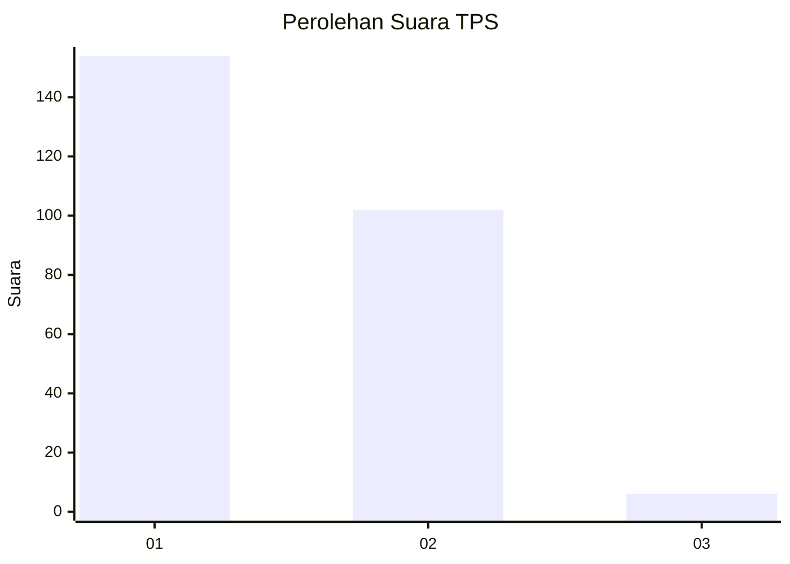
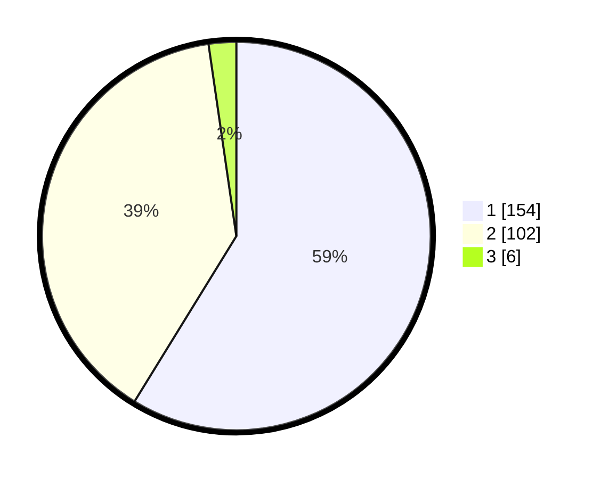

# Hasil

## Grafik

## Tabel

| No. | Nama Paslon    | Suara | Suara (raw) | Persentase |
|:--- |:-------------- | -----:| -----------:| ----------:|
| 1   | ANIES MUHAIMIN | 154   | [154][p-1]  | 58,78      |
| 2   | PRABOWO GIBRAN | 102   | [102][p-2]  | 38,93      |
| 3   | GANJAR MAHFUD  | 6     | [6][p-3]    | 2,29       |

[p-1]: https://github.com/gigit-pemilu/pemilu-2024-11-aceh/blob/main/pilpres/hitung-suara/sub/11-aceh/sub/75-kota-subulussalam/sub/01-simpang-kiri/sub/2008-suka-makmur/sub/002-tps/sub/paslon-1.txt
[p-2]: https://github.com/gigit-pemilu/pemilu-2024-11-aceh/blob/main/pilpres/hitung-suara/sub/11-aceh/sub/75-kota-subulussalam/sub/01-simpang-kiri/sub/2008-suka-makmur/sub/002-tps/sub/paslon-2.txt
[p-3]: https://github.com/gigit-pemilu/pemilu-2024-11-aceh/blob/main/pilpres/hitung-suara/sub/11-aceh/sub/75-kota-subulussalam/sub/01-simpang-kiri/sub/2008-suka-makmur/sub/002-tps/sub/paslon-3.txt

## Foto C Plano

https://sirekap-obj-formc.kpu.go.id/fde8/pemilu/ppwp/11/75/01/20/08/1175012008002-20240215-093601--c7a2775f-35c3-447a-b009-95302153a639.jpg

https://sirekap-obj-formc.kpu.go.id/fde8/pemilu/ppwp/11/75/01/20/08/1175012008002-20240215-094939--ef32374e-e720-400b-b31a-fca9f06baa37.jpg

https://sirekap-obj-formc.kpu.go.id/fde8/pemilu/ppwp/11/75/01/20/08/1175012008002-20240215-094720--4bfb80e9-b058-4a01-9d22-6dfa80515301.jpg

## Metadata

| Key        | Value               |
| ---------- | ------------------- |
| Time Stamp | 2024-02-24 22:31:28 |

