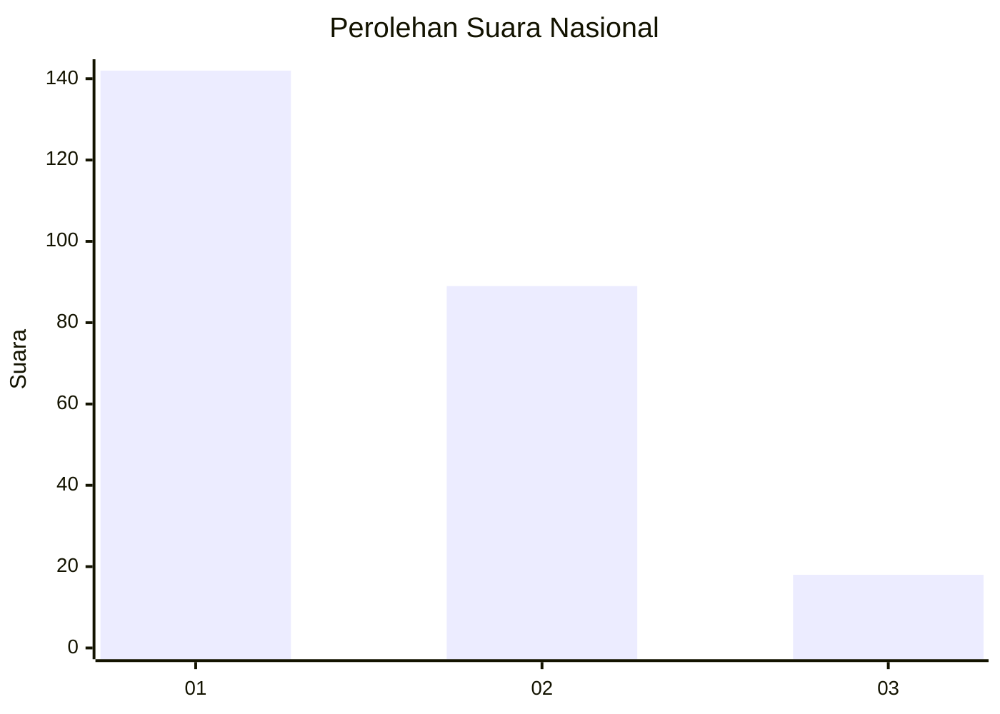
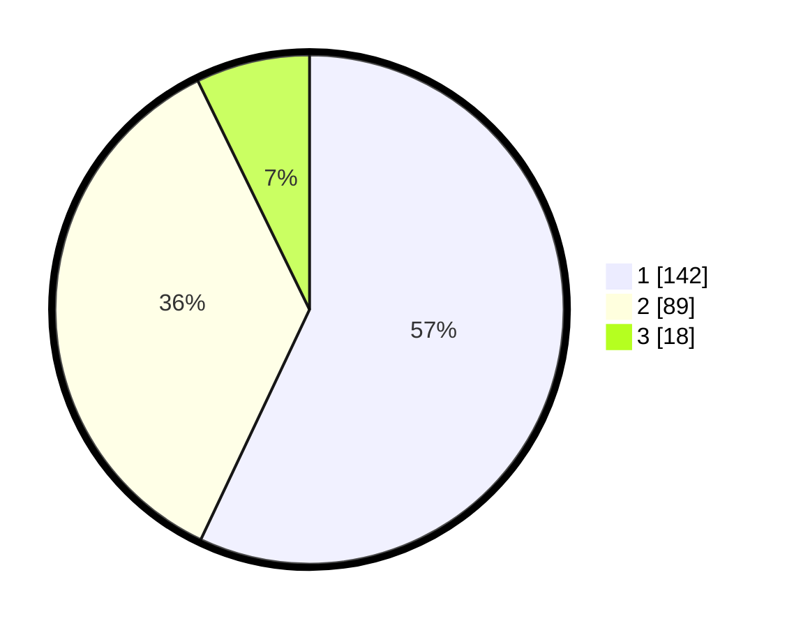

# Hasil

## Grafik

## Tabel

| No. | Nama Paslon    | Suara | Suara (raw) | Persentase |
|:--- |:-------------- | -----:| -----------:| ----------:|
| 1   | ANIES MUHAIMIN | 142   | [142][p-1]  | 57,03      |
| 2   | PRABOWO GIBRAN | 89    | [89][p-2]   | 35,74      |
| 3   | GANJAR MAHFUD  | 18    | [18][p-3]   | 7,23       |

[p-1]: https://github.com/gigit-pemilu/pemilu-2024/blob/main/pilpres/hitung-suara/sub/11-aceh/sub/75-kota-subulussalam/sub/01-simpang-kiri/sub/2008-suka-makmur/sub/003-tps/sub/paslon-1.txt
[p-2]: https://github.com/gigit-pemilu/pemilu-2024/blob/main/pilpres/hitung-suara/sub/11-aceh/sub/75-kota-subulussalam/sub/01-simpang-kiri/sub/2008-suka-makmur/sub/003-tps/sub/paslon-2.txt
[p-3]: https://github.com/gigit-pemilu/pemilu-2024/blob/main/pilpres/hitung-suara/sub/11-aceh/sub/75-kota-subulussalam/sub/01-simpang-kiri/sub/2008-suka-makmur/sub/003-tps/sub/paslon-3.txt

## Foto C Plano

https://sirekap-obj-formc.kpu.go.id/c6c0/pemilu/ppwp/11/75/01/20/08/1175012008003-20240215-071152--7f8970f5-70f0-40e7-b0ca-23524bbd3cf6.jpg

https://sirekap-obj-formc.kpu.go.id/c6c0/pemilu/ppwp/11/75/01/20/08/1175012008003-20240215-071256--595b3507-b985-418b-826c-749fc8911f4d.jpg

https://sirekap-obj-formc.kpu.go.id/c6c0/pemilu/ppwp/11/75/01/20/08/1175012008003-20240215-071407--66cd759d-2791-4b03-8fcf-5383831009fe.jpg

## Metadata

| Key        | Value               |
| ---------- | ------------------- |
| Time Stamp | 2024-02-15 23:29:50 |

