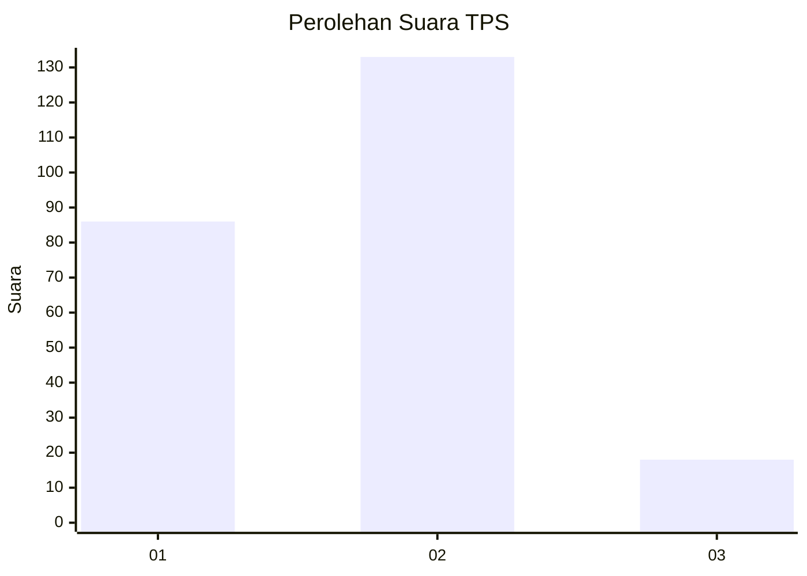

# Hasil

## Grafik

## Tabel

| No. | Nama Paslon    | Suara | Suara (raw) | Persentase |
|:--- |:-------------- | -----:| -----------:| ----------:|
| 1   | ANIES MUHAIMIN | 86    | [86][p-1]   | 36,29      |
| 2   | PRABOWO GIBRAN | 133   | [133][p-2]  | 56,12      |
| 3   | GANJAR MAHFUD  | 18    | [18][p-3]   | 7,59       |

[p-1]: https://github.com/gigit-pemilu/pemilu-2024-11-aceh/blob/main/pilpres/hitung-suara/sub/11-aceh/sub/75-kota-subulussalam/sub/01-simpang-kiri/sub/2008-suka-makmur/sub/004-tps/sub/paslon-1.txt
[p-2]: https://github.com/gigit-pemilu/pemilu-2024-11-aceh/blob/main/pilpres/hitung-suara/sub/11-aceh/sub/75-kota-subulussalam/sub/01-simpang-kiri/sub/2008-suka-makmur/sub/004-tps/sub/paslon-2.txt
[p-3]: https://github.com/gigit-pemilu/pemilu-2024-11-aceh/blob/main/pilpres/hitung-suara/sub/11-aceh/sub/75-kota-subulussalam/sub/01-simpang-kiri/sub/2008-suka-makmur/sub/004-tps/sub/paslon-3.txt

## Foto C Plano

https://sirekap-obj-formc.kpu.go.id/c923/pemilu/ppwp/11/75/01/20/08/1175012008004-20240225-172256--7c553d61-10a1-47a4-8edc-59be43ee7094.jpg

https://sirekap-obj-formc.kpu.go.id/c923/pemilu/ppwp/11/75/01/20/08/1175012008004-20240225-172319--184fd669-a1ec-4ac5-b0e2-26f3924e3e84.jpg

https://sirekap-obj-formc.kpu.go.id/c923/pemilu/ppwp/11/75/01/20/08/1175012008004-20240225-172343--46340c53-16ae-4048-ad74-8c19204b73b3.jpg

## Metadata

| Key        | Value               |
| ---------- | ------------------- |
| Time Stamp | 2024-02-25 18:00:00 |

## DATA PEMILIH TETAP

Jumlah pemilih dalam DPT: **452**.
 * L: **901**.
 * P: **451**.

## DATA PENGGUNA HAK PILIH

Jumlah pengguna hak pilih dalam DPT: **255**.
 * L: **139**.
 * P: **116**.

Jumlah pengguna hak pilih dalam DPTb: **4**.
 * L: **2**.
 * P: **2**.

Jumlah pengguna hak pilih dalam DPK: **0**.
 * L: **200**.
 * P: **0**.

Jumlah pengguna hak pilih: **259**.
 * L: **141**.
 * P: **118**.

## JUMLAH SUARA SAH DAN TIDAK SAH

JUMLAH SELURUH SUARA SAH: **237**.

JUMLAH SUARA TIDAK SAH: **22**.

JUMLAH SELURUH SUARA SAH DAN SUARA TIDAK SAH: **259**.

