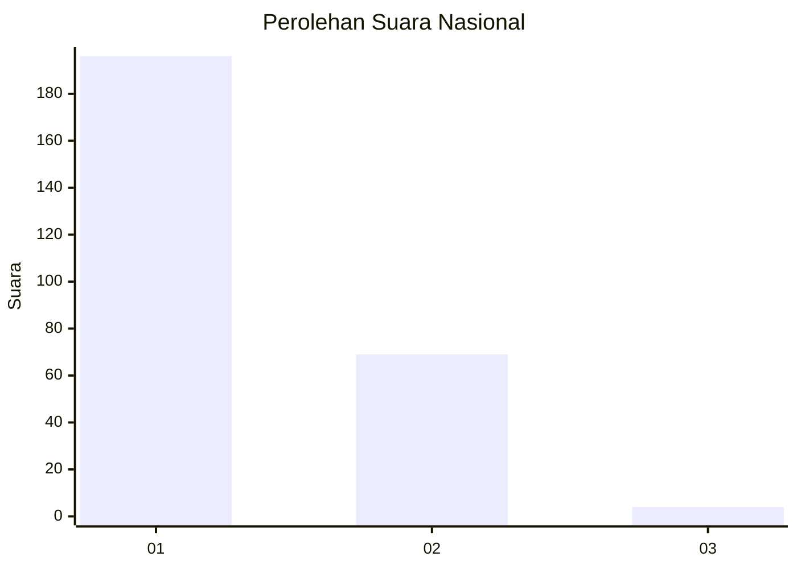
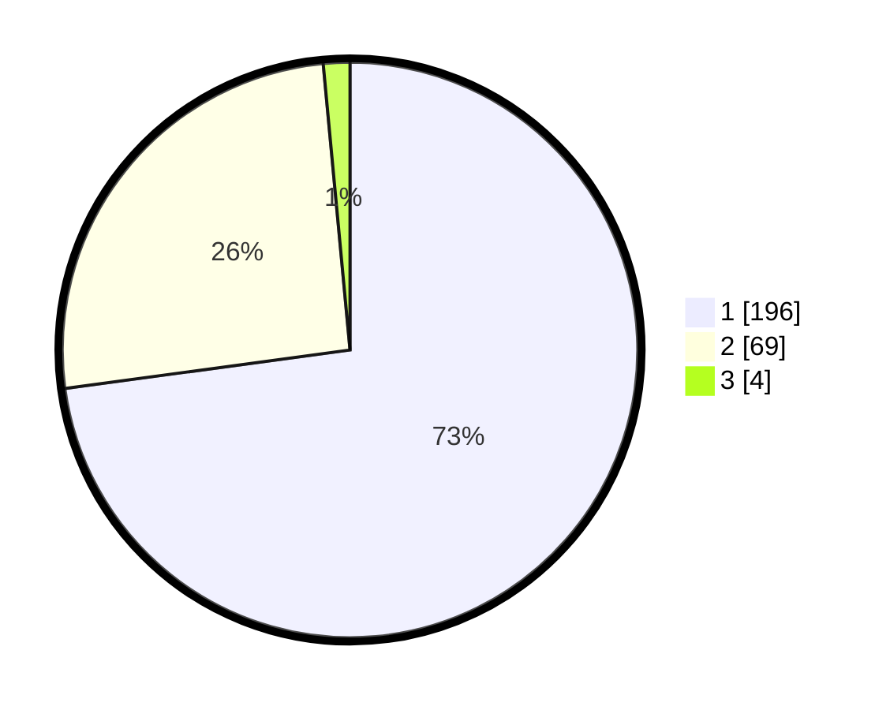

# Hasil

## Grafik

## Tabel

| No. | Nama Paslon    | Suara | Suara (raw) | Persentase |
|:--- |:-------------- | -----:| -----------:| ----------:|
| 1   | ANIES MUHAIMIN | 196   | [196][p-1]  | 72,86      |
| 2   | PRABOWO GIBRAN | 69    | [69][p-2]   | 25,65      |
| 3   | GANJAR MAHFUD  | 4     | [4][p-3]    | 1,49       |

[p-1]: https://github.com/gigit-pemilu/pemilu-2024/blob/main/pilpres/hitung-suara/sub/11-aceh/sub/75-kota-subulussalam/sub/01-simpang-kiri/sub/2009-tangga-besi/sub/002-tps/sub/paslon-1.txt
[p-2]: https://github.com/gigit-pemilu/pemilu-2024/blob/main/pilpres/hitung-suara/sub/11-aceh/sub/75-kota-subulussalam/sub/01-simpang-kiri/sub/2009-tangga-besi/sub/002-tps/sub/paslon-2.txt
[p-3]: https://github.com/gigit-pemilu/pemilu-2024/blob/main/pilpres/hitung-suara/sub/11-aceh/sub/75-kota-subulussalam/sub/01-simpang-kiri/sub/2009-tangga-besi/sub/002-tps/sub/paslon-3.txt

## Foto C Plano

https://sirekap-obj-formc.kpu.go.id/a067/pemilu/ppwp/11/75/01/20/09/1175012009002-20240214-193652--2af327c1-dd5e-4179-90ab-71ec2c8fecdd.jpg

https://sirekap-obj-formc.kpu.go.id/a067/pemilu/ppwp/11/75/01/20/09/1175012009002-20240215-005859--75e56d44-e10a-4411-83d8-0e40c6d13d01.jpg

https://sirekap-obj-formc.kpu.go.id/a067/pemilu/ppwp/11/75/01/20/09/1175012009002-20240215-010017--4d6c5a12-f6d6-42a7-97ee-4bf9dc1822f5.jpg

## Metadata

| Key        | Value               |
| ---------- | ------------------- |
| Time Stamp | 2024-02-15 23:29:50 |

## DATA PEMILIH TETAP

Jumlah pemilih dalam DPT: **275**.
 * L: **146**.
 * P: **129**.

## DATA PENGGUNA HAK PILIH

Jumlah pengguna hak pilih dalam DPT: **261**.
 * L: **134**.
 * P: **124**.

Jumlah pengguna hak pilih dalam DPTb: **14**.
 * L: **10**.
 * P: **4**.

Jumlah pengguna hak pilih dalam DPK: **4**.
 * L: **3**.
 * P: **1**.

Jumlah pengguna hak pilih: **276**.
 * L: **147**.
 * P: **129**.

## JUMLAH SUARA SAH DAN TIDAK SAH

JUMLAH SELURUH SUARA SAH: **269**.

JUMLAH SUARA TIDAK SAH: **7**.

JUMLAH SELURUH SUARA SAH DAN SUARA TIDAK SAH: **276**.

