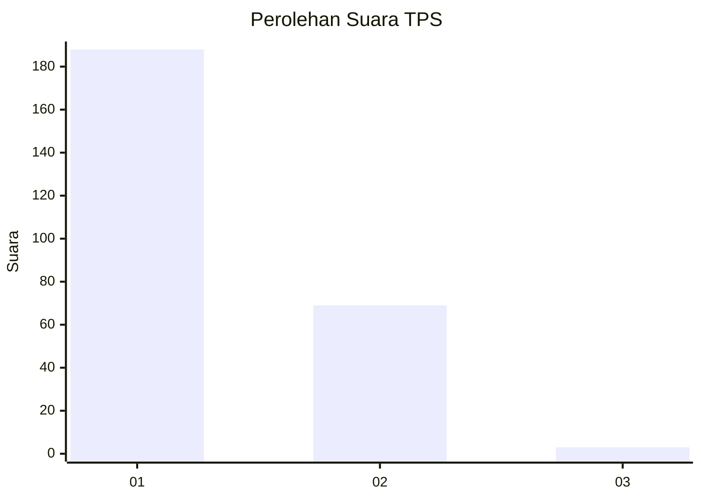
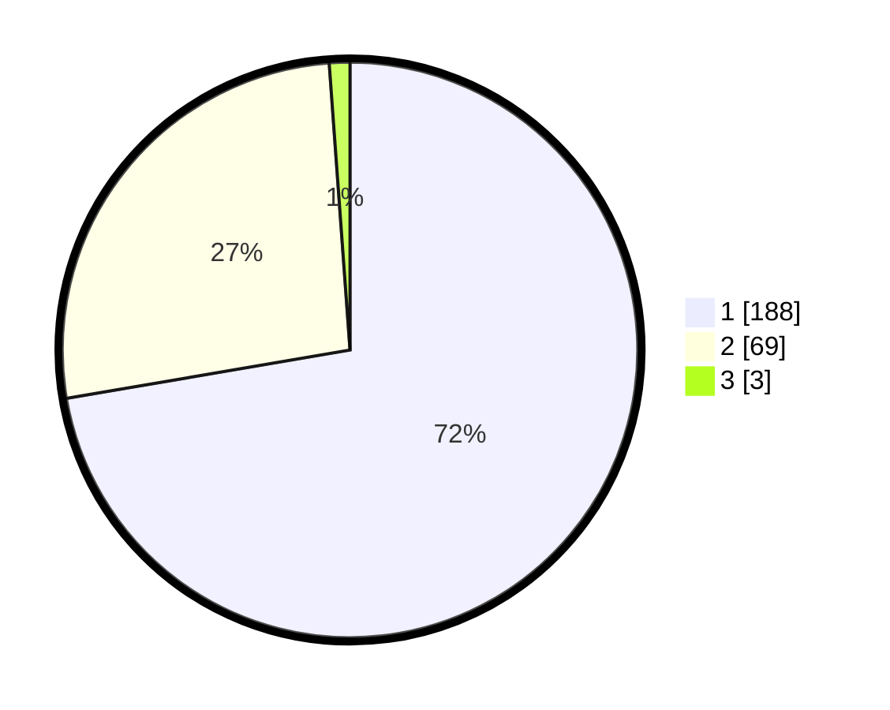

# Hasil

## Grafik

## Tabel

| No. | Nama Paslon    | Suara | Suara (raw) | Persentase |
|:--- |:-------------- | -----:| -----------:| ----------:|
| 1   | ANIES MUHAIMIN | 188   | [188][p-1]  | 72,31      |
| 2   | PRABOWO GIBRAN | 69    | [69][p-2]   | 26,54      |
| 3   | GANJAR MAHFUD  | 3     | [3][p-3]    | 1,15       |

[p-1]: https://github.com/gigit-pemilu/pemilu-2024-11-aceh/blob/main/pilpres/hitung-suara/sub/11-aceh/sub/75-kota-subulussalam/sub/01-simpang-kiri/sub/2009-tangga-besi/sub/003-tps/sub/paslon-1.txt
[p-2]: https://github.com/gigit-pemilu/pemilu-2024-11-aceh/blob/main/pilpres/hitung-suara/sub/11-aceh/sub/75-kota-subulussalam/sub/01-simpang-kiri/sub/2009-tangga-besi/sub/003-tps/sub/paslon-2.txt
[p-3]: https://github.com/gigit-pemilu/pemilu-2024-11-aceh/blob/main/pilpres/hitung-suara/sub/11-aceh/sub/75-kota-subulussalam/sub/01-simpang-kiri/sub/2009-tangga-besi/sub/003-tps/sub/paslon-3.txt

## Foto C Plano

https://sirekap-obj-formc.kpu.go.id/1e9b/pemilu/ppwp/11/75/01/20/09/1175012009003-20240214-213533--43148636-38e3-4e1c-9a2a-74d11ac0d647.jpg

https://sirekap-obj-formc.kpu.go.id/1e9b/pemilu/ppwp/11/75/01/20/09/1175012009003-20240214-213618--023b28c8-a9dc-4a44-8200-98eb317d654a.jpg

https://sirekap-obj-formc.kpu.go.id/1e9b/pemilu/ppwp/11/75/01/20/09/1175012009003-20240214-213645--e4565065-2993-413d-9998-2ae1e59f059e.jpg

## Metadata

| Key        | Value               |
| ---------- | ------------------- |
| Time Stamp | 2024-02-15 23:29:50 |

