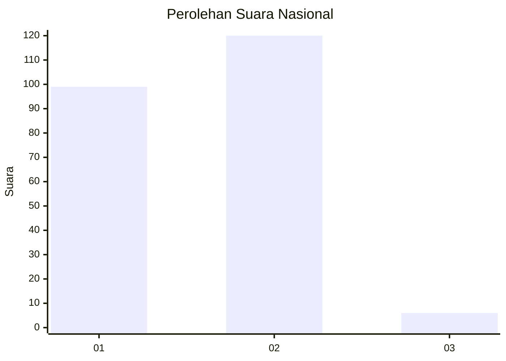
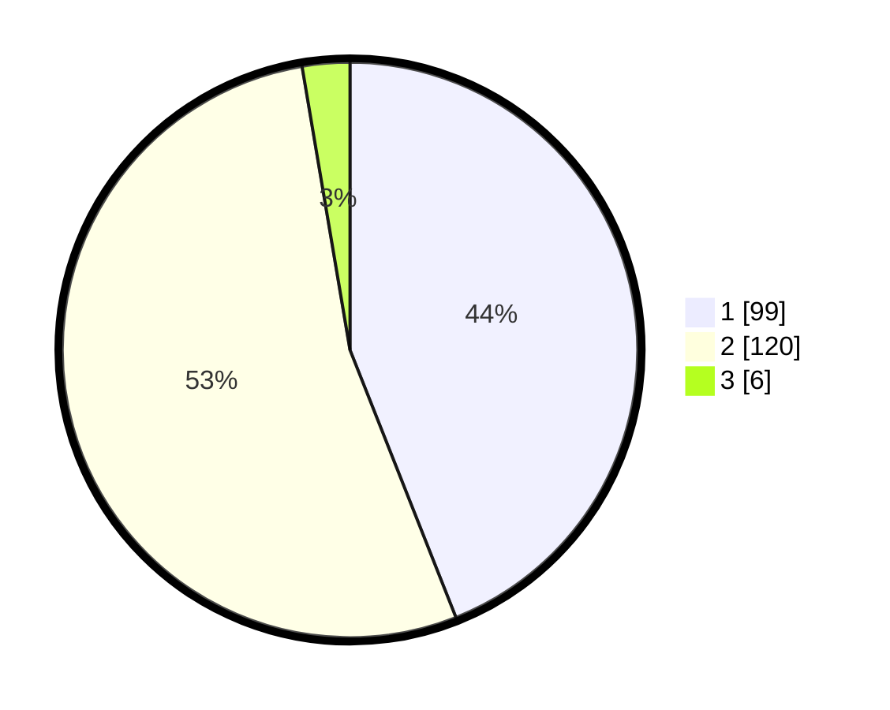

# Hasil

## Grafik

## Tabel

| No. | Nama Paslon    | Suara | Suara (raw) | Persentase |
|:--- |:-------------- | -----:| -----------:| ----------:|
| 1   | ANIES MUHAIMIN | 99    | [99][p-1]   | 44,00      |
| 2   | PRABOWO GIBRAN | 120   | [120][p-2]  | 53,33      |
| 3   | GANJAR MAHFUD  | 6     | [6][p-3]    | 2,67       |

[p-1]: https://github.com/gigit-pemilu/pemilu-2024/blob/main/pilpres/hitung-suara/sub/11-aceh/sub/75-kota-subulussalam/sub/01-simpang-kiri/sub/2011-pasar-panjang/sub/001-tps/sub/paslon-1.txt
[p-2]: https://github.com/gigit-pemilu/pemilu-2024/blob/main/pilpres/hitung-suara/sub/11-aceh/sub/75-kota-subulussalam/sub/01-simpang-kiri/sub/2011-pasar-panjang/sub/001-tps/sub/paslon-2.txt
[p-3]: https://github.com/gigit-pemilu/pemilu-2024/blob/main/pilpres/hitung-suara/sub/11-aceh/sub/75-kota-subulussalam/sub/01-simpang-kiri/sub/2011-pasar-panjang/sub/001-tps/sub/paslon-3.txt

## Foto C Plano

https://sirekap-obj-formc.kpu.go.id/76a1/pemilu/ppwp/11/75/01/20/11/1175012011001-20240219-210159--c94385ce-013c-4c16-b182-65366769f232.jpg

https://sirekap-obj-formc.kpu.go.id/76a1/pemilu/ppwp/11/75/01/20/11/1175012011001-20240219-210217--298e2f25-2124-4b42-8c8b-0f50147af594.jpg

https://sirekap-obj-formc.kpu.go.id/76a1/pemilu/ppwp/11/75/01/20/11/1175012011001-20240219-210235--a5771a13-177a-4989-9eaa-4ce993ae4021.jpg

## Metadata

| Key        | Value               |
| ---------- | ------------------- |
| Time Stamp | 2024-02-20 14:00:00 |

## DATA PEMILIH TETAP

Jumlah pemilih dalam DPT: **246**.
 * L: **327**.
 * P: **369**.

## DATA PENGGUNA HAK PILIH

Jumlah pengguna hak pilih dalam DPT: **223**.
 * L: **803**.
 * P: **321**.

Jumlah pengguna hak pilih dalam DPTb: **563**.
 * L: **302**.
 * P: **821**.

Jumlah pengguna hak pilih dalam DPK: **420**.
 * L: **487**.
 * P: **743**.

Jumlah pengguna hak pilih: **233**.
 * L: **220**.
 * P: **725**.

## JUMLAH SUARA SAH DAN TIDAK SAH

JUMLAH SELURUH SUARA SAH: **225**.

JUMLAH SUARA TIDAK SAH: **10**.

JUMLAH SELURUH SUARA SAH DAN SUARA TIDAK SAH: **235**.

