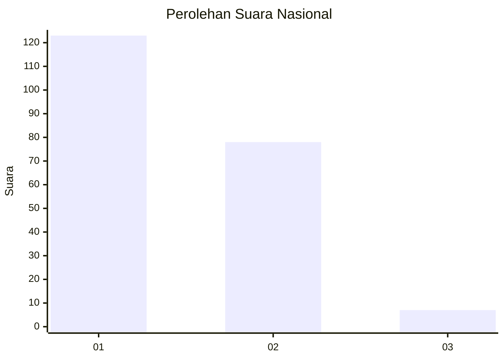
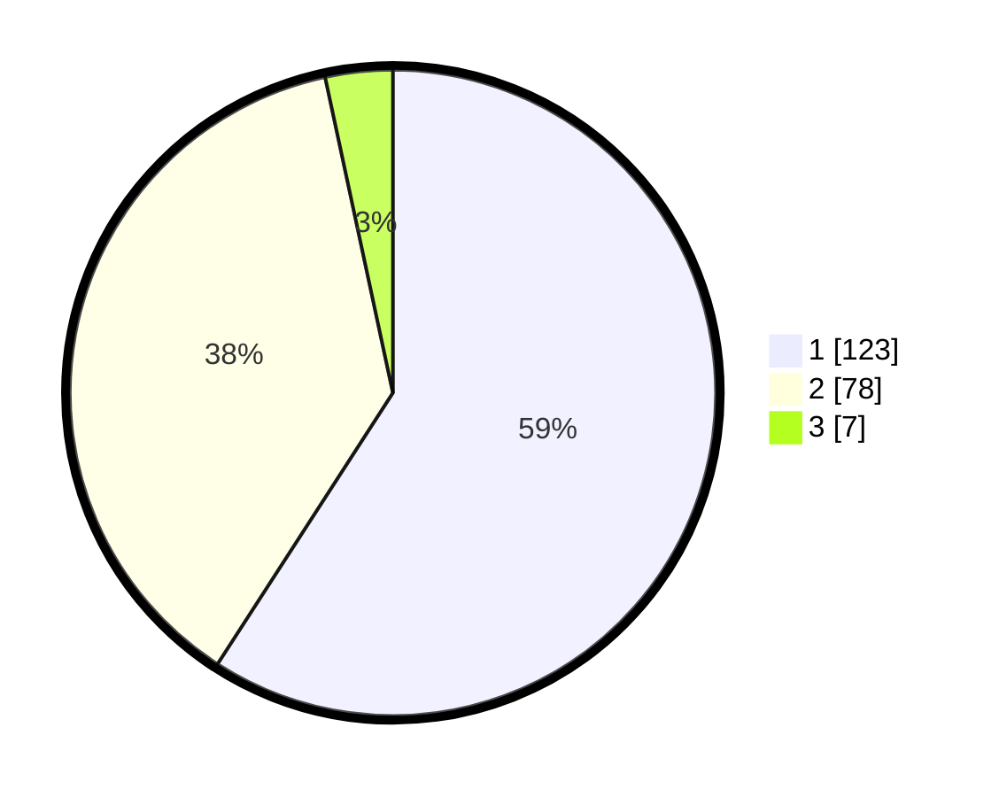

# Hasil

## Grafik

## Tabel

| No. | Nama Paslon    | Suara | Suara (raw) | Persentase |
|:--- |:-------------- | -----:| -----------:| ----------:|
| 1   | ANIES MUHAIMIN | 123   | [123][p-1]  | 59,13      |
| 2   | PRABOWO GIBRAN | 78    | [78][p-2]   | 37,50      |
| 3   | GANJAR MAHFUD  | 7     | [7][p-3]    | 3,37       |

[p-1]: https://github.com/gigit-pemilu/pemilu-2024/blob/main/pilpres/hitung-suara/sub/11-aceh/sub/75-kota-subulussalam/sub/01-simpang-kiri/sub/2011-pasar-panjang/sub/003-tps/sub/paslon-1.txt
[p-2]: https://github.com/gigit-pemilu/pemilu-2024/blob/main/pilpres/hitung-suara/sub/11-aceh/sub/75-kota-subulussalam/sub/01-simpang-kiri/sub/2011-pasar-panjang/sub/003-tps/sub/paslon-2.txt
[p-3]: https://github.com/gigit-pemilu/pemilu-2024/blob/main/pilpres/hitung-suara/sub/11-aceh/sub/75-kota-subulussalam/sub/01-simpang-kiri/sub/2011-pasar-panjang/sub/003-tps/sub/paslon-3.txt

## Foto C Plano

https://sirekap-obj-formc.kpu.go.id/f135/pemilu/ppwp/11/75/01/20/11/1175012011003-20240220-095614--5d14712b-49d7-4d8f-8365-6b411b3e589e.jpg

https://sirekap-obj-formc.kpu.go.id/f135/pemilu/ppwp/11/75/01/20/11/1175012011003-20240220-095631--250a5a65-047d-43e9-8182-0e00971231d7.jpg

https://sirekap-obj-formc.kpu.go.id/f135/pemilu/ppwp/11/75/01/20/11/1175012011003-20240220-095700--86c63e20-d152-456a-80b2-596d6b215d64.jpg

## Metadata

| Key        | Value               |
| ---------- | ------------------- |
| Time Stamp | 2024-02-20 14:00:00 |

## DATA PEMILIH TETAP

Jumlah pemilih dalam DPT: **227**.
 * L: **119**.
 * P: **113**.

## DATA PENGGUNA HAK PILIH

Jumlah pengguna hak pilih dalam DPT: **282**.
 * L: **185**.
 * P: **184**.

Jumlah pengguna hak pilih dalam DPTb: **883**.
 * L: **801**.
 * P: **887**.

Jumlah pengguna hak pilih dalam DPK: **887**.
 * L: **401**.
 * P: **886**.

Jumlah pengguna hak pilih: **322**.
 * L: **187**.
 * P: **815**.

## JUMLAH SUARA SAH DAN TIDAK SAH

JUMLAH SELURUH SUARA SAH: **208**.

JUMLAH SUARA TIDAK SAH: **14**.

JUMLAH SELURUH SUARA SAH DAN SUARA TIDAK SAH: **222**.

