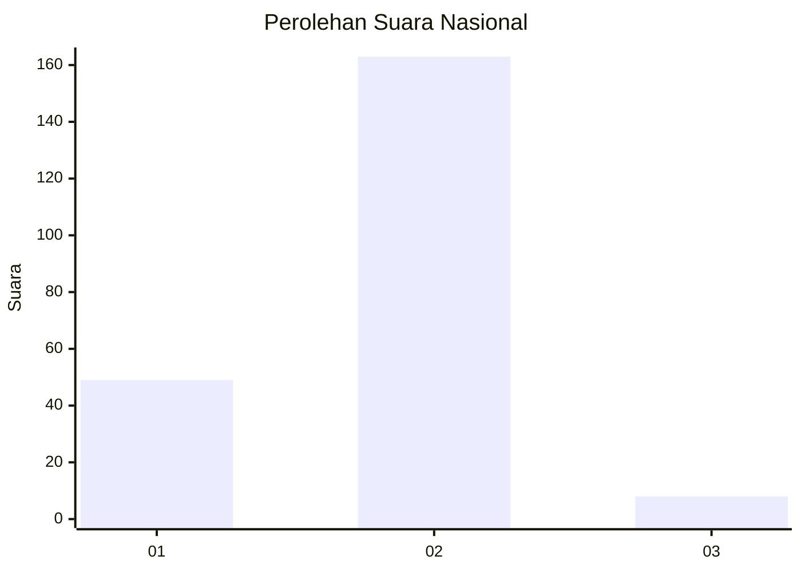

# Hasil

## Grafik

## Tabel

| No. | Nama Paslon    | Suara | Suara (raw) | Persentase |
|:--- |:-------------- | -----:| -----------:| ----------:|
| 1   | ANIES MUHAIMIN | 49    | [49][p-1]   | 22,27      |
| 2   | PRABOWO GIBRAN | 163   | [163][p-2]  | 74,09      |
| 3   | GANJAR MAHFUD  | 8     | [8][p-3]    | 3,64       |

[p-1]: https://github.com/gigit-pemilu/pemilu-2024/blob/main/pilpres/hitung-suara/sub/11-aceh/sub/75-kota-subulussalam/sub/01-simpang-kiri/sub/2012-mukti-makmur/sub/001-tps/sub/paslon-1.txt
[p-2]: https://github.com/gigit-pemilu/pemilu-2024/blob/main/pilpres/hitung-suara/sub/11-aceh/sub/75-kota-subulussalam/sub/01-simpang-kiri/sub/2012-mukti-makmur/sub/001-tps/sub/paslon-2.txt
[p-3]: https://github.com/gigit-pemilu/pemilu-2024/blob/main/pilpres/hitung-suara/sub/11-aceh/sub/75-kota-subulussalam/sub/01-simpang-kiri/sub/2012-mukti-makmur/sub/001-tps/sub/paslon-3.txt

## Foto C Plano

https://sirekap-obj-formc.kpu.go.id/ab86/pemilu/ppwp/11/75/01/20/12/1175012012001-20240214-202121--d148f72d-e01b-4eee-a297-bb0a00d72279.jpg

https://sirekap-obj-formc.kpu.go.id/ab86/pemilu/ppwp/11/75/01/20/12/1175012012001-20240214-202447--10a5d92a-e41b-4414-bd9a-653efa6c7910.jpg

https://sirekap-obj-formc.kpu.go.id/ab86/pemilu/ppwp/11/75/01/20/12/1175012012001-20240215-031648--0294cd8e-3f90-454c-81a8-1818e9ce0c74.jpg

## Metadata

| Key        | Value               |
| ---------- | ------------------- |
| Time Stamp | 2024-02-15 05:00:24 |

