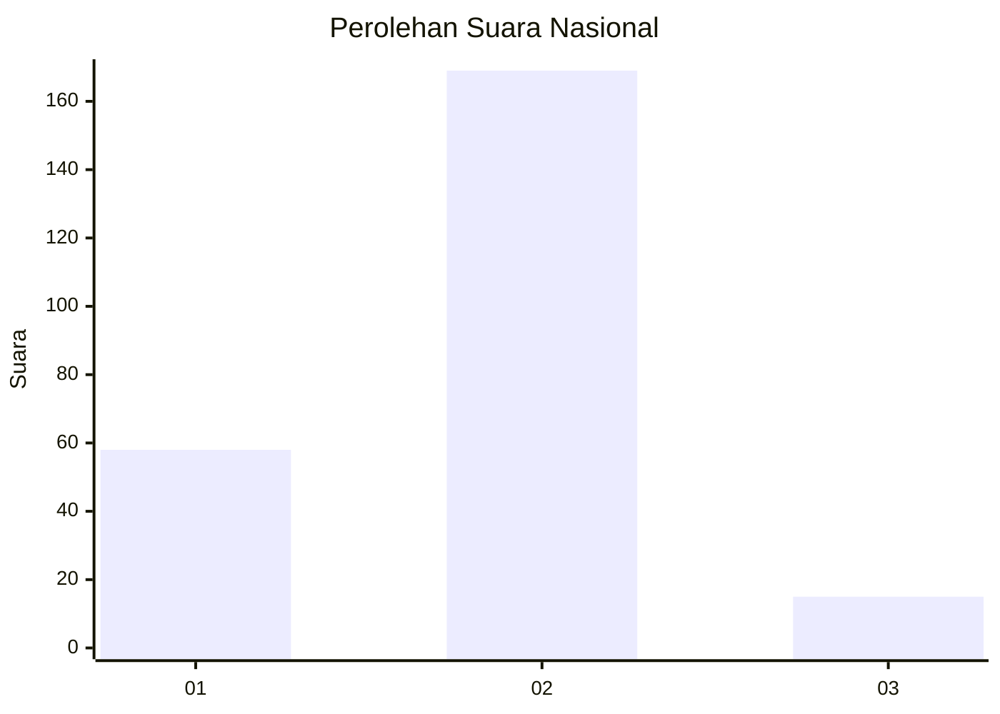

# Hasil

## Grafik

## Tabel

| No. | Nama Paslon    | Suara | Suara (raw) | Persentase |
|:--- |:-------------- | -----:| -----------:| ----------:|
| 1   | ANIES MUHAIMIN | 58    | [58][p-1]   | 23,97      |
| 2   | PRABOWO GIBRAN | 169   | [169][p-2]  | 69,83      |
| 3   | GANJAR MAHFUD  | 15    | [15][p-3]   | 6,20       |

[p-1]: https://github.com/gigit-pemilu/pemilu-2024/blob/main/pilpres/hitung-suara/sub/11-aceh/sub/75-kota-subulussalam/sub/01-simpang-kiri/sub/2012-mukti-makmur/sub/003-tps/sub/paslon-1.txt
[p-2]: https://github.com/gigit-pemilu/pemilu-2024/blob/main/pilpres/hitung-suara/sub/11-aceh/sub/75-kota-subulussalam/sub/01-simpang-kiri/sub/2012-mukti-makmur/sub/003-tps/sub/paslon-2.txt
[p-3]: https://github.com/gigit-pemilu/pemilu-2024/blob/main/pilpres/hitung-suara/sub/11-aceh/sub/75-kota-subulussalam/sub/01-simpang-kiri/sub/2012-mukti-makmur/sub/003-tps/sub/paslon-3.txt

## Foto C Plano

https://sirekap-obj-formc.kpu.go.id/f415/pemilu/ppwp/11/75/01/20/12/1175012012003-20240217-200312--fd341c88-077e-4a0b-9927-cb4912617fa7.jpg

https://sirekap-obj-formc.kpu.go.id/f415/pemilu/ppwp/11/75/01/20/12/1175012012003-20240214-190640--f22a84e0-62c3-45f6-8acd-179284868dca.jpg

https://sirekap-obj-formc.kpu.go.id/f415/pemilu/ppwp/11/75/01/20/12/1175012012003-20240214-190627--f10094b7-522d-4b9a-ac7d-2432c52749d7.jpg

## Metadata

| Key        | Value               |
| ---------- | ------------------- |
| Time Stamp | 2024-02-19 06:16:00 |

