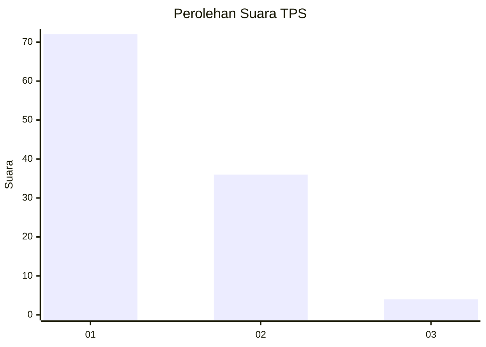
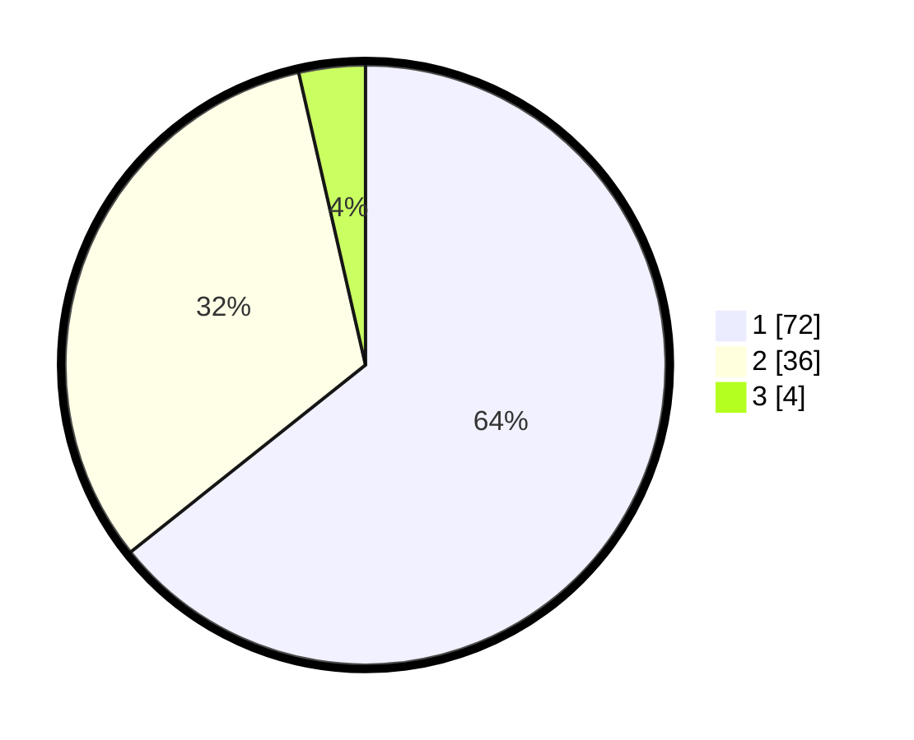

# Hasil

## Grafik

## Tabel

| No. | Nama Paslon    | Suara | Suara (raw) | Persentase |
|:--- |:-------------- | -----:| -----------:| ----------:|
| 1   | ANIES MUHAIMIN | 72    | [72][p-1]   | 64,29      |
| 2   | PRABOWO GIBRAN | 36    | [36][p-2]   | 32,14      |
| 3   | GANJAR MAHFUD  | 4     | [4][p-3]    | 3,57       |

[p-1]: https://github.com/gigit-pemilu/pemilu-2024-11-aceh/blob/main/pilpres/hitung-suara/sub/11-aceh/sub/75-kota-subulussalam/sub/01-simpang-kiri/sub/2013-lae-oram/sub/005-tps/sub/paslon-1.txt
[p-2]: https://github.com/gigit-pemilu/pemilu-2024-11-aceh/blob/main/pilpres/hitung-suara/sub/11-aceh/sub/75-kota-subulussalam/sub/01-simpang-kiri/sub/2013-lae-oram/sub/005-tps/sub/paslon-2.txt
[p-3]: https://github.com/gigit-pemilu/pemilu-2024-11-aceh/blob/main/pilpres/hitung-suara/sub/11-aceh/sub/75-kota-subulussalam/sub/01-simpang-kiri/sub/2013-lae-oram/sub/005-tps/sub/paslon-3.txt

## Foto C Plano

https://sirekap-obj-formc.kpu.go.id/8a66/pemilu/ppwp/11/75/01/20/13/1175012013005-20240222-161948--60429a92-f10c-4326-a410-8d18a323265b.jpg

https://sirekap-obj-formc.kpu.go.id/8a66/pemilu/ppwp/11/75/01/20/13/1175012013005-20240222-162009--1572c094-1102-41b3-a667-8a68c0743070.jpg

https://sirekap-obj-formc.kpu.go.id/8a66/pemilu/ppwp/11/75/01/20/13/1175012013005-20240222-162028--06f1c9ba-40a1-43ac-8f3e-2c5e5d46ebdc.jpg

## Metadata

| Key        | Value               |
| ---------- | ------------------- |
| Time Stamp | 2024-02-22 17:00:00 |

## DATA PEMILIH TETAP

Jumlah pemilih dalam DPT: **206**.
 * L: **473**.
 * P: **107**.

## DATA PENGGUNA HAK PILIH

Jumlah pengguna hak pilih dalam DPT: **940**.
 * L: **830**.
 * P: **330**.

Jumlah pengguna hak pilih dalam DPTb: **882**.
 * L: **882**.
 * P: **388**.

Jumlah pengguna hak pilih dalam DPK: **887**.
 * L: **845**.
 * P: **882**.

Jumlah pengguna hak pilih: **175**.
 * L: **427**.
 * P: **442**.

## JUMLAH SUARA SAH DAN TIDAK SAH

JUMLAH SELURUH SUARA SAH: **172**.

JUMLAH SUARA TIDAK SAH: **7**.

JUMLAH SELURUH SUARA SAH DAN SUARA TIDAK SAH: **179**.

