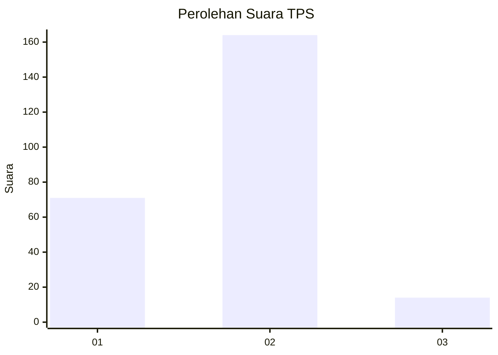
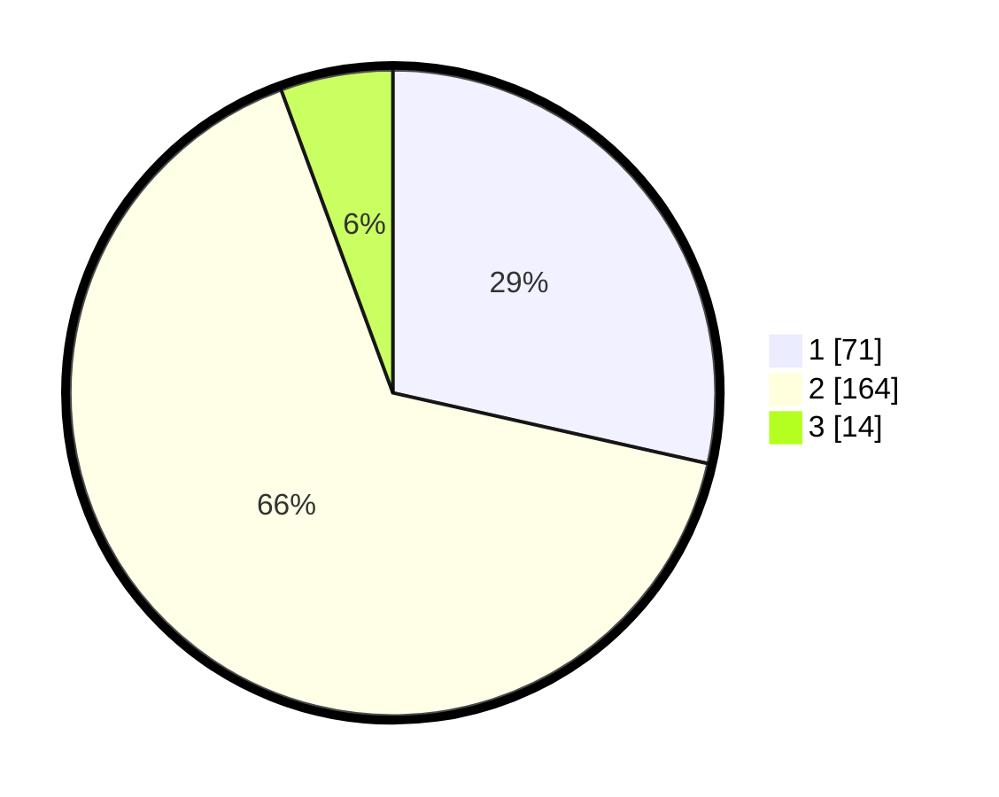

# Hasil

## Grafik

## Tabel

| No. | Nama Paslon    | Suara | Suara (raw) | Persentase |
|:--- |:-------------- | -----:| -----------:| ----------:|
| 1   | ANIES MUHAIMIN | 71    | [71][p-1]   | 28,51      |
| 2   | PRABOWO GIBRAN | 164   | [164][p-2]  | 65,86      |
| 3   | GANJAR MAHFUD  | 14    | [14][p-3]   | 5,62       |

[p-1]: https://github.com/gigit-pemilu/pemilu-2024-11-aceh/blob/main/pilpres/hitung-suara/sub/11-aceh/sub/75-kota-subulussalam/sub/01-simpang-kiri/sub/2014-makmur-jaya/sub/001-tps/sub/paslon-1.txt
[p-2]: https://github.com/gigit-pemilu/pemilu-2024-11-aceh/blob/main/pilpres/hitung-suara/sub/11-aceh/sub/75-kota-subulussalam/sub/01-simpang-kiri/sub/2014-makmur-jaya/sub/001-tps/sub/paslon-2.txt
[p-3]: https://github.com/gigit-pemilu/pemilu-2024-11-aceh/blob/main/pilpres/hitung-suara/sub/11-aceh/sub/75-kota-subulussalam/sub/01-simpang-kiri/sub/2014-makmur-jaya/sub/001-tps/sub/paslon-3.txt

## Foto C Plano

https://sirekap-obj-formc.kpu.go.id/b470/pemilu/ppwp/11/75/01/20/14/1175012014001-20240215-011712--51d8c96d-92ad-4cfc-8145-c585a06e919a.jpg

https://sirekap-obj-formc.kpu.go.id/b470/pemilu/ppwp/11/75/01/20/14/1175012014001-20240215-011752--2c2ca7a4-bd4f-4627-af88-40c8cd0b67b2.jpg

https://sirekap-obj-formc.kpu.go.id/b470/pemilu/ppwp/11/75/01/20/14/1175012014001-20240215-011929--ee7240fe-a7c9-4a20-ae95-bd8313c23a2c.jpg

## Metadata

| Key        | Value               |
| ---------- | ------------------- |
| Time Stamp | 2024-02-24 22:31:28 |

