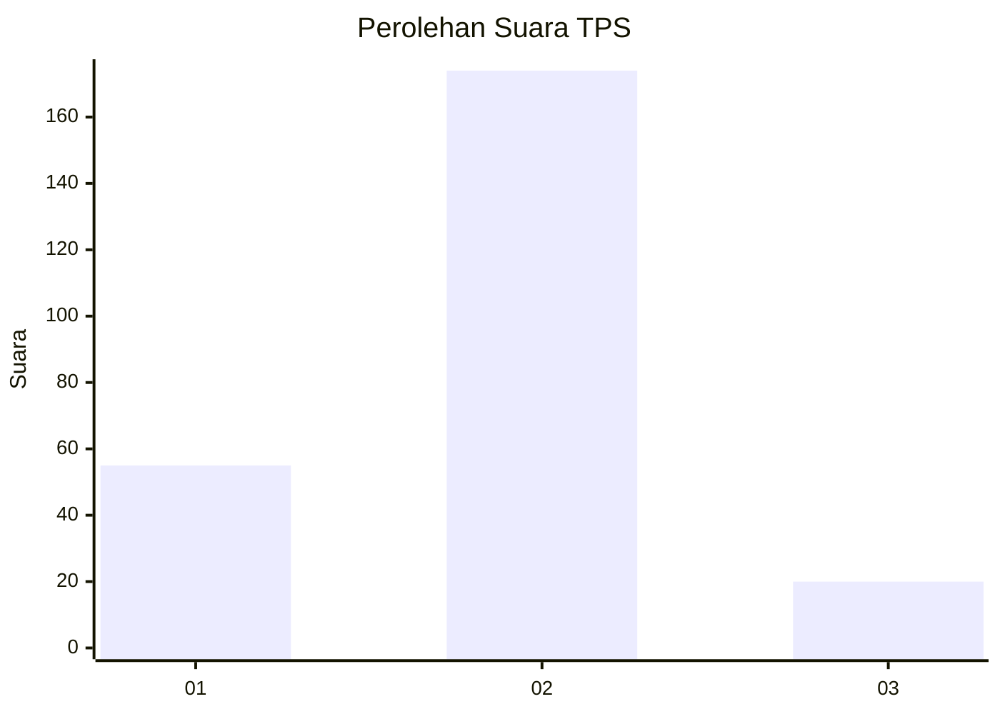
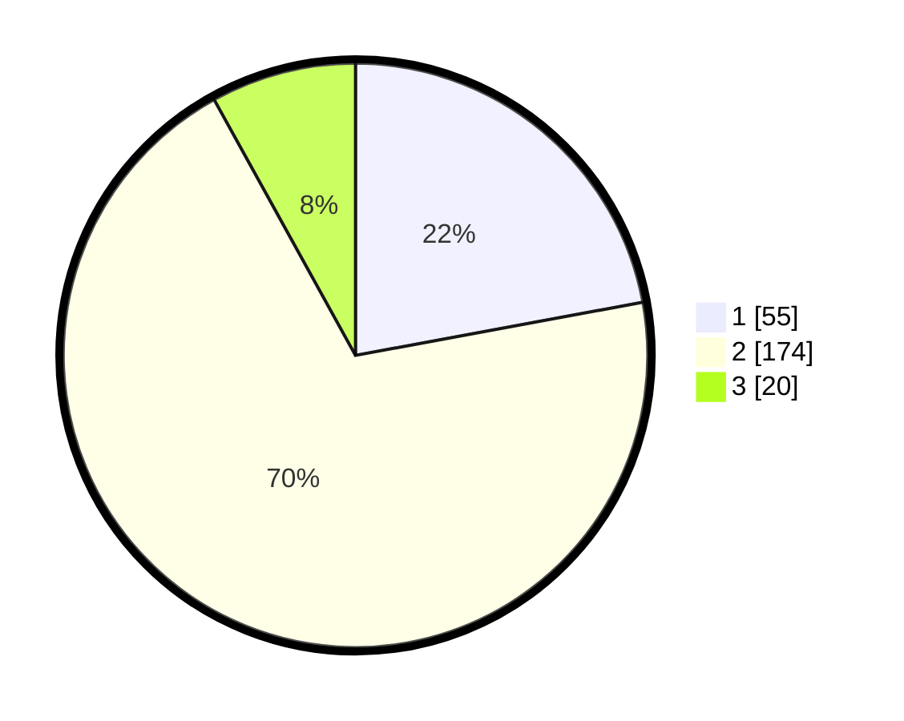

# Hasil

## Grafik

## Tabel

| No. | Nama Paslon    | Suara | Suara (raw) | Persentase |
|:--- |:-------------- | -----:| -----------:| ----------:|
| 1   | ANIES MUHAIMIN | 55    | [55][p-1]   | 22,09      |
| 2   | PRABOWO GIBRAN | 174   | [174][p-2]  | 69,88      |
| 3   | GANJAR MAHFUD  | 20    | [20][p-3]   | 8,03       |

[p-1]: https://github.com/gigit-pemilu/pemilu-2024-11-aceh/blob/main/pilpres/hitung-suara/sub/11-aceh/sub/75-kota-subulussalam/sub/01-simpang-kiri/sub/2014-makmur-jaya/sub/002-tps/sub/paslon-1.txt
[p-2]: https://github.com/gigit-pemilu/pemilu-2024-11-aceh/blob/main/pilpres/hitung-suara/sub/11-aceh/sub/75-kota-subulussalam/sub/01-simpang-kiri/sub/2014-makmur-jaya/sub/002-tps/sub/paslon-2.txt
[p-3]: https://github.com/gigit-pemilu/pemilu-2024-11-aceh/blob/main/pilpres/hitung-suara/sub/11-aceh/sub/75-kota-subulussalam/sub/01-simpang-kiri/sub/2014-makmur-jaya/sub/002-tps/sub/paslon-3.txt

## Foto C Plano

https://sirekap-obj-formc.kpu.go.id/1495/pemilu/ppwp/11/75/01/20/14/1175012014002-20240214-194742--f216c451-2994-4b52-8f96-941f1996ecbd.jpg

https://sirekap-obj-formc.kpu.go.id/1495/pemilu/ppwp/11/75/01/20/14/1175012014002-20240214-194234--0600dd71-c57a-4665-8fce-b77dcdba1680.jpg

https://sirekap-obj-formc.kpu.go.id/1495/pemilu/ppwp/11/75/01/20/14/1175012014002-20240214-194629--65abe8c8-f132-4464-b66b-135e4988faca.jpg

## Metadata

| Key        | Value               |
| ---------- | ------------------- |
| Time Stamp | 2024-02-20 15:00:00 |

