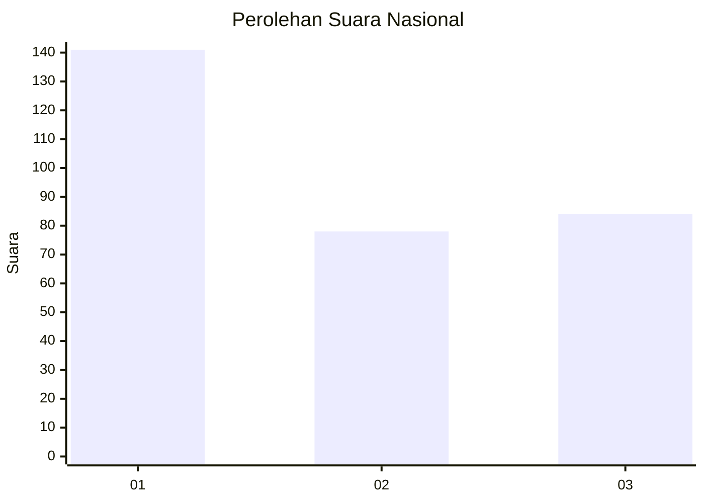
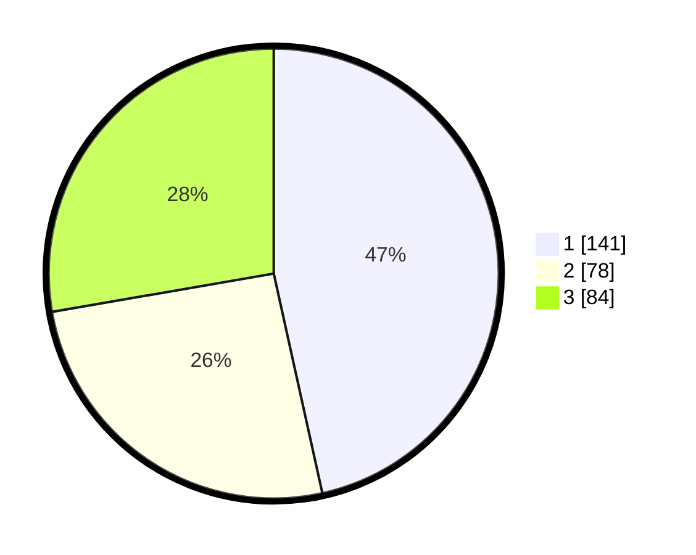

# Hasil

## Grafik

## Tabel

| No. | Nama Paslon    | Suara | Suara (raw) | Persentase |
|:--- |:-------------- | -----:| -----------:| ----------:|
| 1   | ANIES MUHAIMIN | 141   | [141][p-1]  | 46,53      |
| 2   | PRABOWO GIBRAN | 78    | [78][p-2]   | 25,74      |
| 3   | GANJAR MAHFUD  | 84    | [84][p-3]   | 27,72      |

[p-1]: https://github.com/gigit-pemilu/pemilu-2024/blob/main/pilpres/hitung-suara/sub/11-aceh/sub/75-kota-subulussalam/sub/01-simpang-kiri/sub/2015-belegen-mulia/sub/002-tps/sub/paslon-1.txt
[p-2]: https://github.com/gigit-pemilu/pemilu-2024/blob/main/pilpres/hitung-suara/sub/11-aceh/sub/75-kota-subulussalam/sub/01-simpang-kiri/sub/2015-belegen-mulia/sub/002-tps/sub/paslon-2.txt
[p-3]: https://github.com/gigit-pemilu/pemilu-2024/blob/main/pilpres/hitung-suara/sub/11-aceh/sub/75-kota-subulussalam/sub/01-simpang-kiri/sub/2015-belegen-mulia/sub/002-tps/sub/paslon-3.txt

## Foto C Plano

https://sirekap-obj-formc.kpu.go.id/a142/pemilu/ppwp/11/75/01/20/15/1175012015002-20240221-090337--ea689c31-46b6-461a-8b1c-047b919ddc53.jpg

https://sirekap-obj-formc.kpu.go.id/a142/pemilu/ppwp/11/75/01/20/15/1175012015002-20240221-090358--0a701083-b7c8-4ce4-8f36-516a1e3e061d.jpg

https://sirekap-obj-formc.kpu.go.id/a142/pemilu/ppwp/11/75/01/20/15/1175012015002-20240221-090426--cbdabda2-7371-44fe-a596-4f3c1dfe0e01.jpg

## Metadata

| Key        | Value               |
| ---------- | ------------------- |
| Time Stamp | 2024-02-21 10:00:00 |

## DATA PEMILIH TETAP

Jumlah pemilih dalam DPT: **254**.
 * L: **131**.
 * P: **123**.

## DATA PENGGUNA HAK PILIH

Jumlah pengguna hak pilih dalam DPT: **225**.
 * L: **116**.
 * P: **103**.

Jumlah pengguna hak pilih dalam DPTb: **200**.
 * L: **600**.
 * P: **308**.

Jumlah pengguna hak pilih dalam DPK: **4**.
 * L: **2**.
 * P: **2**.

Jumlah pengguna hak pilih: **233**.
 * L: **630**.
 * P: **113**.

## JUMLAH SUARA SAH DAN TIDAK SAH

JUMLAH SELURUH SUARA SAH: **223**.

JUMLAH SUARA TIDAK SAH: **10**.

JUMLAH SELURUH SUARA SAH DAN SUARA TIDAK SAH: **233**.

