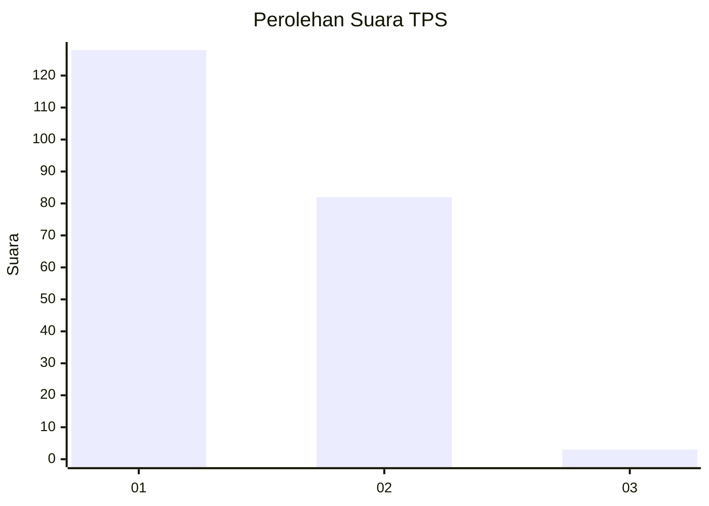
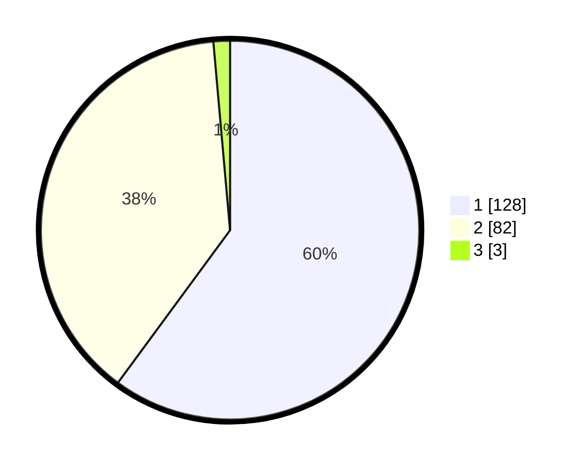

# Hasil

## Grafik

## Tabel

| No. | Nama Paslon    | Suara | Suara (raw) | Persentase |
|:--- |:-------------- | -----:| -----------:| ----------:|
| 1   | ANIES MUHAIMIN | 128   | [128][p-1]  | 60,09      |
| 2   | PRABOWO GIBRAN | 82    | [82][p-2]   | 38,50      |
| 3   | GANJAR MAHFUD  | 3     | [3][p-3]    | 1,41       |

[p-1]: https://github.com/gigit-pemilu/pemilu-2024-11-aceh/blob/main/pilpres/hitung-suara/sub/11-aceh/sub/75-kota-subulussalam/sub/01-simpang-kiri/sub/2015-belegen-mulia/sub/005-tps/sub/paslon-1.txt
[p-2]: https://github.com/gigit-pemilu/pemilu-2024-11-aceh/blob/main/pilpres/hitung-suara/sub/11-aceh/sub/75-kota-subulussalam/sub/01-simpang-kiri/sub/2015-belegen-mulia/sub/005-tps/sub/paslon-2.txt
[p-3]: https://github.com/gigit-pemilu/pemilu-2024-11-aceh/blob/main/pilpres/hitung-suara/sub/11-aceh/sub/75-kota-subulussalam/sub/01-simpang-kiri/sub/2015-belegen-mulia/sub/005-tps/sub/paslon-3.txt

## Foto C Plano

https://sirekap-obj-formc.kpu.go.id/d19d/pemilu/ppwp/11/75/01/20/15/1175012015005-20240221-141220--bbc360d3-da40-4ab6-9afe-2066145a92b5.jpg

https://sirekap-obj-formc.kpu.go.id/d19d/pemilu/ppwp/11/75/01/20/15/1175012015005-20240221-141041--a267d58d-d4e9-4c15-bf3e-18d0e64ddd32.jpg

https://sirekap-obj-formc.kpu.go.id/d19d/pemilu/ppwp/11/75/01/20/15/1175012015005-20240221-141112--27149f99-6a15-4102-9415-c9b117ad0e00.jpg

## Metadata

| Key        | Value               |
| ---------- | ------------------- |
| Time Stamp | 2024-02-21 15:00:00 |

## DATA PEMILIH TETAP

Jumlah pemilih dalam DPT: **365**.
 * L: **133**.
 * P: **133**.

## DATA PENGGUNA HAK PILIH

Jumlah pengguna hak pilih dalam DPT: **586**.
 * L: **109**.
 * P: **608**.

Jumlah pengguna hak pilih dalam DPTb: **881**.
 * L: **888**.
 * P: **881**.

Jumlah pengguna hak pilih dalam DPK: **882**.
 * L: **888**.
 * P: **882**.

Jumlah pengguna hak pilih: **219**.
 * L: **508**.
 * P: **239**.

## JUMLAH SUARA SAH DAN TIDAK SAH

JUMLAH SELURUH SUARA SAH: **213**.

JUMLAH SUARA TIDAK SAH: **86**.

JUMLAH SELURUH SUARA SAH DAN SUARA TIDAK SAH: **219**.

