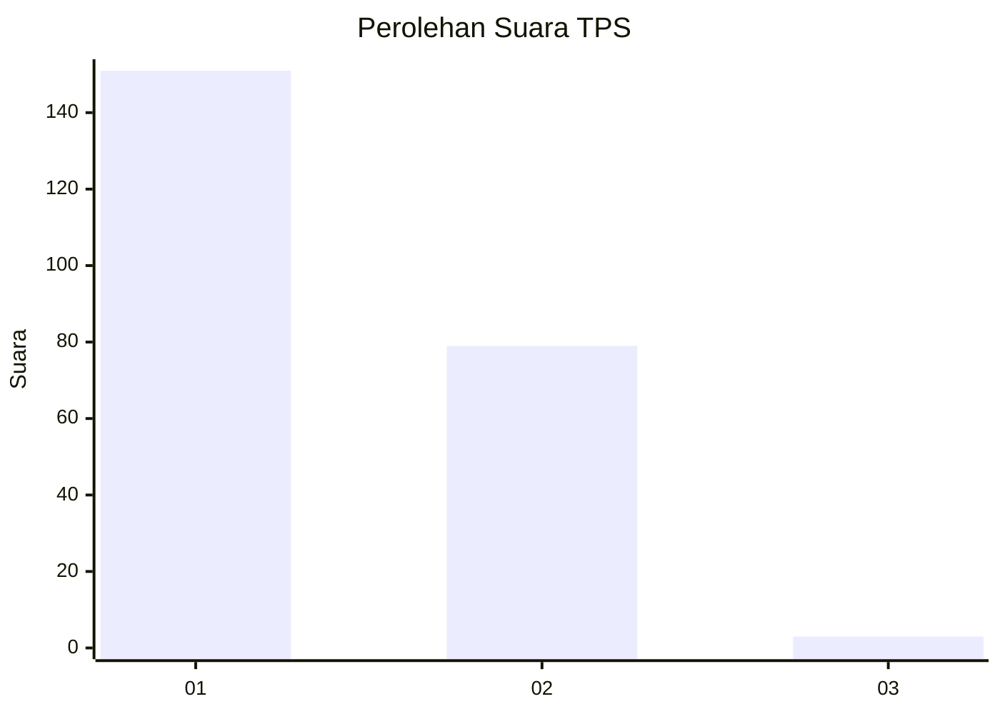
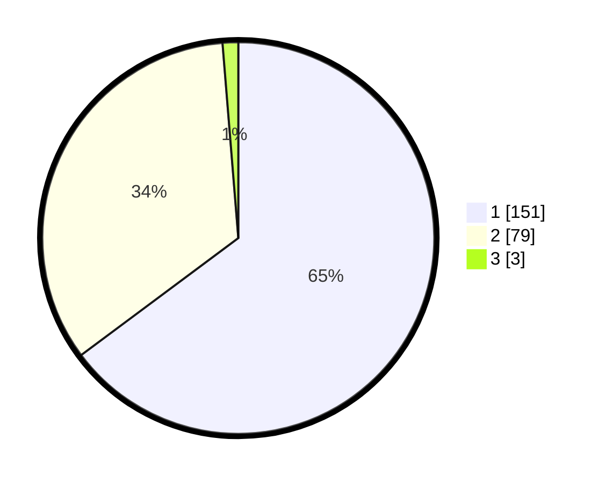

# Hasil

## Grafik

## Tabel

| No. | Nama Paslon    | Suara | Suara (raw) | Persentase |
|:--- |:-------------- | -----:| -----------:| ----------:|
| 1   | ANIES MUHAIMIN | 151   | [151][p-1]  | 64,81      |
| 2   | PRABOWO GIBRAN | 79    | [79][p-2]   | 33,91      |
| 3   | GANJAR MAHFUD  | 3     | [3][p-3]    | 1,29       |

[p-1]: https://github.com/gigit-pemilu/pemilu-2024-11-aceh/blob/main/pilpres/hitung-suara/sub/11-aceh/sub/75-kota-subulussalam/sub/01-simpang-kiri/sub/2017-subulussalam-timur/sub/005-tps/sub/paslon-1.txt
[p-2]: https://github.com/gigit-pemilu/pemilu-2024-11-aceh/blob/main/pilpres/hitung-suara/sub/11-aceh/sub/75-kota-subulussalam/sub/01-simpang-kiri/sub/2017-subulussalam-timur/sub/005-tps/sub/paslon-2.txt
[p-3]: https://github.com/gigit-pemilu/pemilu-2024-11-aceh/blob/main/pilpres/hitung-suara/sub/11-aceh/sub/75-kota-subulussalam/sub/01-simpang-kiri/sub/2017-subulussalam-timur/sub/005-tps/sub/paslon-3.txt

## Foto C Plano

https://sirekap-obj-formc.kpu.go.id/edf0/pemilu/ppwp/11/75/01/20/17/1175012017005-20240215-072319--9d5147d5-16b9-4455-8b33-47030c3c2083.jpg

https://sirekap-obj-formc.kpu.go.id/edf0/pemilu/ppwp/11/75/01/20/17/1175012017005-20240215-072136--1d9ce170-1bcb-43c5-8274-0277802df543.jpg

https://sirekap-obj-formc.kpu.go.id/edf0/pemilu/ppwp/11/75/01/20/17/1175012017005-20240215-072249--0ed040d8-44ef-4782-8306-4d666c50502b.jpg

## Metadata

| Key        | Value               |
| ---------- | ------------------- |
| Time Stamp | 2024-02-24 22:31:28 |

