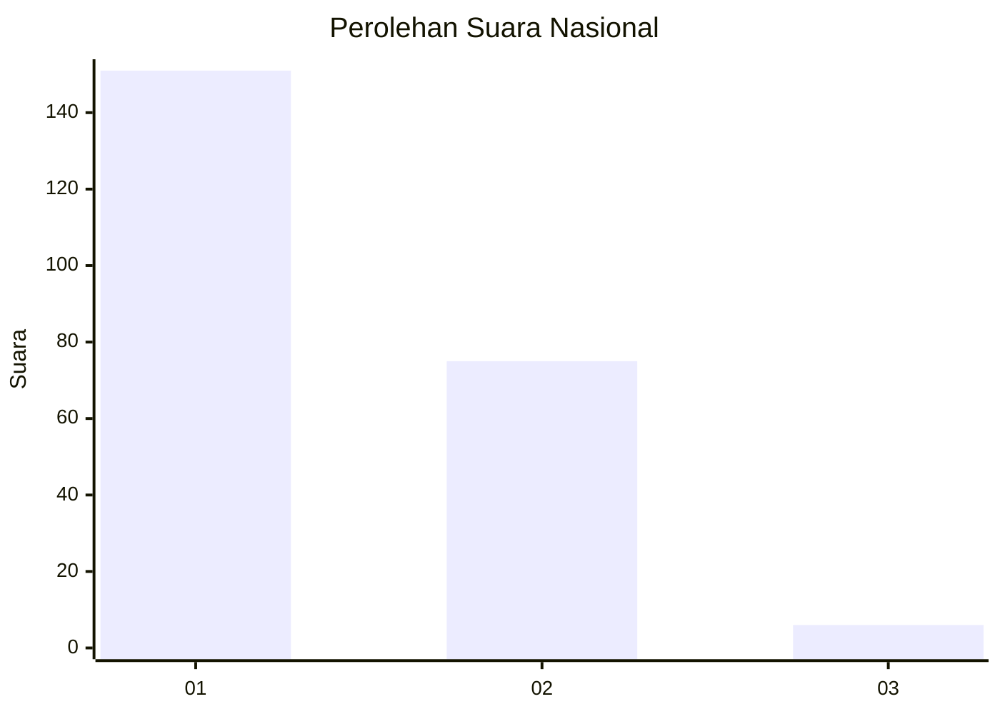
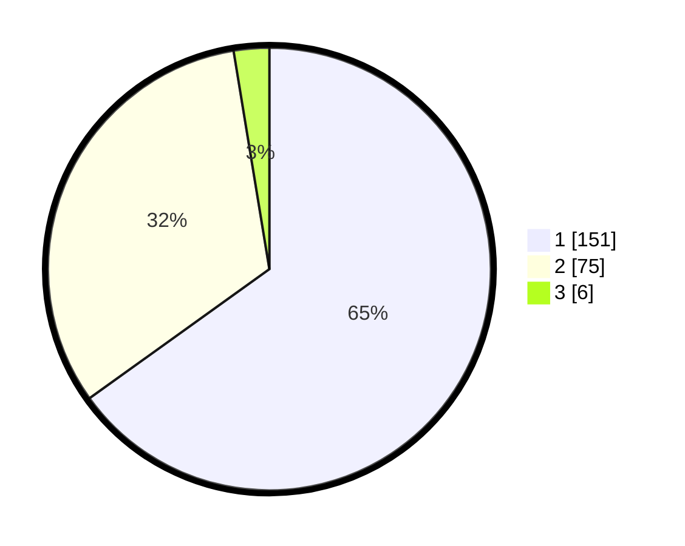

# Hasil

## Grafik

## Tabel

| No. | Nama Paslon    | Suara | Suara (raw) | Persentase |
|:--- |:-------------- | -----:| -----------:| ----------:|
| 1   | ANIES MUHAIMIN | 151   | [151][p-1]  | 65,09      |
| 2   | PRABOWO GIBRAN | 75    | [75][p-2]   | 32,33      |
| 3   | GANJAR MAHFUD  | 6     | [6][p-3]    | 2,59       |

[p-1]: https://github.com/gigit-pemilu/pemilu-2024/blob/main/pilpres/hitung-suara/sub/11-aceh/sub/75-kota-subulussalam/sub/02-penanggalan/sub/2001-penanggalan/sub/001-tps/sub/paslon-1.txt
[p-2]: https://github.com/gigit-pemilu/pemilu-2024/blob/main/pilpres/hitung-suara/sub/11-aceh/sub/75-kota-subulussalam/sub/02-penanggalan/sub/2001-penanggalan/sub/001-tps/sub/paslon-2.txt
[p-3]: https://github.com/gigit-pemilu/pemilu-2024/blob/main/pilpres/hitung-suara/sub/11-aceh/sub/75-kota-subulussalam/sub/02-penanggalan/sub/2001-penanggalan/sub/001-tps/sub/paslon-3.txt

## Foto C Plano

https://sirekap-obj-formc.kpu.go.id/ce31/pemilu/ppwp/11/75/02/20/01/1175022001001-20240222-155554--c0a18f41-3589-4749-8ddd-02e7f1e88236.jpg

https://sirekap-obj-formc.kpu.go.id/ce31/pemilu/ppwp/11/75/02/20/01/1175022001001-20240222-155722--44e7ef87-874a-4da8-a925-c1872e7d0933.jpg

https://sirekap-obj-formc.kpu.go.id/ce31/pemilu/ppwp/11/75/02/20/01/1175022001001-20240222-155920--0d578478-0fff-4bd9-8144-93c4a693ba35.jpg

## Metadata

| Key        | Value               |
| ---------- | ------------------- |
| Time Stamp | 2024-02-22 16:00:00 |

## DATA PEMILIH TETAP

Jumlah pemilih dalam DPT: **293**.
 * L: **632**.
 * P: **163**.

## DATA PENGGUNA HAK PILIH

Jumlah pengguna hak pilih dalam DPT: **248**.
 * L: **950**.
 * P: **136**.

Jumlah pengguna hak pilih dalam DPTb: **53**.
 * L: **2**.
 * P: **1**.

Jumlah pengguna hak pilih dalam DPK: **4**.
 * L: **2**.
 * P: **2**.

Jumlah pengguna hak pilih: **238**.
 * L: **28**.
 * P: **134**.

## JUMLAH SUARA SAH DAN TIDAK SAH

JUMLAH SELURUH SUARA SAH: **232**.

JUMLAH SUARA TIDAK SAH: **6**.

JUMLAH SELURUH SUARA SAH DAN SUARA TIDAK SAH: **238**.

