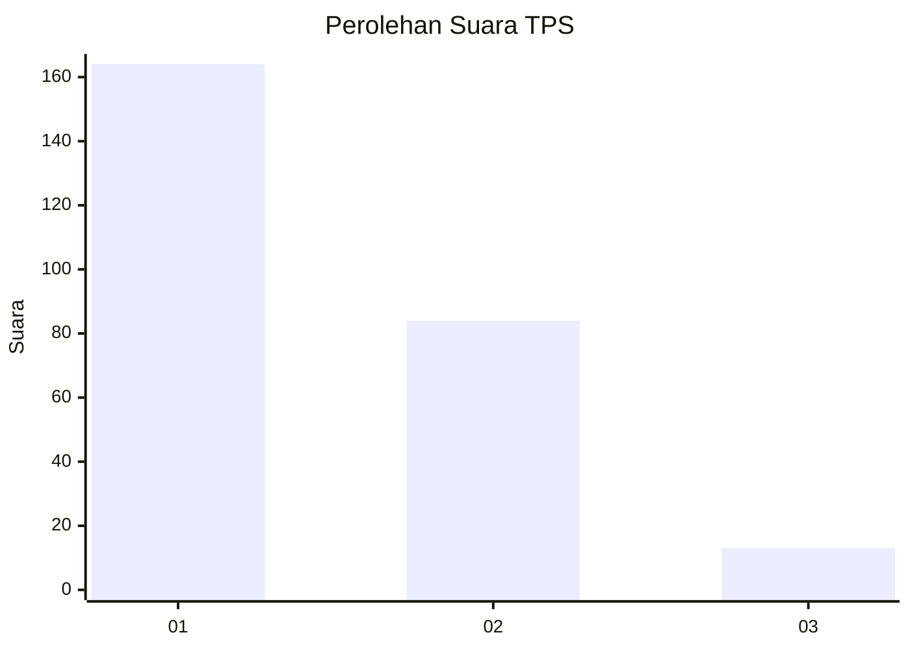
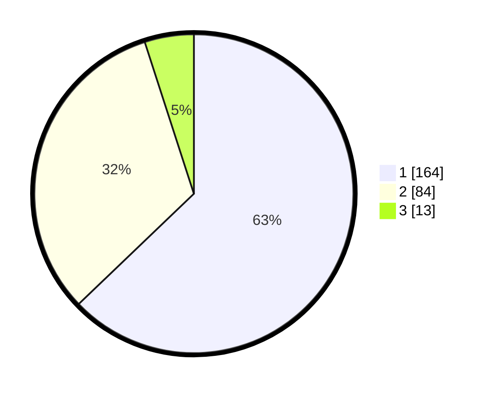

# Hasil

## Grafik

## Tabel

| No. | Nama Paslon    | Suara | Suara (raw) | Persentase |
|:--- |:-------------- | -----:| -----------:| ----------:|
| 1   | ANIES MUHAIMIN | 164   | [164][p-1]  | 62,84      |
| 2   | PRABOWO GIBRAN | 84    | [84][p-2]   | 32,18      |
| 3   | GANJAR MAHFUD  | 13    | [13][p-3]   | 4,98       |

[p-1]: https://github.com/gigit-pemilu/pemilu-2024-11-aceh/blob/main/pilpres/hitung-suara/sub/11-aceh/sub/75-kota-subulussalam/sub/02-penanggalan/sub/2001-penanggalan/sub/002-tps/sub/paslon-1.txt
[p-2]: https://github.com/gigit-pemilu/pemilu-2024-11-aceh/blob/main/pilpres/hitung-suara/sub/11-aceh/sub/75-kota-subulussalam/sub/02-penanggalan/sub/2001-penanggalan/sub/002-tps/sub/paslon-2.txt
[p-3]: https://github.com/gigit-pemilu/pemilu-2024-11-aceh/blob/main/pilpres/hitung-suara/sub/11-aceh/sub/75-kota-subulussalam/sub/02-penanggalan/sub/2001-penanggalan/sub/002-tps/sub/paslon-3.txt

## Foto C Plano

https://sirekap-obj-formc.kpu.go.id/21a4/pemilu/ppwp/11/75/02/20/01/1175022001002-20240214-195715--645dbbe2-6176-4690-be93-30349c16b420.jpg

https://sirekap-obj-formc.kpu.go.id/21a4/pemilu/ppwp/11/75/02/20/01/1175022001002-20240222-145939--3c8f6f05-14e5-4ee0-a00a-6e542c05b67a.jpg

https://sirekap-obj-formc.kpu.go.id/21a4/pemilu/ppwp/11/75/02/20/01/1175022001002-20240222-150033--679492c4-9bc0-4dea-b6a1-e383d2184741.jpg

## Metadata

| Key        | Value               |
| ---------- | ------------------- |
| Time Stamp | 2024-02-22 16:00:00 |

## DATA PEMILIH TETAP

Jumlah pemilih dalam DPT: **295**.
 * L: **134**.
 * P: **161**.

## DATA PENGGUNA HAK PILIH

Jumlah pengguna hak pilih dalam DPT: **248**.
 * L: **112**.
 * P: **636**.

Jumlah pengguna hak pilih dalam DPTb: **2**.
 * L: **2**.
 * P: **5**.

Jumlah pengguna hak pilih dalam DPK: **8**.
 * L: **3**.
 * P: **5**.

Jumlah pengguna hak pilih: **263**.
 * L: **117**.
 * P: **146**.

## JUMLAH SUARA SAH DAN TIDAK SAH

JUMLAH SELURUH SUARA SAH: **258**.

JUMLAH SUARA TIDAK SAH: **85**.

JUMLAH SELURUH SUARA SAH DAN SUARA TIDAK SAH: **83**.

