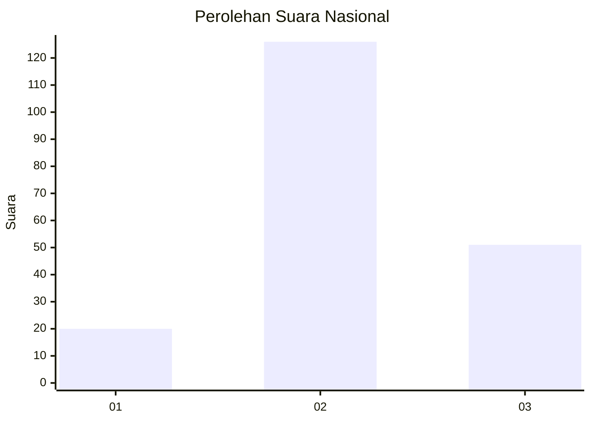
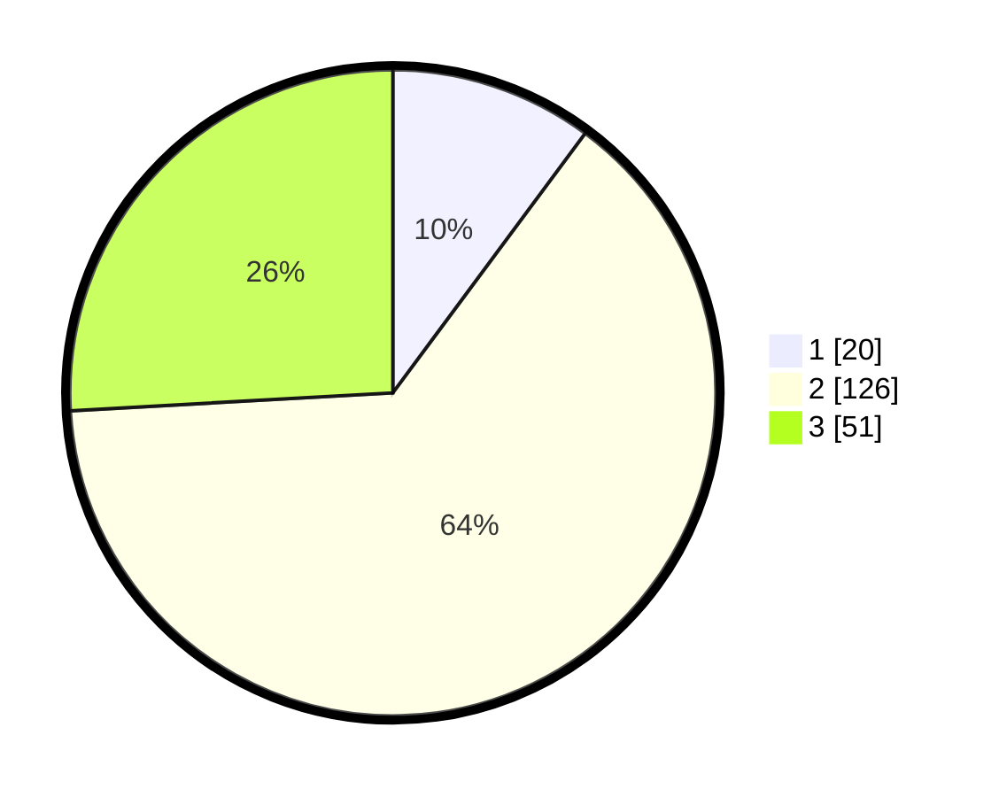

# Hasil

## Grafik

## Tabel

| No. | Nama Paslon    | Suara | Suara (raw) | Persentase |
|:--- |:-------------- | -----:| -----------:| ----------:|
| 1   | ANIES MUHAIMIN | 20    | [20][p-1]   | 10,15      |
| 2   | PRABOWO GIBRAN | 126   | [126][p-2]  | 63,96      |
| 3   | GANJAR MAHFUD  | 51    | [51][p-3]   | 25,89      |

[p-1]: https://github.com/gigit-pemilu/pemilu-2024/blob/main/pilpres/hitung-suara/sub/11-aceh/sub/75-kota-subulussalam/sub/02-penanggalan/sub/2001-penanggalan/sub/006-tps/sub/paslon-1.txt
[p-2]: https://github.com/gigit-pemilu/pemilu-2024/blob/main/pilpres/hitung-suara/sub/11-aceh/sub/75-kota-subulussalam/sub/02-penanggalan/sub/2001-penanggalan/sub/006-tps/sub/paslon-2.txt
[p-3]: https://github.com/gigit-pemilu/pemilu-2024/blob/main/pilpres/hitung-suara/sub/11-aceh/sub/75-kota-subulussalam/sub/02-penanggalan/sub/2001-penanggalan/sub/006-tps/sub/paslon-3.txt

## Foto C Plano

https://sirekap-obj-formc.kpu.go.id/c535/pemilu/ppwp/11/75/02/20/01/1175022001006-20240222-161331--d182e5a4-60ff-4622-89d4-ca93902de2ca.jpg

https://sirekap-obj-formc.kpu.go.id/c535/pemilu/ppwp/11/75/02/20/01/1175022001006-20240222-161433--0d8b4ddd-1d32-4982-a791-5fdb5eef8c78.jpg

https://sirekap-obj-formc.kpu.go.id/c535/pemilu/ppwp/11/75/02/20/01/1175022001006-20240222-161544--9b3c2a25-0d0e-438a-a6b9-3d62b97680dc.jpg

## Metadata

| Key        | Value               |
| ---------- | ------------------- |
| Time Stamp | 2024-02-22 17:00:00 |

## DATA PEMILIH TETAP

Jumlah pemilih dalam DPT: **297**.
 * L: **195**.
 * P: **188**.

## DATA PENGGUNA HAK PILIH

Jumlah pengguna hak pilih dalam DPT: **194**.
 * L: **896**.
 * P: **98**.

Jumlah pengguna hak pilih dalam DPTb: **5**.
 * L: **3**.
 * P: **2**.

Jumlah pengguna hak pilih dalam DPK: **11**.
 * L: **7**.
 * P: **4**.

Jumlah pengguna hak pilih: **210**.
 * L: **106**.
 * P: **104**.

## JUMLAH SUARA SAH DAN TIDAK SAH

JUMLAH SELURUH SUARA SAH: **197**.

JUMLAH SUARA TIDAK SAH: **13**.

JUMLAH SELURUH SUARA SAH DAN SUARA TIDAK SAH: **210**.

