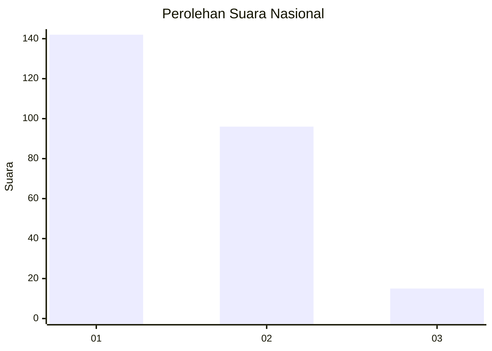
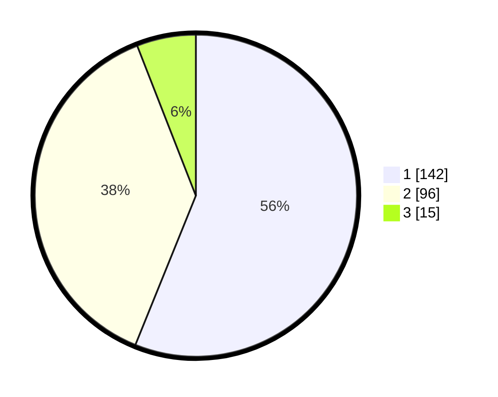

# Hasil

## Grafik

## Tabel

| No. | Nama Paslon    | Suara | Suara (raw) | Persentase |
|:--- |:-------------- | -----:| -----------:| ----------:|
| 1   | ANIES MUHAIMIN | 142   | [142][p-1]  | 56,13      |
| 2   | PRABOWO GIBRAN | 96    | [96][p-2]   | 37,94      |
| 3   | GANJAR MAHFUD  | 15    | [15][p-3]   | 5,93       |

[p-1]: https://github.com/gigit-pemilu/pemilu-2024/blob/main/pilpres/hitung-suara/sub/11-aceh/sub/75-kota-subulussalam/sub/02-penanggalan/sub/2002-cepu/sub/002-tps/sub/paslon-1.txt
[p-2]: https://github.com/gigit-pemilu/pemilu-2024/blob/main/pilpres/hitung-suara/sub/11-aceh/sub/75-kota-subulussalam/sub/02-penanggalan/sub/2002-cepu/sub/002-tps/sub/paslon-2.txt
[p-3]: https://github.com/gigit-pemilu/pemilu-2024/blob/main/pilpres/hitung-suara/sub/11-aceh/sub/75-kota-subulussalam/sub/02-penanggalan/sub/2002-cepu/sub/002-tps/sub/paslon-3.txt

## Foto C Plano

https://sirekap-obj-formc.kpu.go.id/af99/pemilu/ppwp/11/75/02/20/02/1175022002002-20240214-224738--09978523-b8c5-4287-b9c2-523214d1730a.jpg

https://sirekap-obj-formc.kpu.go.id/af99/pemilu/ppwp/11/75/02/20/02/1175022002002-20240214-224519--b9abfd33-2fe4-422d-8fd1-7ad67bf40548.jpg

https://sirekap-obj-formc.kpu.go.id/af99/pemilu/ppwp/11/75/02/20/02/1175022002002-20240214-224705--f204ee1c-0513-4bfc-a587-3b437e1a7605.jpg

## Metadata

| Key        | Value               |
| ---------- | ------------------- |
| Time Stamp | 2024-02-15 23:29:50 |

