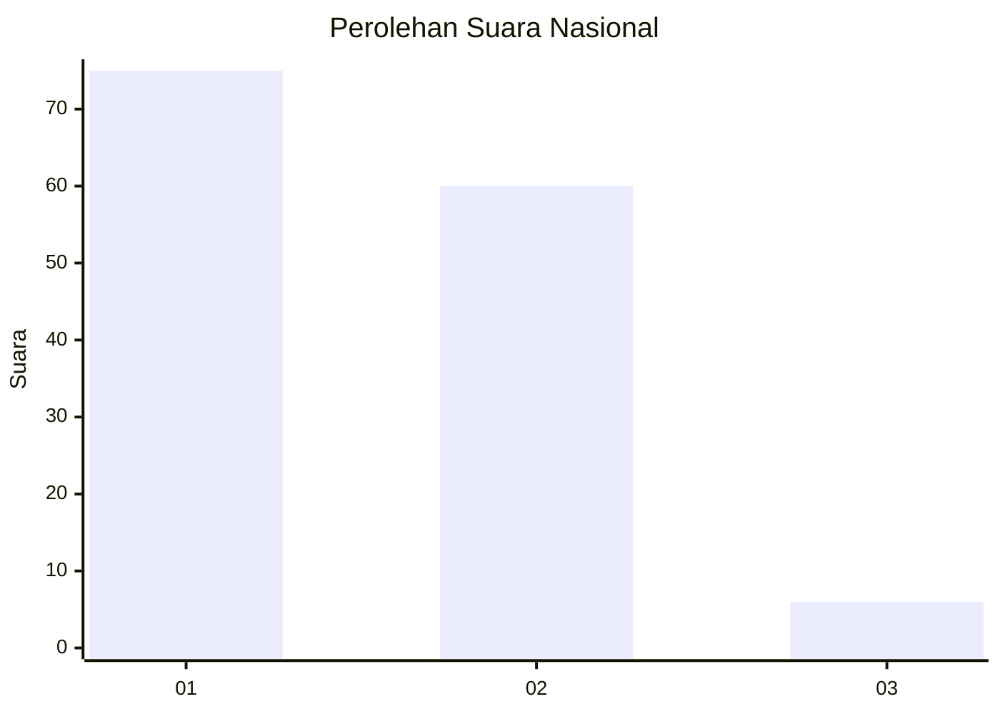
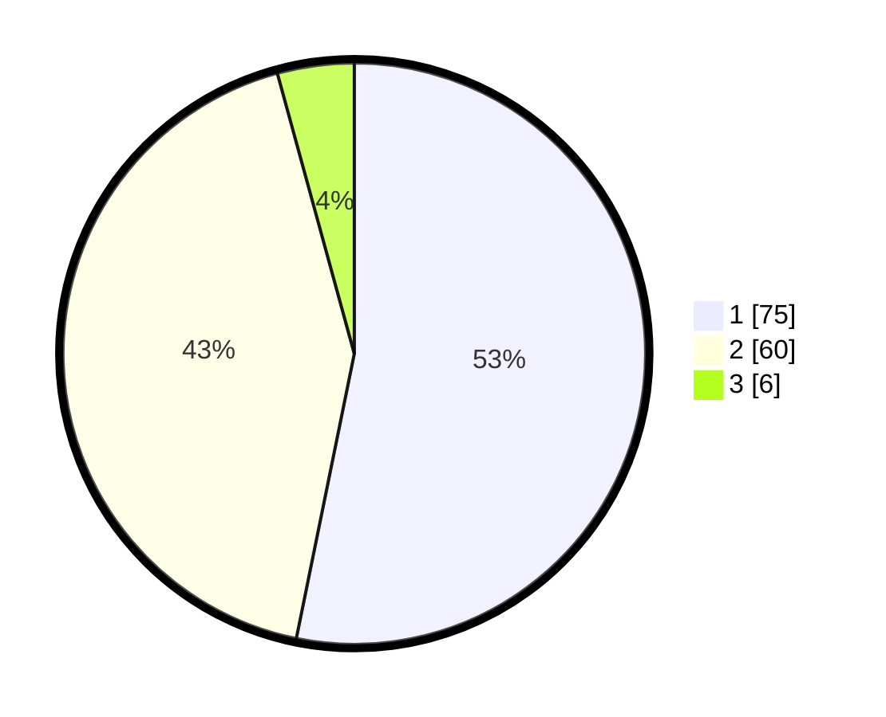

# Hasil

## Grafik

## Tabel

| No. | Nama Paslon    | Suara | Suara (raw) | Persentase |
|:--- |:-------------- | -----:| -----------:| ----------:|
| 1   | ANIES MUHAIMIN | 75    | [75][p-1]   | 53,19      |
| 2   | PRABOWO GIBRAN | 60    | [60][p-2]   | 42,55      |
| 3   | GANJAR MAHFUD  | 6     | [6][p-3]    | 4,26       |

[p-1]: https://github.com/gigit-pemilu/pemilu-2024/blob/main/pilpres/hitung-suara/sub/11-aceh/sub/75-kota-subulussalam/sub/02-penanggalan/sub/2003-kuta-tengah/sub/001-tps/sub/paslon-1.txt
[p-2]: https://github.com/gigit-pemilu/pemilu-2024/blob/main/pilpres/hitung-suara/sub/11-aceh/sub/75-kota-subulussalam/sub/02-penanggalan/sub/2003-kuta-tengah/sub/001-tps/sub/paslon-2.txt
[p-3]: https://github.com/gigit-pemilu/pemilu-2024/blob/main/pilpres/hitung-suara/sub/11-aceh/sub/75-kota-subulussalam/sub/02-penanggalan/sub/2003-kuta-tengah/sub/001-tps/sub/paslon-3.txt

## Foto C Plano

https://sirekap-obj-formc.kpu.go.id/fa05/pemilu/ppwp/11/75/02/20/03/1175022003001-20240221-205052--48639da5-7793-4634-9e77-62364e0bfa55.jpg

https://sirekap-obj-formc.kpu.go.id/fa05/pemilu/ppwp/11/75/02/20/03/1175022003001-20240221-205152--c74127b8-9f37-4fcd-8562-d88b4d3bb2fb.jpg

https://sirekap-obj-formc.kpu.go.id/fa05/pemilu/ppwp/11/75/02/20/03/1175022003001-20240221-205254--2b574ef6-ebeb-4f56-b9e8-723fd88e5b5e.jpg

## Metadata

| Key        | Value               |
| ---------- | ------------------- |
| Time Stamp | 2024-02-21 21:00:04 |

## DATA PEMILIH TETAP

Jumlah pemilih dalam DPT: **157**.
 * L: **76**.
 * P: **33**.

## DATA PENGGUNA HAK PILIH

Jumlah pengguna hak pilih dalam DPT: **136**.
 * L: **65**.
 * P: **73**.

Jumlah pengguna hak pilih dalam DPTb: **521**.
 * L: **5**.
 * P: **5**.

Jumlah pengguna hak pilih dalam DPK: **808**.
 * L: **6**.
 * P: **1**.

Jumlah pengguna hak pilih: **145**.
 * L: **852**.
 * P: **872**.

## JUMLAH SUARA SAH DAN TIDAK SAH

JUMLAH SELURUH SUARA SAH: **148**.

JUMLAH SUARA TIDAK SAH: **2**.

JUMLAH SELURUH SUARA SAH DAN SUARA TIDAK SAH: **143**.

