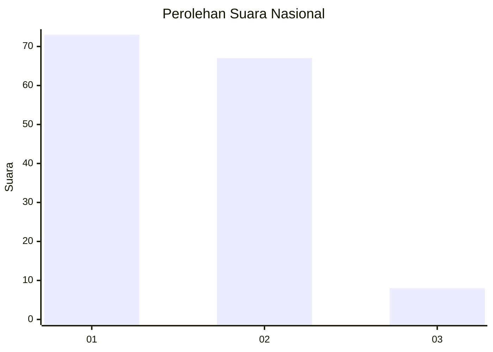
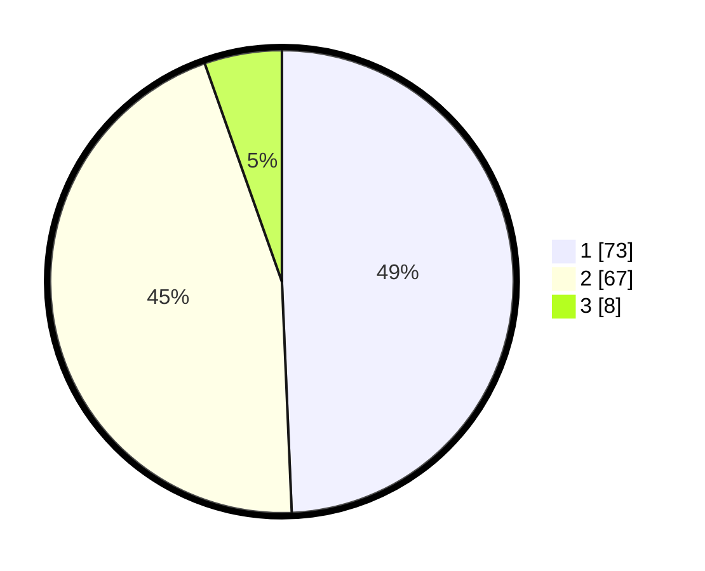

# Hasil

## Grafik

## Tabel

| No. | Nama Paslon    | Suara | Suara (raw) | Persentase |
|:--- |:-------------- | -----:| -----------:| ----------:|
| 1   | ANIES MUHAIMIN | 73    | [73][p-1]   | 49,32      |
| 2   | PRABOWO GIBRAN | 67    | [67][p-2]   | 45,27      |
| 3   | GANJAR MAHFUD  | 8     | [8][p-3]    | 5,41       |

[p-1]: https://github.com/gigit-pemilu/pemilu-2024/blob/main/pilpres/hitung-suara/sub/11-aceh/sub/75-kota-subulussalam/sub/02-penanggalan/sub/2003-kuta-tengah/sub/002-tps/sub/paslon-1.txt
[p-2]: https://github.com/gigit-pemilu/pemilu-2024/blob/main/pilpres/hitung-suara/sub/11-aceh/sub/75-kota-subulussalam/sub/02-penanggalan/sub/2003-kuta-tengah/sub/002-tps/sub/paslon-2.txt
[p-3]: https://github.com/gigit-pemilu/pemilu-2024/blob/main/pilpres/hitung-suara/sub/11-aceh/sub/75-kota-subulussalam/sub/02-penanggalan/sub/2003-kuta-tengah/sub/002-tps/sub/paslon-3.txt

## Foto C Plano

https://sirekap-obj-formc.kpu.go.id/5a06/pemilu/ppwp/11/75/02/20/03/1175022003002-20240215-023044--fe3e4277-ad04-4bba-bc53-f892d7b15e04.jpg

https://sirekap-obj-formc.kpu.go.id/5a06/pemilu/ppwp/11/75/02/20/03/1175022003002-20240215-023304--83a3c31c-d957-4881-98bb-6971b0f393cd.jpg

https://sirekap-obj-formc.kpu.go.id/5a06/pemilu/ppwp/11/75/02/20/03/1175022003002-20240215-023510--67641395-ec36-416e-97a3-f24c0d730856.jpg

## Metadata

| Key        | Value               |
| ---------- | ------------------- |
| Time Stamp | 2024-02-15 23:29:50 |

