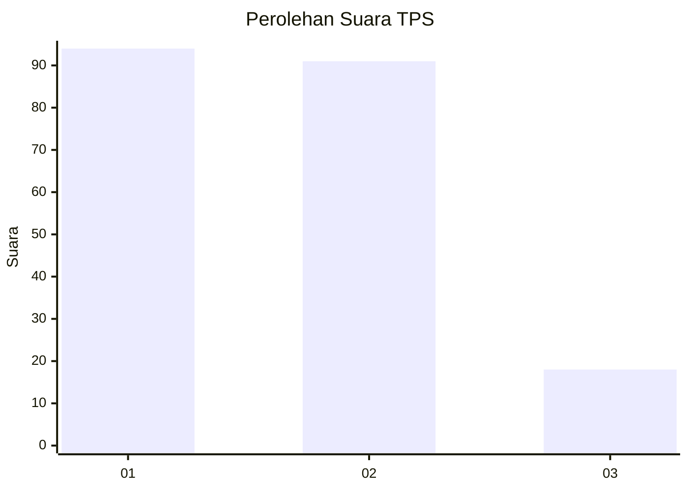
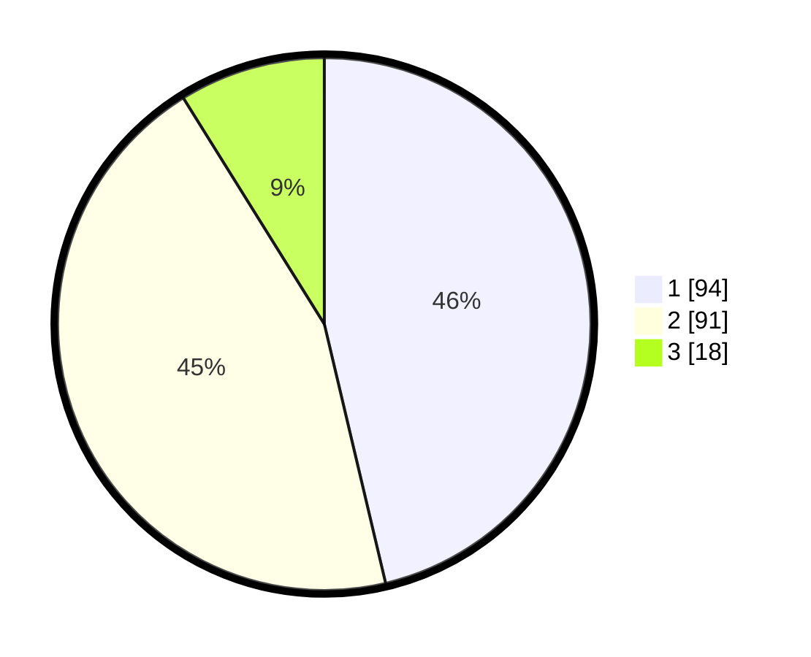

# Hasil

## Grafik

## Tabel

| No. | Nama Paslon    | Suara | Suara (raw) | Persentase |
|:--- |:-------------- | -----:| -----------:| ----------:|
| 1   | ANIES MUHAIMIN | 94    | [94][p-1]   | 46,31      |
| 2   | PRABOWO GIBRAN | 91    | [91][p-2]   | 44,83      |
| 3   | GANJAR MAHFUD  | 18    | [18][p-3]   | 8,87       |

[p-1]: https://github.com/gigit-pemilu/pemilu-2024-11-aceh/blob/main/pilpres/hitung-suara/sub/11-aceh/sub/75-kota-subulussalam/sub/02-penanggalan/sub/2006-penuntungan/sub/001-tps/sub/paslon-1.txt
[p-2]: https://github.com/gigit-pemilu/pemilu-2024-11-aceh/blob/main/pilpres/hitung-suara/sub/11-aceh/sub/75-kota-subulussalam/sub/02-penanggalan/sub/2006-penuntungan/sub/001-tps/sub/paslon-2.txt
[p-3]: https://github.com/gigit-pemilu/pemilu-2024-11-aceh/blob/main/pilpres/hitung-suara/sub/11-aceh/sub/75-kota-subulussalam/sub/02-penanggalan/sub/2006-penuntungan/sub/001-tps/sub/paslon-3.txt

## Foto C Plano

https://sirekap-obj-formc.kpu.go.id/bc3a/pemilu/ppwp/11/75/02/20/06/1175022006001-20240221-093442--632e6c89-5b38-47d8-83d4-0fe176bfe6ea.jpg

https://sirekap-obj-formc.kpu.go.id/bc3a/pemilu/ppwp/11/75/02/20/06/1175022006001-20240221-093628--5e124d5a-6da2-4360-8ff4-a193821cb76b.jpg

https://sirekap-obj-formc.kpu.go.id/bc3a/pemilu/ppwp/11/75/02/20/06/1175022006001-20240221-093816--7c0f11ca-d845-445e-bb08-a5ba2ac0a206.jpg

## Metadata

| Key        | Value               |
| ---------- | ------------------- |
| Time Stamp | 2024-02-21 10:00:00 |

## DATA PEMILIH TETAP

Jumlah pemilih dalam DPT: **260**.
 * L: **141**.
 * P: **119**.

## DATA PENGGUNA HAK PILIH

Jumlah pengguna hak pilih dalam DPT: **227**.
 * L: **120**.
 * P: **107**.

Jumlah pengguna hak pilih dalam DPTb: **5**.
 * L: **3**.
 * P: **2**.

Jumlah pengguna hak pilih dalam DPK: **0**.
 * L: **0**.
 * P: **0**.

Jumlah pengguna hak pilih: **232**.
 * L: **23**.
 * P: **109**.

## JUMLAH SUARA SAH DAN TIDAK SAH

JUMLAH SELURUH SUARA SAH: **203**.

JUMLAH SUARA TIDAK SAH: **29**.

JUMLAH SELURUH SUARA SAH DAN SUARA TIDAK SAH: **232**.

