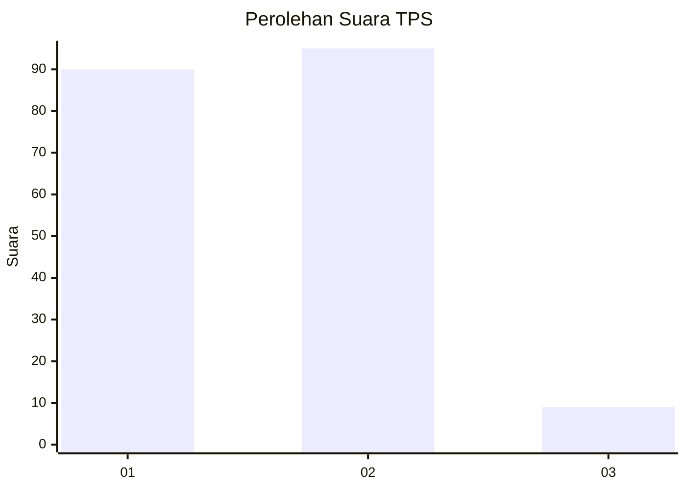
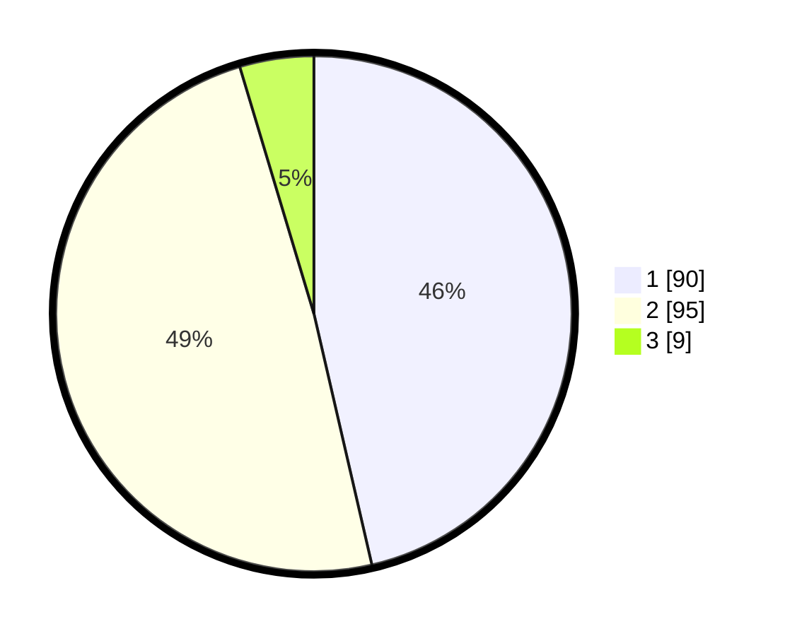

# Hasil

## Grafik

## Tabel

| No. | Nama Paslon    | Suara | Suara (raw) | Persentase |
|:--- |:-------------- | -----:| -----------:| ----------:|
| 1   | ANIES MUHAIMIN | 90    | [90][p-1]   | 46,39      |
| 2   | PRABOWO GIBRAN | 95    | [95][p-2]   | 48,97      |
| 3   | GANJAR MAHFUD  | 9     | [9][p-3]    | 4,64       |

[p-1]: https://github.com/gigit-pemilu/pemilu-2024-11-aceh/blob/main/pilpres/hitung-suara/sub/11-aceh/sub/75-kota-subulussalam/sub/02-penanggalan/sub/2006-penuntungan/sub/004-tps/sub/paslon-1.txt
[p-2]: https://github.com/gigit-pemilu/pemilu-2024-11-aceh/blob/main/pilpres/hitung-suara/sub/11-aceh/sub/75-kota-subulussalam/sub/02-penanggalan/sub/2006-penuntungan/sub/004-tps/sub/paslon-2.txt
[p-3]: https://github.com/gigit-pemilu/pemilu-2024-11-aceh/blob/main/pilpres/hitung-suara/sub/11-aceh/sub/75-kota-subulussalam/sub/02-penanggalan/sub/2006-penuntungan/sub/004-tps/sub/paslon-3.txt

## Foto C Plano

https://sirekap-obj-formc.kpu.go.id/2f4e/pemilu/ppwp/11/75/02/20/06/1175022006004-20240221-101220--354b2b38-214e-45f6-aee6-f370575311d5.jpg

https://sirekap-obj-formc.kpu.go.id/2f4e/pemilu/ppwp/11/75/02/20/06/1175022006004-20240221-101343--6bd38f86-c1a7-4c4f-8a46-ab9498394038.jpg

https://sirekap-obj-formc.kpu.go.id/2f4e/pemilu/ppwp/11/75/02/20/06/1175022006004-20240221-101457--1104e56c-a533-4cc8-91ef-11a0a52145e2.jpg

## Metadata

| Key        | Value               |
| ---------- | ------------------- |
| Time Stamp | 2024-02-21 11:00:00 |

## DATA PEMILIH TETAP

Jumlah pemilih dalam DPT: **279**.
 * L: **733**.
 * P: **146**.

## DATA PENGGUNA HAK PILIH

Jumlah pengguna hak pilih dalam DPT: **215**.
 * L: **97**.
 * P: **188**.

Jumlah pengguna hak pilih dalam DPTb: **2**.
 * L: **1**.
 * P: **81**.

Jumlah pengguna hak pilih dalam DPK: **3**.
 * L: **7**.
 * P: **2**.

Jumlah pengguna hak pilih: **220**.
 * L: **99**.
 * P: **121**.

## JUMLAH SUARA SAH DAN TIDAK SAH

JUMLAH SELURUH SUARA SAH: **194**.

JUMLAH SUARA TIDAK SAH: **26**.

JUMLAH SELURUH SUARA SAH DAN SUARA TIDAK SAH: **220**.

