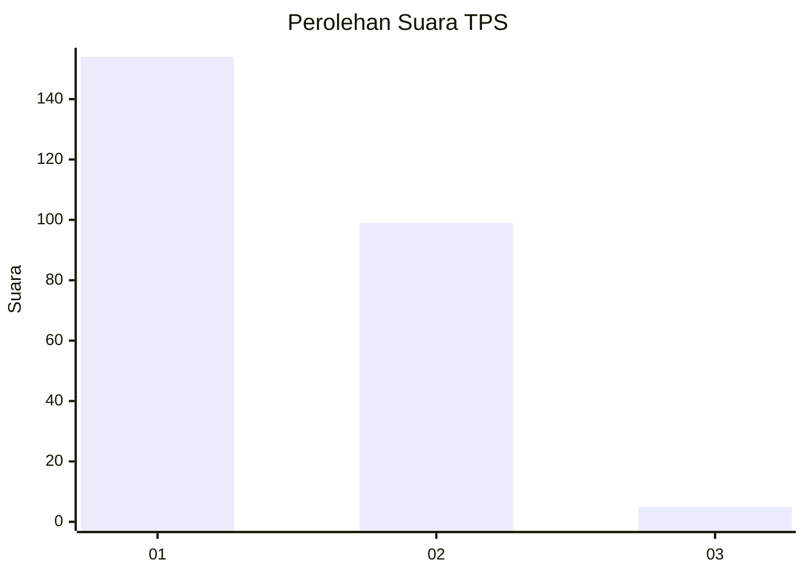
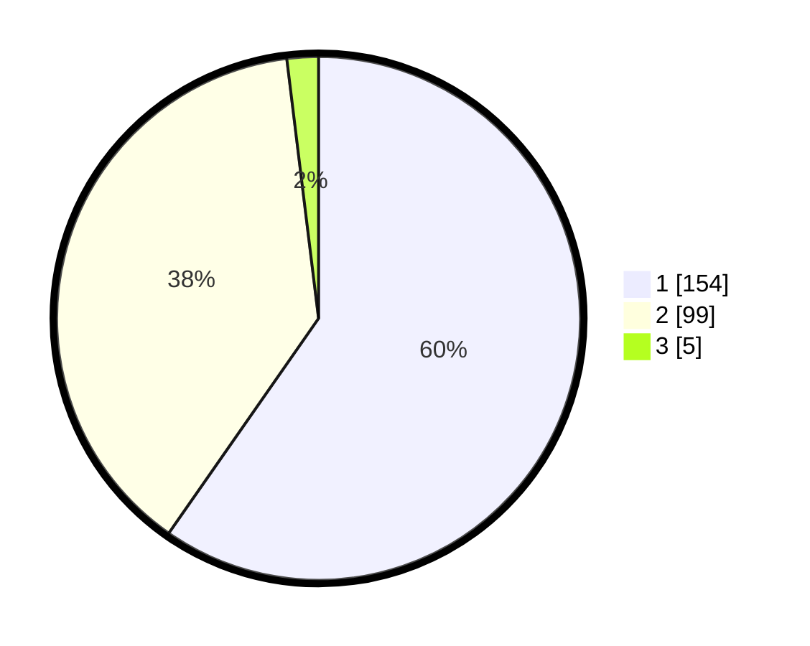

# Hasil

## Grafik

## Tabel

| No. | Nama Paslon    | Suara | Suara (raw) | Persentase |
|:--- |:-------------- | -----:| -----------:| ----------:|
| 1   | ANIES MUHAIMIN | 154   | [154][p-1]  | 59,69      |
| 2   | PRABOWO GIBRAN | 99    | [99][p-2]   | 38,37      |
| 3   | GANJAR MAHFUD  | 5     | [5][p-3]    | 1,94       |

[p-1]: https://github.com/gigit-pemilu/pemilu-2024-11-aceh/blob/main/pilpres/hitung-suara/sub/11-aceh/sub/75-kota-subulussalam/sub/02-penanggalan/sub/2010-lae-bersih/sub/003-tps/sub/paslon-1.txt
[p-2]: https://github.com/gigit-pemilu/pemilu-2024-11-aceh/blob/main/pilpres/hitung-suara/sub/11-aceh/sub/75-kota-subulussalam/sub/02-penanggalan/sub/2010-lae-bersih/sub/003-tps/sub/paslon-2.txt
[p-3]: https://github.com/gigit-pemilu/pemilu-2024-11-aceh/blob/main/pilpres/hitung-suara/sub/11-aceh/sub/75-kota-subulussalam/sub/02-penanggalan/sub/2010-lae-bersih/sub/003-tps/sub/paslon-3.txt

## Foto C Plano

https://sirekap-obj-formc.kpu.go.id/495a/pemilu/ppwp/11/75/02/20/10/1175022010003-20240214-212323--a17f82e1-523c-45af-ad81-65f7404bf53e.jpg

https://sirekap-obj-formc.kpu.go.id/495a/pemilu/ppwp/11/75/02/20/10/1175022010003-20240214-220128--3841d3c8-f5cf-4a86-857f-89def9735c47.jpg

https://sirekap-obj-formc.kpu.go.id/495a/pemilu/ppwp/11/75/02/20/10/1175022010003-20240214-220217--5e18b642-6684-4b0e-b885-eb5280f520cf.jpg

## Metadata

| Key        | Value               |
| ---------- | ------------------- |
| Time Stamp | 2024-02-15 23:29:50 |

