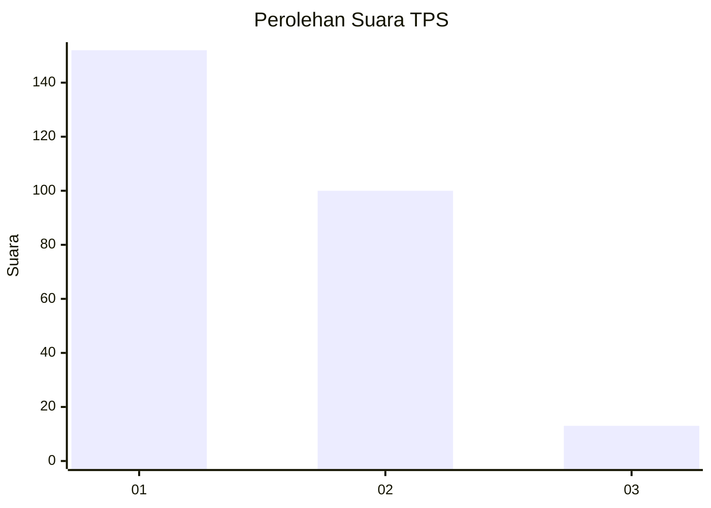
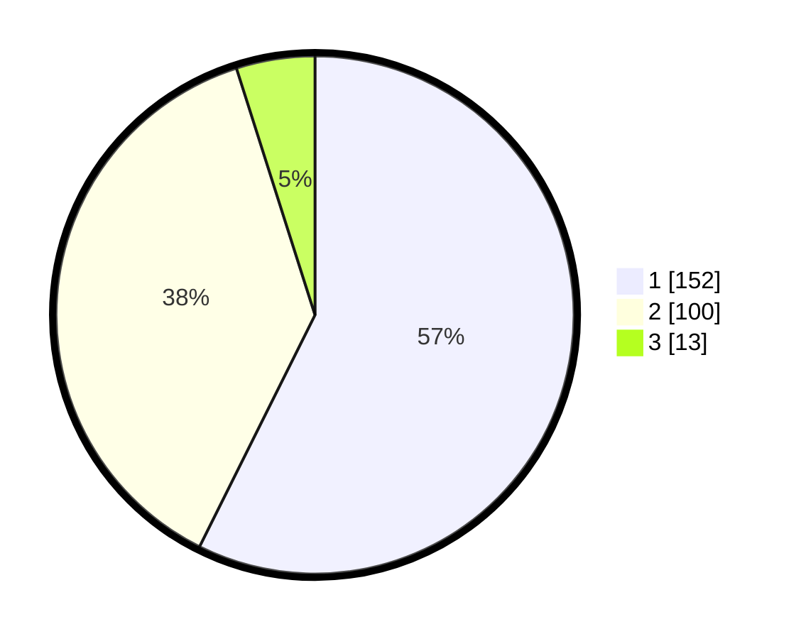

# Hasil

## Grafik

## Tabel

| No. | Nama Paslon    | Suara | Suara (raw) | Persentase |
|:--- |:-------------- | -----:| -----------:| ----------:|
| 1   | ANIES MUHAIMIN | 152   | [152][p-1]  | 57,36      |
| 2   | PRABOWO GIBRAN | 100   | [100][p-2]  | 37,74      |
| 3   | GANJAR MAHFUD  | 13    | [13][p-3]   | 4,91       |

[p-1]: https://github.com/gigit-pemilu/pemilu-2024-11-aceh/blob/main/pilpres/hitung-suara/sub/11-aceh/sub/75-kota-subulussalam/sub/02-penanggalan/sub/2011-dasan-raja/sub/001-tps/sub/paslon-1.txt
[p-2]: https://github.com/gigit-pemilu/pemilu-2024-11-aceh/blob/main/pilpres/hitung-suara/sub/11-aceh/sub/75-kota-subulussalam/sub/02-penanggalan/sub/2011-dasan-raja/sub/001-tps/sub/paslon-2.txt
[p-3]: https://github.com/gigit-pemilu/pemilu-2024-11-aceh/blob/main/pilpres/hitung-suara/sub/11-aceh/sub/75-kota-subulussalam/sub/02-penanggalan/sub/2011-dasan-raja/sub/001-tps/sub/paslon-3.txt

## Foto C Plano

https://sirekap-obj-formc.kpu.go.id/2ecb/pemilu/ppwp/11/75/02/20/11/1175022011001-20240214-214835--3204cd1f-4a0d-4563-a9c0-05effc894c53.jpg

https://sirekap-obj-formc.kpu.go.id/2ecb/pemilu/ppwp/11/75/02/20/11/1175022011001-20240215-021820--39077083-e4c2-44e7-b526-5951cb09f222.jpg

https://sirekap-obj-formc.kpu.go.id/2ecb/pemilu/ppwp/11/75/02/20/11/1175022011001-20240214-215041--a8d44109-840d-45f9-9fe9-e58b59756962.jpg

## Metadata

| Key        | Value               |
| ---------- | ------------------- |
| Time Stamp | 2024-02-15 15:00:29 |

