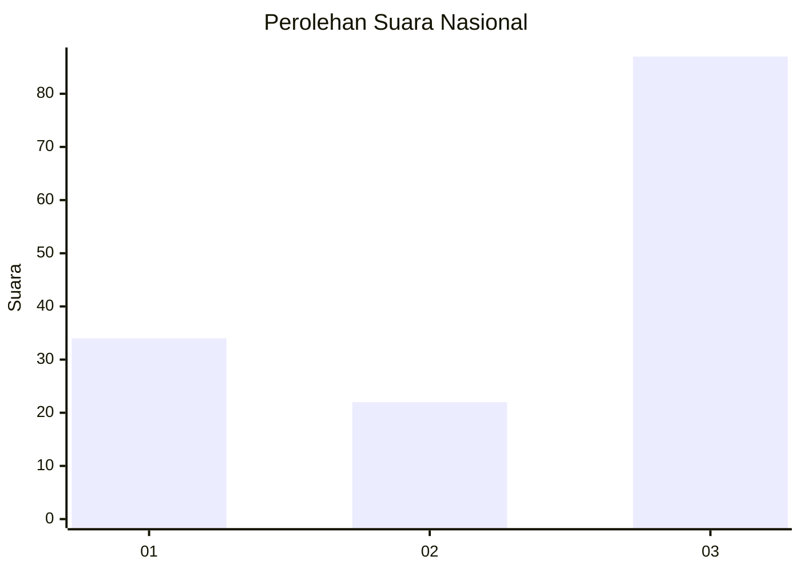
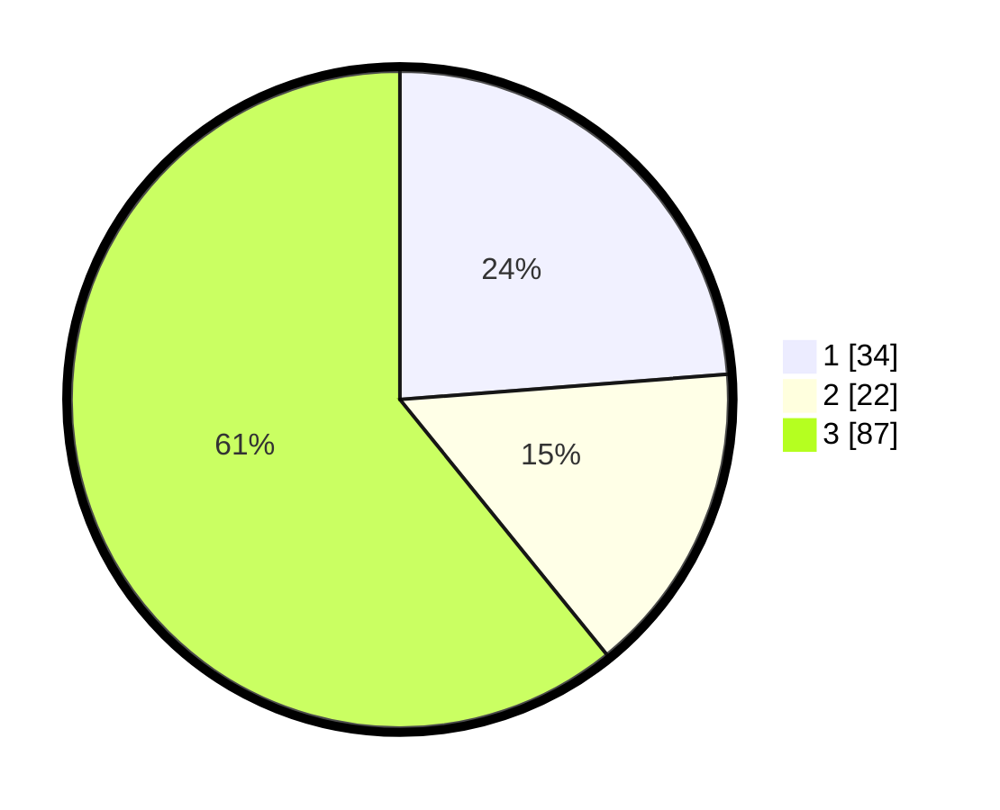

# Hasil

## Grafik

## Tabel

| No. | Nama Paslon    | Suara | Suara (raw) | Persentase |
|:--- |:-------------- | -----:| -----------:| ----------:|
| 1   | ANIES MUHAIMIN | 34    | [34][p-1]   | 23,78      |
| 2   | PRABOWO GIBRAN | 22    | [22][p-2]   | 15,38      |
| 3   | GANJAR MAHFUD  | 87    | [87][p-3]   | 60,84      |

[p-1]: https://github.com/gigit-pemilu/pemilu-2024/blob/main/pilpres/hitung-suara/sub/11-aceh/sub/75-kota-subulussalam/sub/02-penanggalan/sub/2011-dasan-raja/sub/002-tps/sub/paslon-1.txt
[p-2]: https://github.com/gigit-pemilu/pemilu-2024/blob/main/pilpres/hitung-suara/sub/11-aceh/sub/75-kota-subulussalam/sub/02-penanggalan/sub/2011-dasan-raja/sub/002-tps/sub/paslon-2.txt
[p-3]: https://github.com/gigit-pemilu/pemilu-2024/blob/main/pilpres/hitung-suara/sub/11-aceh/sub/75-kota-subulussalam/sub/02-penanggalan/sub/2011-dasan-raja/sub/002-tps/sub/paslon-3.txt

## Foto C Plano

https://sirekap-obj-formc.kpu.go.id/3696/pemilu/ppwp/11/75/02/20/11/1175022011002-20240221-160444--51543c8f-a0c8-423f-a8af-b9264858f529.jpg

https://sirekap-obj-formc.kpu.go.id/3696/pemilu/ppwp/11/75/02/20/11/1175022011002-20240221-161040--dc2e2799-34d3-44ec-9d49-0fc8401f8449.jpg

https://sirekap-obj-formc.kpu.go.id/3696/pemilu/ppwp/11/75/02/20/11/1175022011002-20240221-161316--722587c9-ad3e-4569-9d59-0b944d55ab16.jpg

## Metadata

| Key        | Value               |
| ---------- | ------------------- |
| Time Stamp | 2024-02-21 17:00:00 |

## DATA PEMILIH TETAP

Jumlah pemilih dalam DPT: **300**.
 * L: **546**.
 * P: **653**.

## DATA PENGGUNA HAK PILIH

Jumlah pengguna hak pilih dalam DPT: **266**.
 * L: **131**.
 * P: **235**.

Jumlah pengguna hak pilih dalam DPTb: **10**.
 * L: **7**.
 * P: **3**.

Jumlah pengguna hak pilih dalam DPK: **0**.
 * L: **0**.
 * P: **0**.

Jumlah pengguna hak pilih: **276**.
 * L: **638**.
 * P: **130**.

## JUMLAH SUARA SAH DAN TIDAK SAH

JUMLAH SELURUH SUARA SAH: **264**.

JUMLAH SUARA TIDAK SAH: **846**.

JUMLAH SELURUH SUARA SAH DAN SUARA TIDAK SAH: **238**.

