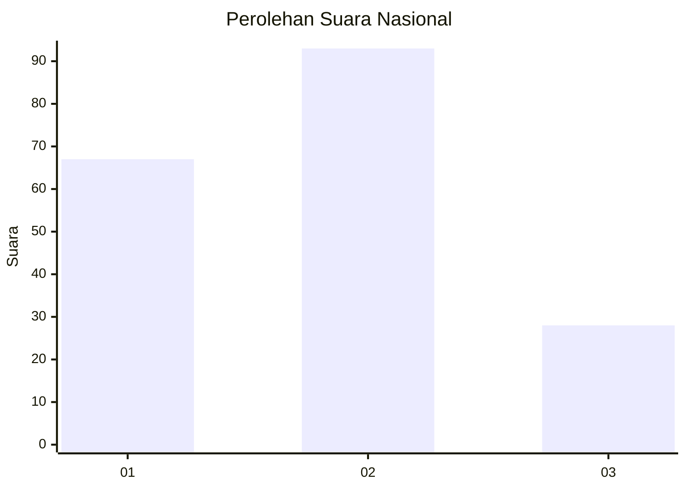
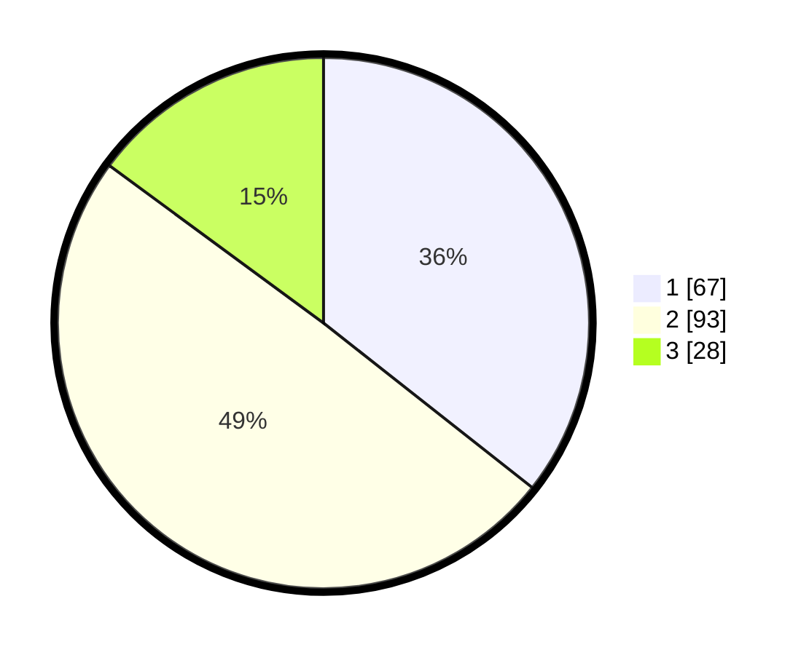

# Hasil

## Grafik

## Tabel

| No. | Nama Paslon    | Suara | Suara (raw) | Persentase |
|:--- |:-------------- | -----:| -----------:| ----------:|
| 1   | ANIES MUHAIMIN | 67    | [67][p-1]   | 35,64      |
| 2   | PRABOWO GIBRAN | 93    | [93][p-2]   | 49,47      |
| 3   | GANJAR MAHFUD  | 28    | [28][p-3]   | 14,89      |

[p-1]: https://github.com/gigit-pemilu/pemilu-2024/blob/main/pilpres/hitung-suara/sub/11-aceh/sub/75-kota-subulussalam/sub/02-penanggalan/sub/2011-dasan-raja/sub/003-tps/sub/paslon-1.txt
[p-2]: https://github.com/gigit-pemilu/pemilu-2024/blob/main/pilpres/hitung-suara/sub/11-aceh/sub/75-kota-subulussalam/sub/02-penanggalan/sub/2011-dasan-raja/sub/003-tps/sub/paslon-2.txt
[p-3]: https://github.com/gigit-pemilu/pemilu-2024/blob/main/pilpres/hitung-suara/sub/11-aceh/sub/75-kota-subulussalam/sub/02-penanggalan/sub/2011-dasan-raja/sub/003-tps/sub/paslon-3.txt

## Foto C Plano

https://sirekap-obj-formc.kpu.go.id/308b/pemilu/ppwp/11/75/02/20/11/1175022011003-20240221-220909--a97941a8-98a7-4595-9b2b-8d1c7d39c0a5.jpg

https://sirekap-obj-formc.kpu.go.id/308b/pemilu/ppwp/11/75/02/20/11/1175022011003-20240221-221035--967f36fb-7a85-4820-b26a-0c2d1cf578fc.jpg

https://sirekap-obj-formc.kpu.go.id/308b/pemilu/ppwp/11/75/02/20/11/1175022011003-20240221-221145--d95b61c7-a675-4865-964e-c92f3825e1f7.jpg

## Metadata

| Key        | Value               |
| ---------- | ------------------- |
| Time Stamp | 2024-02-21 23:00:00 |

## DATA PEMILIH TETAP

Jumlah pemilih dalam DPT: **205**.
 * L: **110**.
 * P: **95**.

## DATA PENGGUNA HAK PILIH

Jumlah pengguna hak pilih dalam DPT: **188**.
 * L: **102**.
 * P: **86**.

Jumlah pengguna hak pilih dalam DPTb: **5**.
 * L: **2**.
 * P: **3**.

Jumlah pengguna hak pilih dalam DPK: **9**.
 * L: **2**.
 * P: **2**.

Jumlah pengguna hak pilih: **197**.
 * L: **106**.
 * P: **91**.

## JUMLAH SUARA SAH DAN TIDAK SAH

JUMLAH SELURUH SUARA SAH: **188**.

JUMLAH SUARA TIDAK SAH: **9**.

JUMLAH SELURUH SUARA SAH DAN SUARA TIDAK SAH: **197**.

