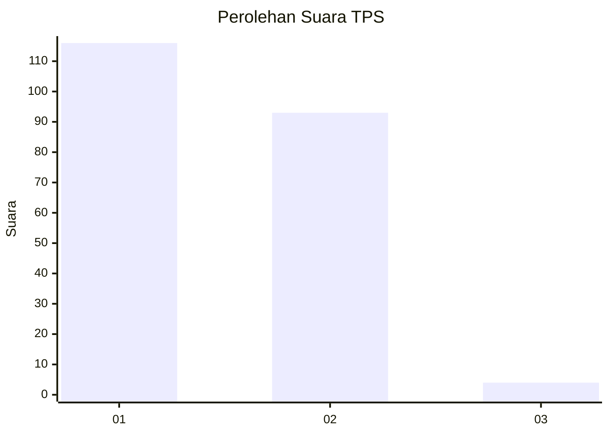
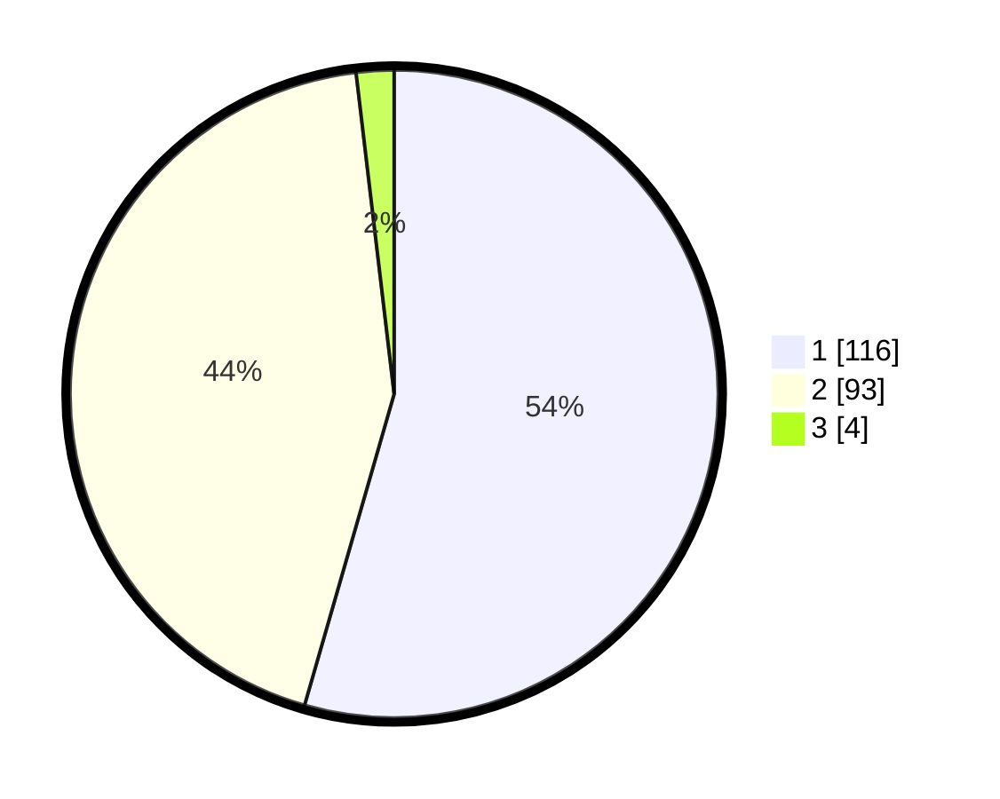

# Hasil

## Grafik

## Tabel

| No. | Nama Paslon    | Suara | Suara (raw) | Persentase |
|:--- |:-------------- | -----:| -----------:| ----------:|
| 1   | ANIES MUHAIMIN | 116   | [116][p-1]  | 54,46      |
| 2   | PRABOWO GIBRAN | 93    | [93][p-2]   | 43,66      |
| 3   | GANJAR MAHFUD  | 4     | [4][p-3]    | 1,88       |

[p-1]: https://github.com/gigit-pemilu/pemilu-2024-11-aceh/blob/main/pilpres/hitung-suara/sub/11-aceh/sub/75-kota-subulussalam/sub/02-penanggalan/sub/2013-penanggalan-barat/sub/001-tps/sub/paslon-1.txt
[p-2]: https://github.com/gigit-pemilu/pemilu-2024-11-aceh/blob/main/pilpres/hitung-suara/sub/11-aceh/sub/75-kota-subulussalam/sub/02-penanggalan/sub/2013-penanggalan-barat/sub/001-tps/sub/paslon-2.txt
[p-3]: https://github.com/gigit-pemilu/pemilu-2024-11-aceh/blob/main/pilpres/hitung-suara/sub/11-aceh/sub/75-kota-subulussalam/sub/02-penanggalan/sub/2013-penanggalan-barat/sub/001-tps/sub/paslon-3.txt

## Foto C Plano

https://sirekap-obj-formc.kpu.go.id/050c/pemilu/ppwp/11/75/02/20/13/1175022013001-20240214-230240--3e2b4db2-2542-41b0-8d74-3b73f6731a3b.jpg

https://sirekap-obj-formc.kpu.go.id/050c/pemilu/ppwp/11/75/02/20/13/1175022013001-20240215-040332--0685b25f-ba4d-4765-a435-d5ba5bf3630b.jpg

https://sirekap-obj-formc.kpu.go.id/050c/pemilu/ppwp/11/75/02/20/13/1175022013001-20240214-230721--30574475-74fa-4a7b-a9ce-1357256829c1.jpg

## Metadata

| Key        | Value               |
| ---------- | ------------------- |
| Time Stamp | 2024-02-15 23:29:50 |

