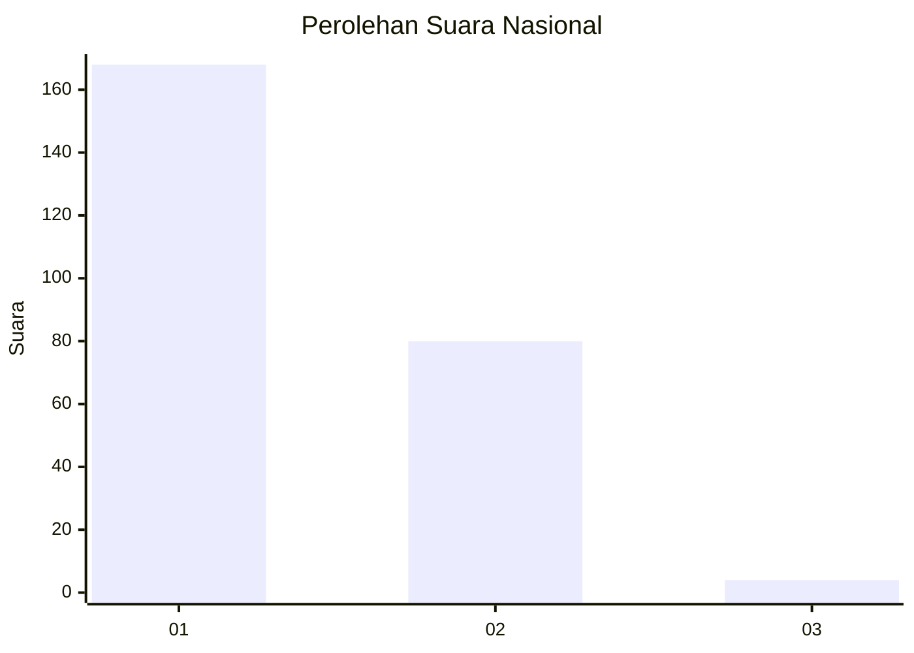
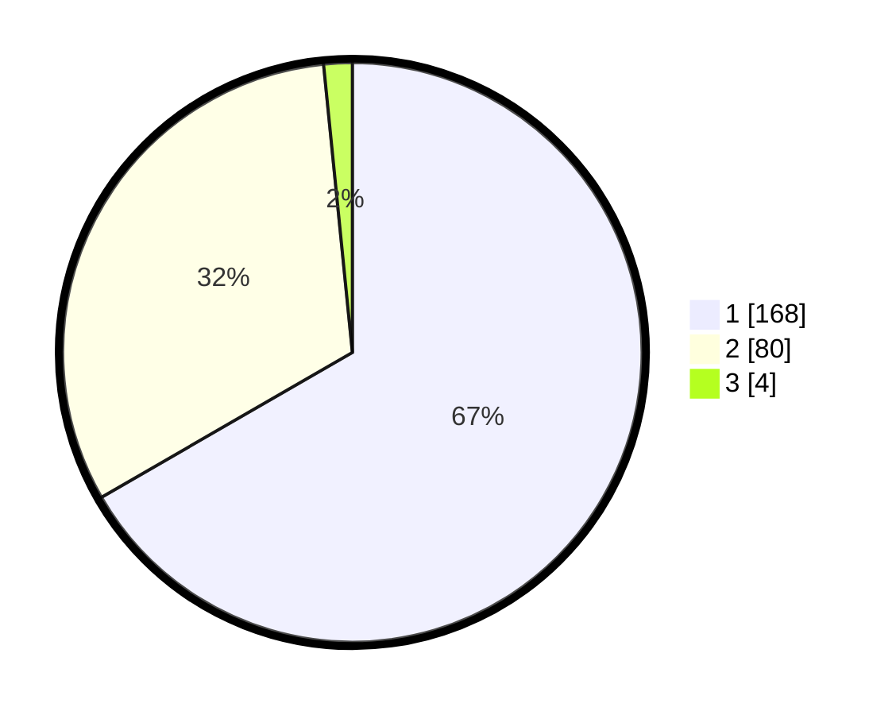

# Hasil

## Grafik

## Tabel

| No. | Nama Paslon    | Suara | Suara (raw) | Persentase |
|:--- |:-------------- | -----:| -----------:| ----------:|
| 1   | ANIES MUHAIMIN | 168   | [168][p-1]  | 66,67      |
| 2   | PRABOWO GIBRAN | 80    | [80][p-2]   | 31,75      |
| 3   | GANJAR MAHFUD  | 4     | [4][p-3]    | 1,59       |

[p-1]: https://github.com/gigit-pemilu/pemilu-2024/blob/main/pilpres/hitung-suara/sub/11-aceh/sub/75-kota-subulussalam/sub/03-rundeng/sub/2001-pasar-rundeng/sub/001-tps/sub/paslon-1.txt
[p-2]: https://github.com/gigit-pemilu/pemilu-2024/blob/main/pilpres/hitung-suara/sub/11-aceh/sub/75-kota-subulussalam/sub/03-rundeng/sub/2001-pasar-rundeng/sub/001-tps/sub/paslon-2.txt
[p-3]: https://github.com/gigit-pemilu/pemilu-2024/blob/main/pilpres/hitung-suara/sub/11-aceh/sub/75-kota-subulussalam/sub/03-rundeng/sub/2001-pasar-rundeng/sub/001-tps/sub/paslon-3.txt

## Foto C Plano

https://sirekap-obj-formc.kpu.go.id/c369/pemilu/ppwp/11/75/03/20/01/1175032001001-20240223-093316--cb3d6559-4af7-42ba-b587-f7dfdb774aa4.jpg

https://sirekap-obj-formc.kpu.go.id/c369/pemilu/ppwp/11/75/03/20/01/1175032001001-20240223-093617--c633b0ac-e47a-45e6-a2b4-805cf51d83c0.jpg

https://sirekap-obj-formc.kpu.go.id/c369/pemilu/ppwp/11/75/03/20/01/1175032001001-20240223-093802--a00e5ff4-f2bb-4cae-8e71-ed5f8076242d.jpg

## Metadata

| Key        | Value               |
| ---------- | ------------------- |
| Time Stamp | 2024-02-24 22:31:28 |

## DATA PEMILIH TETAP

Jumlah pemilih dalam DPT: **274**.
 * L: **154**.
 * P: **720**.

## DATA PENGGUNA HAK PILIH

Jumlah pengguna hak pilih dalam DPT: **250**.
 * L: **740**.
 * P: **710**.

Jumlah pengguna hak pilih dalam DPTb: **3**.
 * L: **0**.
 * P: **2**.

Jumlah pengguna hak pilih dalam DPK: **8**.
 * L: **2**.
 * P: **5**.

Jumlah pengguna hak pilih: **261**.
 * L: **2**.
 * P: **777**.

## JUMLAH SUARA SAH DAN TIDAK SAH

JUMLAH SELURUH SUARA SAH: **252**.

JUMLAH SUARA TIDAK SAH: **9**.

JUMLAH SELURUH SUARA SAH DAN SUARA TIDAK SAH: **261**.

