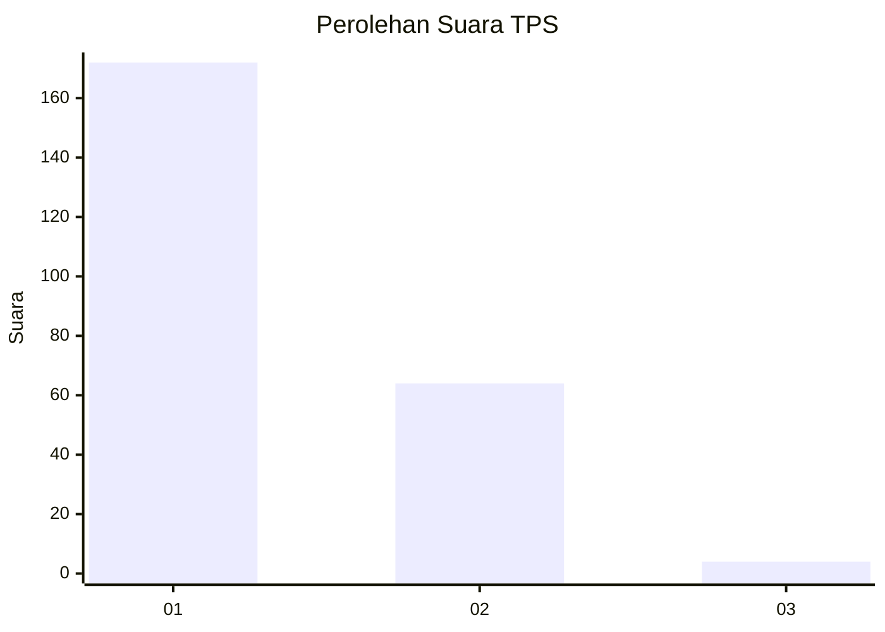
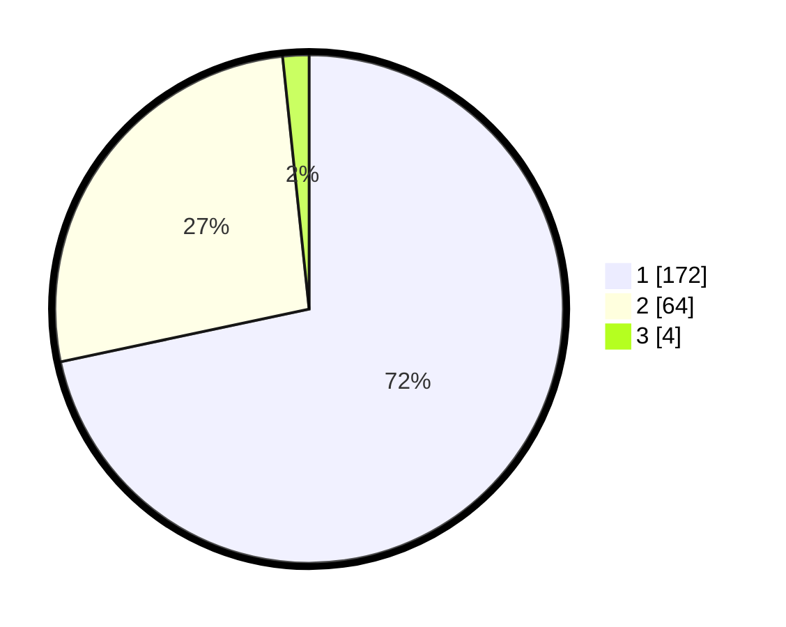

# Hasil

## Grafik

## Tabel

| No. | Nama Paslon    | Suara | Suara (raw) | Persentase |
|:--- |:-------------- | -----:| -----------:| ----------:|
| 1   | ANIES MUHAIMIN | 172   | [172][p-1]  | 71,67      |
| 2   | PRABOWO GIBRAN | 64    | [64][p-2]   | 26,67      |
| 3   | GANJAR MAHFUD  | 4     | [4][p-3]    | 1,67       |

[p-1]: https://github.com/gigit-pemilu/pemilu-2024-11-aceh/blob/main/pilpres/hitung-suara/sub/11-aceh/sub/75-kota-subulussalam/sub/03-rundeng/sub/2001-pasar-rundeng/sub/003-tps/sub/paslon-1.txt
[p-2]: https://github.com/gigit-pemilu/pemilu-2024-11-aceh/blob/main/pilpres/hitung-suara/sub/11-aceh/sub/75-kota-subulussalam/sub/03-rundeng/sub/2001-pasar-rundeng/sub/003-tps/sub/paslon-2.txt
[p-3]: https://github.com/gigit-pemilu/pemilu-2024-11-aceh/blob/main/pilpres/hitung-suara/sub/11-aceh/sub/75-kota-subulussalam/sub/03-rundeng/sub/2001-pasar-rundeng/sub/003-tps/sub/paslon-3.txt

## Foto C Plano

https://sirekap-obj-formc.kpu.go.id/e6d8/pemilu/ppwp/11/75/03/20/01/1175032001003-20240223-144052--1d7fa488-3b7a-42a7-b49c-e16edef2fcd2.jpg

https://sirekap-obj-formc.kpu.go.id/e6d8/pemilu/ppwp/11/75/03/20/01/1175032001003-20240223-144131--96ae69b8-5b93-459b-aa74-5cb4bcd41250.jpg

https://sirekap-obj-formc.kpu.go.id/e6d8/pemilu/ppwp/11/75/03/20/01/1175032001003-20240223-144210--aaff6da2-e07c-409b-a93e-2d0008f0b572.jpg

## Metadata

| Key        | Value               |
| ---------- | ------------------- |
| Time Stamp | 2024-02-24 22:31:28 |

## DATA PEMILIH TETAP

Jumlah pemilih dalam DPT: **264**.
 * L: **131**.
 * P: **133**.

## DATA PENGGUNA HAK PILIH

Jumlah pengguna hak pilih dalam DPT: **243**.
 * L: **419**.
 * P: **124**.

Jumlah pengguna hak pilih dalam DPTb: **0**.
 * L: **0**.
 * P: **5**.

Jumlah pengguna hak pilih dalam DPK: **808**.
 * L: **4**.
 * P: **4**.

Jumlah pengguna hak pilih: **251**.
 * L: **123**.
 * P: **128**.

## JUMLAH SUARA SAH DAN TIDAK SAH

JUMLAH SELURUH SUARA SAH: **240**.

JUMLAH SUARA TIDAK SAH: **11**.

JUMLAH SELURUH SUARA SAH DAN SUARA TIDAK SAH: **251**.

