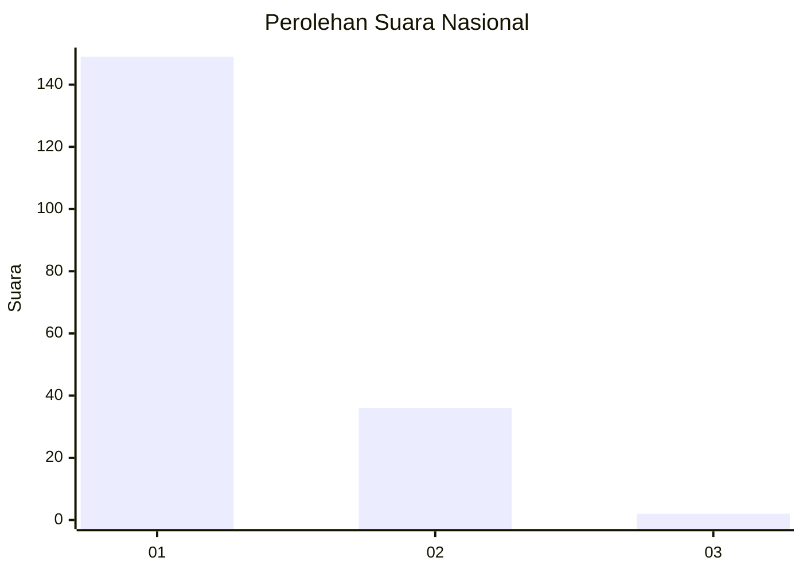
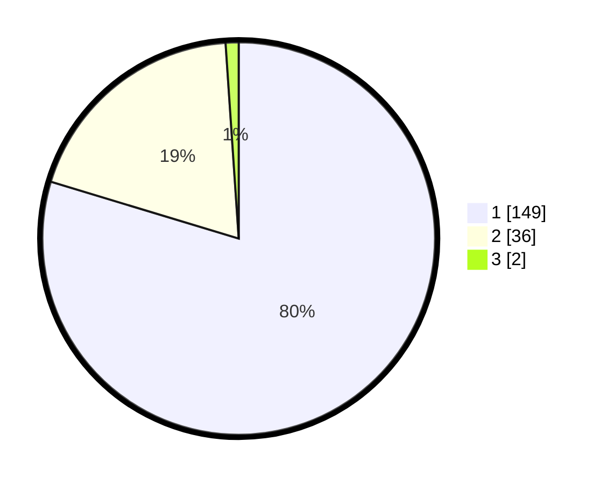

# Hasil

## Grafik

## Tabel

| No. | Nama Paslon    | Suara | Suara (raw) | Persentase |
|:--- |:-------------- | -----:| -----------:| ----------:|
| 1   | ANIES MUHAIMIN | 149   | [149][p-1]  | 79,68      |
| 2   | PRABOWO GIBRAN | 36    | [36][p-2]   | 19,25      |
| 3   | GANJAR MAHFUD  | 2     | [2][p-3]    | 1,07       |

[p-1]: https://github.com/gigit-pemilu/pemilu-2024/blob/main/pilpres/hitung-suara/sub/11-aceh/sub/75-kota-subulussalam/sub/03-rundeng/sub/2002-dah/sub/002-tps/sub/paslon-1.txt
[p-2]: https://github.com/gigit-pemilu/pemilu-2024/blob/main/pilpres/hitung-suara/sub/11-aceh/sub/75-kota-subulussalam/sub/03-rundeng/sub/2002-dah/sub/002-tps/sub/paslon-2.txt
[p-3]: https://github.com/gigit-pemilu/pemilu-2024/blob/main/pilpres/hitung-suara/sub/11-aceh/sub/75-kota-subulussalam/sub/03-rundeng/sub/2002-dah/sub/002-tps/sub/paslon-3.txt

## Foto C Plano

https://sirekap-obj-formc.kpu.go.id/6ce1/pemilu/ppwp/11/75/03/20/02/1175032002002-20240215-092655--db4fe61c-6920-44f7-83ad-a7e0591a23c3.jpg

https://sirekap-obj-formc.kpu.go.id/6ce1/pemilu/ppwp/11/75/03/20/02/1175032002002-20240215-092710--c7849677-f3a6-4eb9-94ea-55950c9558ba.jpg

https://sirekap-obj-formc.kpu.go.id/6ce1/pemilu/ppwp/11/75/03/20/02/1175032002002-20240215-092729--95adc7b0-4b22-4cdd-83d0-891f7b0fb82e.jpg

## Metadata

| Key        | Value               |
| ---------- | ------------------- |
| Time Stamp | 2024-02-15 23:29:50 |

