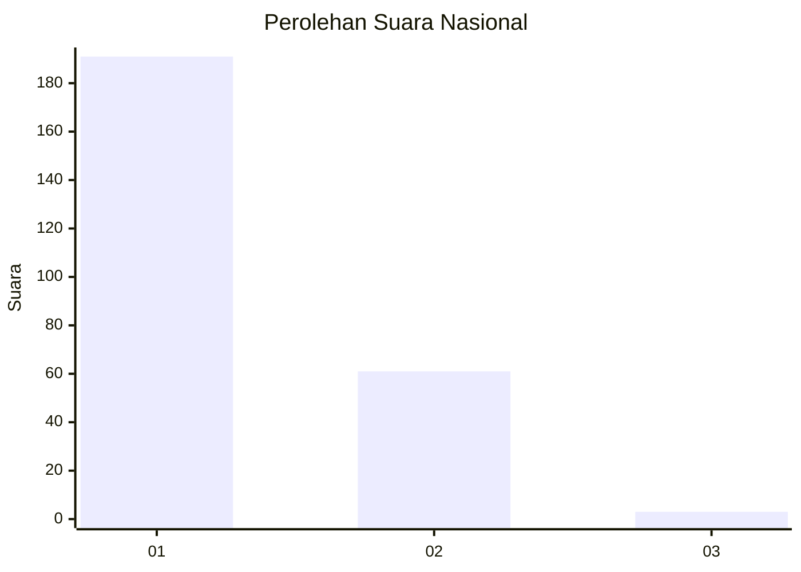
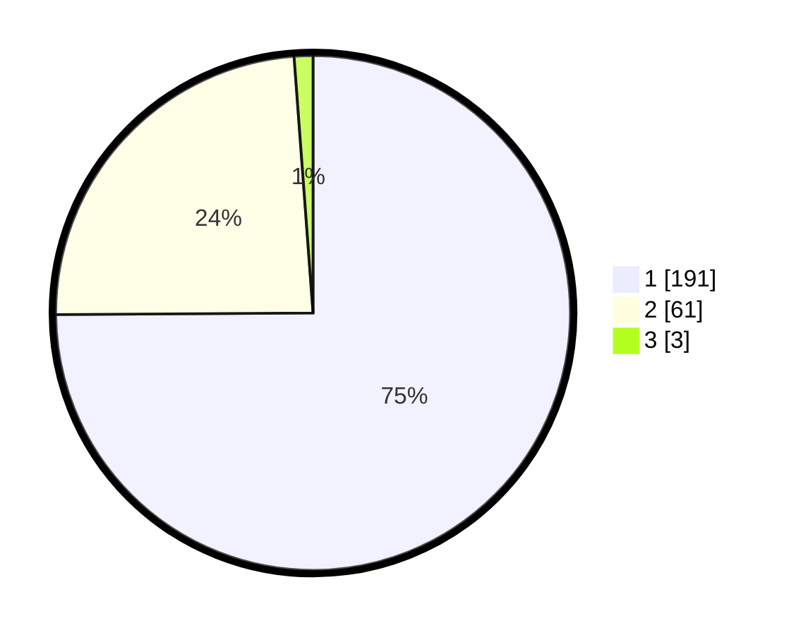

# Hasil

## Grafik

## Tabel

| No. | Nama Paslon    | Suara | Suara (raw) | Persentase |
|:--- |:-------------- | -----:| -----------:| ----------:|
| 1   | ANIES MUHAIMIN | 191   | [191][p-1]  | 74,90      |
| 2   | PRABOWO GIBRAN | 61    | [61][p-2]   | 23,92      |
| 3   | GANJAR MAHFUD  | 3     | [3][p-3]    | 1,18       |

[p-1]: https://github.com/gigit-pemilu/pemilu-2024/blob/main/pilpres/hitung-suara/sub/11-aceh/sub/75-kota-subulussalam/sub/03-rundeng/sub/2003-oboh/sub/001-tps/sub/paslon-1.txt
[p-2]: https://github.com/gigit-pemilu/pemilu-2024/blob/main/pilpres/hitung-suara/sub/11-aceh/sub/75-kota-subulussalam/sub/03-rundeng/sub/2003-oboh/sub/001-tps/sub/paslon-2.txt
[p-3]: https://github.com/gigit-pemilu/pemilu-2024/blob/main/pilpres/hitung-suara/sub/11-aceh/sub/75-kota-subulussalam/sub/03-rundeng/sub/2003-oboh/sub/001-tps/sub/paslon-3.txt

## Foto C Plano

https://sirekap-obj-formc.kpu.go.id/2127/pemilu/ppwp/11/75/03/20/03/1175032003001-20240215-062530--498c142d-a98c-4f1c-befd-8694bde32ab0.jpg

https://sirekap-obj-formc.kpu.go.id/2127/pemilu/ppwp/11/75/03/20/03/1175032003001-20240216-072414--7c7ff75b-e562-4969-a369-ab8e27609d0f.jpg

https://sirekap-obj-formc.kpu.go.id/2127/pemilu/ppwp/11/75/03/20/03/1175032003001-20240215-063735--252ff62d-e6c7-4ff5-8142-aec2b5958166.jpg

## Metadata

| Key        | Value               |
| ---------- | ------------------- |
| Time Stamp | 2024-02-20 15:00:00 |

