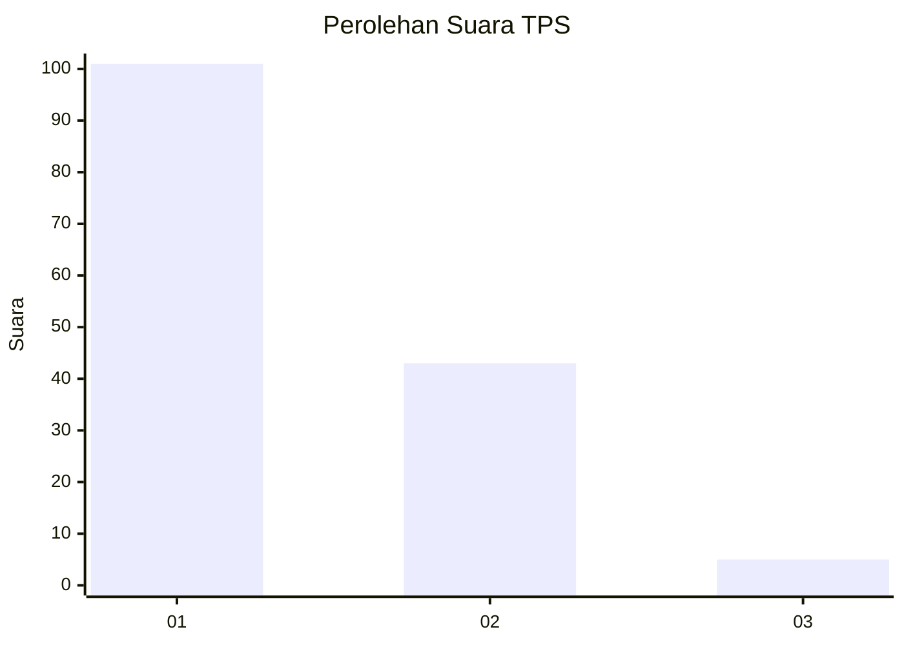
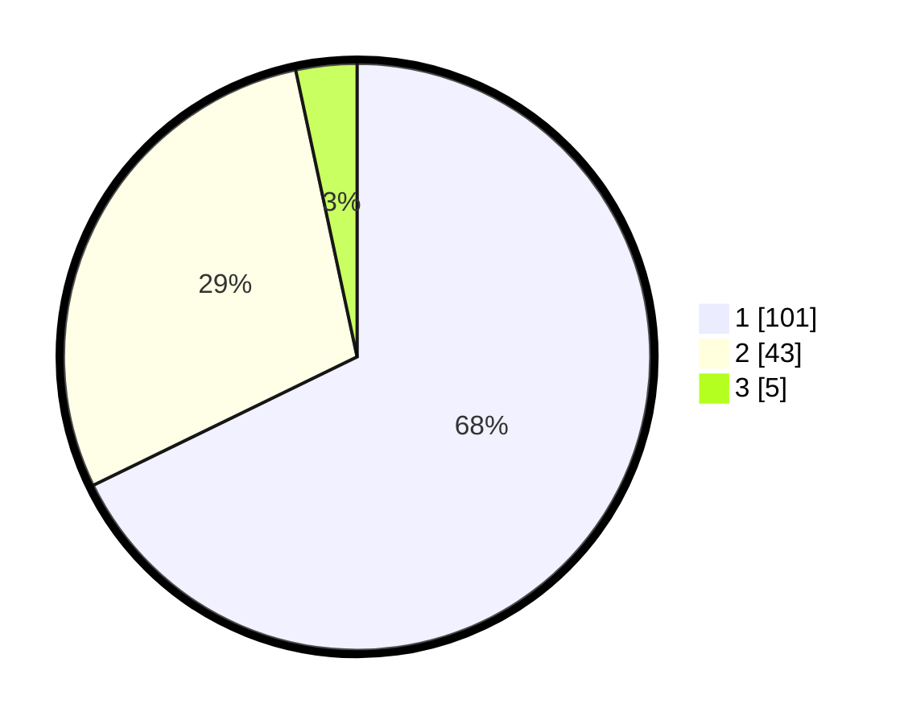

# Hasil

## Grafik

## Tabel

| No. | Nama Paslon    | Suara | Suara (raw) | Persentase |
|:--- |:-------------- | -----:| -----------:| ----------:|
| 1   | ANIES MUHAIMIN | 101   | [101][p-1]  | 67,79      |
| 2   | PRABOWO GIBRAN | 43    | [43][p-2]   | 28,86      |
| 3   | GANJAR MAHFUD  | 5     | [5][p-3]    | 3,36       |

[p-1]: https://github.com/gigit-pemilu/pemilu-2024-11-aceh/blob/main/pilpres/hitung-suara/sub/11-aceh/sub/75-kota-subulussalam/sub/03-rundeng/sub/2005-sibuasan/sub/001-tps/sub/paslon-1.txt
[p-2]: https://github.com/gigit-pemilu/pemilu-2024-11-aceh/blob/main/pilpres/hitung-suara/sub/11-aceh/sub/75-kota-subulussalam/sub/03-rundeng/sub/2005-sibuasan/sub/001-tps/sub/paslon-2.txt
[p-3]: https://github.com/gigit-pemilu/pemilu-2024-11-aceh/blob/main/pilpres/hitung-suara/sub/11-aceh/sub/75-kota-subulussalam/sub/03-rundeng/sub/2005-sibuasan/sub/001-tps/sub/paslon-3.txt

## Foto C Plano

https://sirekap-obj-formc.kpu.go.id/fef2/pemilu/ppwp/11/75/03/20/05/1175032005001-20240219-165630--a0bd054f-08fa-4af5-a637-fae02dfc4e35.jpg

https://sirekap-obj-formc.kpu.go.id/fef2/pemilu/ppwp/11/75/03/20/05/1175032005001-20240219-165724--e32db9eb-6d93-467e-b56f-55453f1b91f5.jpg

https://sirekap-obj-formc.kpu.go.id/fef2/pemilu/ppwp/11/75/03/20/05/1175032005001-20240219-165811--462ed0ed-e5b0-4ddc-bbbd-403f3d6fc8dd.jpg

## Metadata

| Key        | Value               |
| ---------- | ------------------- |
| Time Stamp | 2024-02-19 17:00:00 |

## DATA PEMILIH TETAP

Jumlah pemilih dalam DPT: **151**.
 * L: **75**.
 * P: **33**.

## DATA PENGGUNA HAK PILIH

Jumlah pengguna hak pilih dalam DPT: **525**.
 * L: **503**.
 * P: **87**.

Jumlah pengguna hak pilih dalam DPTb: **2**.
 * L: **804**.
 * P: **887**.

Jumlah pengguna hak pilih dalam DPK: **1**.
 * L: **805**.
 * P: **800**.

Jumlah pengguna hak pilih: **158**.
 * L: **2**.
 * P: **876**.

## JUMLAH SUARA SAH DAN TIDAK SAH

JUMLAH SELURUH SUARA SAH: **849**.

JUMLAH SUARA TIDAK SAH: **5**.

JUMLAH SELURUH SUARA SAH DAN SUARA TIDAK SAH: **154**.

