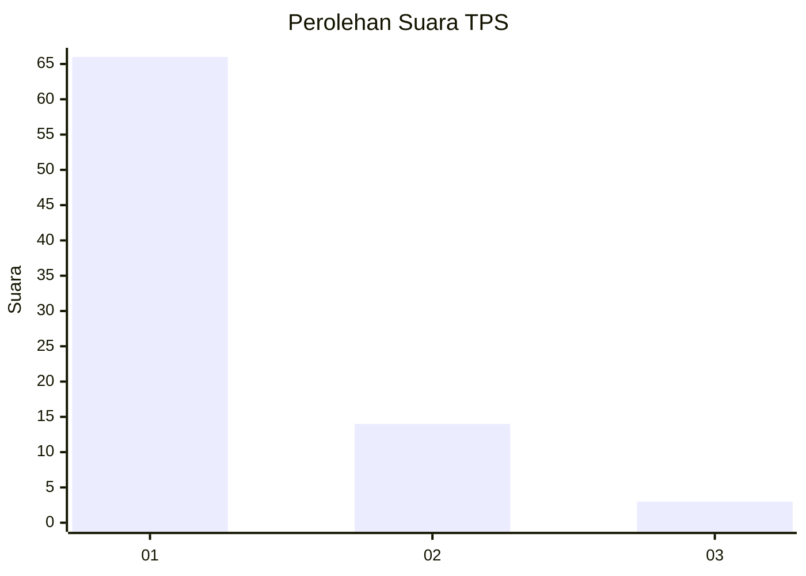
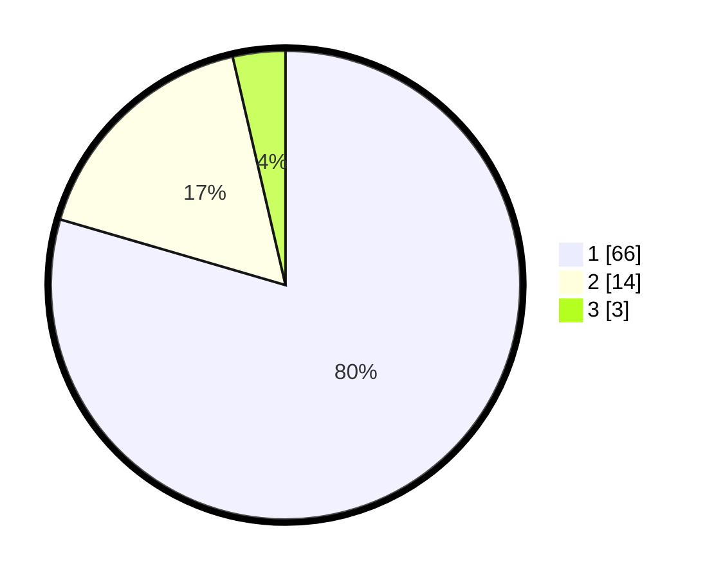

# Hasil

## Grafik

## Tabel

| No. | Nama Paslon    | Suara | Suara (raw) | Persentase |
|:--- |:-------------- | -----:| -----------:| ----------:|
| 1   | ANIES MUHAIMIN | 66    | [66][p-1]   | 79,52      |
| 2   | PRABOWO GIBRAN | 14    | [14][p-2]   | 16,87      |
| 3   | GANJAR MAHFUD  | 3     | [3][p-3]    | 3,61       |

[p-1]: https://github.com/gigit-pemilu/pemilu-2024-11-aceh/blob/main/pilpres/hitung-suara/sub/11-aceh/sub/75-kota-subulussalam/sub/03-rundeng/sub/2007-kuta-beringin/sub/001-tps/sub/paslon-1.txt
[p-2]: https://github.com/gigit-pemilu/pemilu-2024-11-aceh/blob/main/pilpres/hitung-suara/sub/11-aceh/sub/75-kota-subulussalam/sub/03-rundeng/sub/2007-kuta-beringin/sub/001-tps/sub/paslon-2.txt
[p-3]: https://github.com/gigit-pemilu/pemilu-2024-11-aceh/blob/main/pilpres/hitung-suara/sub/11-aceh/sub/75-kota-subulussalam/sub/03-rundeng/sub/2007-kuta-beringin/sub/001-tps/sub/paslon-3.txt

## Foto C Plano

https://sirekap-obj-formc.kpu.go.id/26e9/pemilu/ppwp/11/75/03/20/07/1175032007001-20240223-164500--26c3f1b2-8b40-4173-bdfa-213d08f9b5b5.jpg

https://sirekap-obj-formc.kpu.go.id/26e9/pemilu/ppwp/11/75/03/20/07/1175032007001-20240223-164502--8679f8f9-1fd1-498a-a8be-a21c20c2b5cc.jpg

https://sirekap-obj-formc.kpu.go.id/26e9/pemilu/ppwp/11/75/03/20/07/1175032007001-20240223-164501--5b46829e-3803-4ba8-a6bc-b783d65091e4.jpg

## Metadata

| Key        | Value               |
| ---------- | ------------------- |
| Time Stamp | 2024-02-27 18:00:00 |

## DATA PEMILIH TETAP

Jumlah pemilih dalam DPT: **89**.
 * L: **46**.
 * P: **43**.

## DATA PENGGUNA HAK PILIH

Jumlah pengguna hak pilih dalam DPT: **85**.
 * L: **44**.
 * P: **41**.

Jumlah pengguna hak pilih dalam DPTb: **0**.
 * L: **0**.
 * P: **0**.

Jumlah pengguna hak pilih dalam DPK: **0**.
 * L: **0**.
 * P: **0**.

Jumlah pengguna hak pilih: **85**.
 * L: **44**.
 * P: **41**.

## JUMLAH SUARA SAH DAN TIDAK SAH

JUMLAH SELURUH SUARA SAH: **83**.

JUMLAH SUARA TIDAK SAH: **2**.

JUMLAH SELURUH SUARA SAH DAN SUARA TIDAK SAH: **85**.

